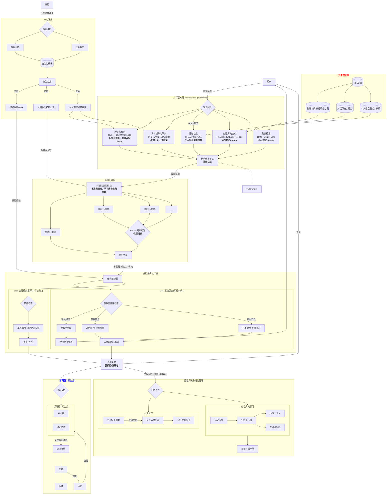

**原则**
规则类任务（比如foodie和shoping的定制、高铁、机场的选择）进skill，不进prompt
工具全部封装为skill，分为意图类和非意图类（非意图类为能力，被意图依赖，比如时间等）模型只判断意图，依赖关系由DAG引导
依赖类的skill按需并行处理
广义的问答场景（以文本输出）单意图和多意图统一合并为多意图，由GRM判定概率偏低的意图，剪枝掉无效意图，最终由大模型总结
**workflow**

### 格式示例
{
  "request_meta": {
    "request_id": "req-20260227-travelshop",
    "timestamp": "2026-02-27T09:45:00+08:00",
    "raw_query": "帮我订明天下午从新加坡飞北京的机票，要求后天上午前到达。这周末我要去逛逛北京的非标网红打卡地，顺便帮我查查附近的商场哪里买国潮服饰比较好，还是按我以前的喜好买。",
    "session_id": "sess-998877"
  },

  "1_tempo_spatial_info": {
    "_comment": "时空标准化增强版：严格区分源与目的，支持时间范围",
    "time_anchors": {
      "current_time": "2026-02-27T09:45:00+08:00",
      "source_time": {
        "raw": "明天下午",
        "standardized": "2026-02-28T14:00:00/18:00:00",
        "type": "departure_time",
        "flexibility": "hard"
      },
      "destination_time": {
        "raw": "后天上午前到达",
        "standardized": "<= 2026-03-01T12:00:00",
        "type": "arrival_deadline",
        "flexibility": "soft"
      },
      "time_range": {
        "raw": "这周末",
        "start_time": "2026-02-28T00:00:00+08:00",
        "end_time": "2026-03-01T23:59:59+08:00",
        "duration_hours": 48,
        "type": "activity_period"
      }
    },
    "spatial_anchors": {
      "current_location": {"city": "新加坡", "coord": "1.3521, 103.8198"},
      "source_address": {
        "raw": "新加坡",
        "standardized_city": "Singapore",
        "poi_type": "airport",
        "inferred_poi": "新加坡樟宜机场 (SIN)"
      },
      "destination_address": {
        "raw": "北京",
        "standardized_city": "北京市",
        "poi_type": "airport",
        "inferred_poi": "北京首都/大兴机场 (PEK/PKX)"
      },
      "activity_radius": {
        "center_coord": "TBD (基于最终目的地)",
        "radius_km": 10,
        "type": "shopping_and_poi_area"
      }
    }
  },

  "2_entity_and_index_info": {
    "_comment": "新增业务线索引：出行索引与购物索引",
    "domain_indexes": {
      "travel_index": {
        "transport_mode": "flight",
        "trip_type": "international_leisure",
        "poi_preference": ["trending", "hidden_gem", "non_standard"],
        "route_type": "one_way"
      },
      "shopping_index": {
        "category": "clothing",
        "sub_category": "guochao (国潮/national trend)",
        "venue_type": "shopping_mall",
        "purchase_mode": "offline_in_store"
      }
    },
    "segmented_clauses":[
      "帮我订明天下午从新加坡飞北京的机票要求后天上午前到达",
      "这周末我要去逛逛北京的非标网红打卡地",
      "顺便帮我查查附近的商场哪里买国潮服饰比较好"
    ],
    "keywords":["新加坡", "北京", "机票", "非标网红", "商场", "国潮服饰"],
    "skill_pre_params": {
      "matched_skills":["flight_booking", "poi_recommendation", "shopping_guide"]
    }
  },

  "3_memory_info": {
    "_comment": "融合出行与购物的双重个人图谱偏好",
    "user_profile": {
      "user_id": "u-10086",
      "vip_level": "gold"
    },
    "preferences":[
      {
        "domain": "travel",
        "attributes": {
          "flight_seat": "aisle (过道)",
          "airline_alliance": "Star Alliance (星空联盟)",
          "passport_no": "E12345678"
        }
      },
      {
        "domain": "shopping",
        "trigger": "以前的喜好",
        "attributes": {
          "clothing_size": "L",
          "favorite_brands": ["李宁", "中国李宁", "Randomevent", "FMACM"],
          "price_sensitivity": "medium-high"
        }
      }
    ]
  },

  "4_context_history": {
    "_comment": "对话历史状态",
    "carried_over_slots": {},
    "recent_turns":[]
  },

  "5_exceptional_shots": {
    "_comment": "复杂/非标意图的 Few-shot 检索结果",
    "matched_scenarios": ["非标网红打卡地推荐", "国潮服饰线下导购"],
    "few_shots":[
      {
        "query": "商场哪里买国潮服饰",
        "example_action": "Search_ShoppingGuide(tags=['国潮', '设计师品牌'], location_context='destination_address')"
      }
    ]
  }
}

### 结构化上下文使用说明（待讨论优化）
1. 意图识别层 (RouterLayer) & 编排器 (Orchestrator)
通过读取 2_entity_and_index_info.domain_indexes，路由层可以直接获得业务线的上帝视角：

看到 travel_index.transport_mode = flight，立即拉起 Skill: 国际机票预订 DAG。
看到 shopping_index.category = clothing，立即拉起 Skill: 线下购物导览 DAG。
由于存在时间与空间的跨度，Orchestrator 知道这两个 DAG 需要按照时间线先后执行（先订机票，后推荐北京本地商场）。
2. 参数完整性检查与工具调用 (SlotCheck -> ToolCall)
在执行特定的 Skill DAG 时，参数的提取变得极其精准：

对于机票系统 (Flight_Tool)：

Departure: 直接取 1_tempo_spatial_info.spatial_anchors.source_address -> 新加坡。
Arrival: 直接取 destination_address -> 北京。
出港时间界限: 读取 source_time.standardized（2026-02-28 14:00~18:00）。
到港时间界限: 读取 destination_time.standardized（最晚 2026-03-01 12:00）。
系统价值：以前如果只有单一的 "time"，遇到“明天飞，后天到”会产生混淆；现在有了 source 和 destination 的明确区分，机票 API 的请求参数（dep_time 和 arr_time）可以直接映射，不出错。
对于购物与 POI 推荐系统 (Search_Poi_Tool)：

生效范围: 读取 time_range（这周末）和 destination_address（北京）。这意味着系统不会去推荐新加坡的商场，也不会推荐工作日才开门的集市。
检索过滤条件: 将 shopping_index.sub_category (国潮) 与 3_memory_info 中的 favorite_brands (中国李宁、Randomevent等) 结合，传递给本地商场数据库进行交叉比对。
3. 记忆与异常处理层 (Memory & ExceptTask)
因为 Query 中出现了“按我以前的喜好买”，MemoryTask 被触发，不仅检索了出行偏好，还检索了购物偏好（尺码 L、偏好品牌）。这些信息落入 3_memory_info 后，Shopping DAG 在执行时就不需要发起 ClarifyNode（澄清交互节点）去询问用户买什么牌子，而是直接静默应用这些偏好。
prompt
模板

