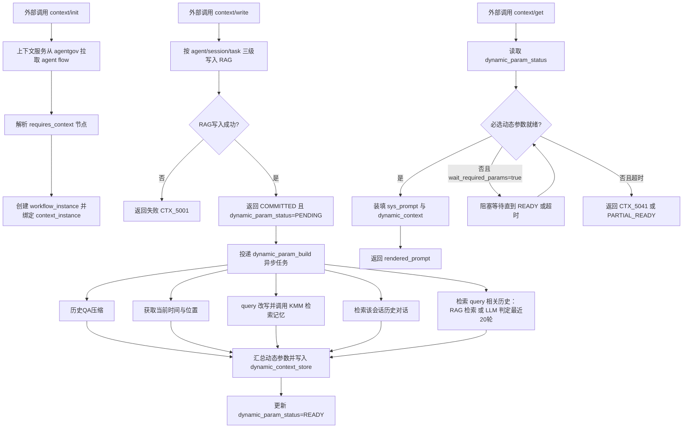
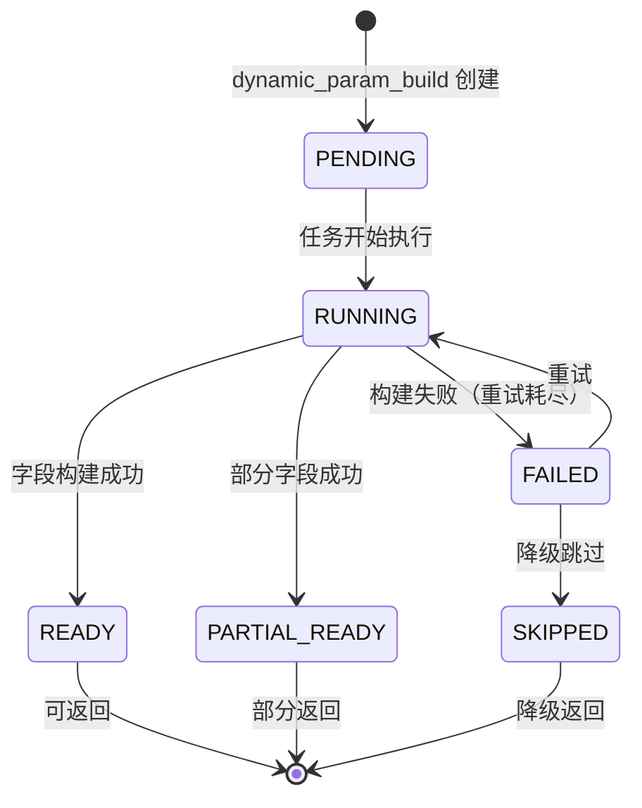

# 异步 Agent 上下文设计文档（重生成）

## 1. 设计目标
基于 `reference.md`，建设一套“异步准备 + 按需获取”的上下文服务，满足：
- 规则和工具能力进入 Skill，不把业务规则塞进 Prompt。
- 输入后并行准备上下文（时空、实体、记忆、历史、例外）。
- 获取接口一次返回 `sys_prompt` 与动态上下文，直接可用于模型调用。
- 支持多意图路由与 Skill DAG 依赖编排。

## 2. 总体流程
1. 用户消息进入 Input Gateway。
2. Context Prepare Orchestrator 异步创建 `context_job`。
3. 并行执行 5 类任务：
- 时空标准化（时间锚点、地点锚点）
- 记忆检索（个人图谱）
- 历史检索（RAG + 重排）
- 历史对话压缩与摘要
4. 聚合为 `structured_context_snapshot`。
8. 查询接口在动态参数未就绪时阻塞等待，直到必选参数可用后返回。

## 2.1 方案流程图


## 3. 核心数据模型

### 3.2 dynamic_context_store
动态上下文存储表，记录每个请求的动态参数构建状态和结果。

**表结构**
```json
{
  "store_key": "dctx:sess-998877:req-20260301-0003",
  "meta": {
    "session_id": "sess-998877",
    "user_id": "u-10086",
    "agent_id": "agent-travel-assistant",
    "snapshot_id": "snap-20260301-0003",
    "created_at": "2026-03-01T22:40:00Z",
    "updated_at": "2026-03-01T22:40:08Z",
    "param_version": 3
  },
  "status": {
    "overall": "READY",
    "overall_changed_at": "2026-03-01T22:40:08Z",
    "fields": {
      "current_time_location": {
        "state": "READY",
        "state_changed_at": "2026-03-01T22:40:01Z",
        "priority": "P0",
        "required": true,
        "retry_count": 0,
        "last_error": null
      },
      "tempo_spatial_info": {
        "state": "READY",
        "state_changed_at": "2026-03-01T22:40:02Z",
        "priority": "P1",
        "required": false,
        "retry_count": 0,
        "last_error": null
      },
      "entity_and_index_info": {
        "state": "READY",
        "state_changed_at": "2026-03-01T22:40:03Z",
        "priority": "P1",
        "required": false,
        "retry_count": 1,
        "last_error": null
      },
      "memory_info": {
        "state": "READY",
        "state_changed_at": "2026-03-01T22:40:05Z",
        "priority": "P0",
        "required": true,
        "retry_count": 0,
        "last_error": null
      },
      "retrieved_session_history": {
        "state": "READY",
        "state_changed_at": "2026-03-01T22:40:06Z",
        "priority": "P0",
        "required": true,
        "retry_count": 0,
        "last_error": null
      },
      "query_related_history": {
        "state": "READY",
        "state_changed_at": "2026-03-01T22:40:07Z",
        "priority": "P0",
        "required": true,
        "retry_count": 0,
        "last_error": null
      },
      "retrieved_rag_context": {
        "state": "READY",
        "state_changed_at": "2026-03-01T22:40:04Z",
        "priority": "P1",
        "required": false,
        "retry_count": 0,
        "last_error": null
      },
      "exceptional_shots_context": {
        "state": "FAILED",
        "state_changed_at": "2026-03-01T22:40:08Z",
        "priority": "P2",
        "required": false,
        "retry_count": 2,
        "last_error": {
          "code": "KMM_TIMEOUT",
          "message": "KMM service timeout after 5000ms",
          "timestamp": "2026-03-01T22:40:08Z"
        }
      },
      "skill_parameters_and_tool_results": {
        "state": "READY",
        "state_changed_at": "2026-03-01T22:40:00Z",
        "priority": "P0",
        "required": true,
        "retry_count": 0,
        "last_error": null
      }
    },
    "required_ready": true,
    "ready_fields_count": 8,
    "total_fields_count": 9
  },
  "data": {
    "current_time_location": {
      "timestamp": "2026-03-01T22:40:00+08:00",
      "timezone": "Asia/Shanghai",
      "location": {
        "latitude": 39.9042,
        "longitude": 116.4074,
        "city": "北京",
        "country": "中国"
      }
    },
    "tempo_spatial_info": {
      "time_anchor": "2026-03-02T14:00:00+08:00",
      "time_range": {
        "start": "2026-03-02T12:00:00+08:00",
        "end": "2026-03-02T18:00:00+08:00"
      },
      "place_anchor": {
        "origin": "新加坡",
        "destination": "北京"
      }
    },
    "entity_and_index_info": {
      "entities": [
        {"text": "新加坡", "type": "LOCATION", "confidence": 0.98},
        {"text": "北京", "type": "LOCATION", "confidence": 0.97},
        {"text": "非标网红打卡地", "type": "POI_TYPE", "confidence": 0.92}
      ],
      "index_terms": ["北京", "网红打卡地", "国潮", "商场"]
    },
    "memory_info": {
      "long_term_preferences": {
        "travel_style": "exploration",
        "interest_tags": ["国潮", "美食", "摄影"],
        "avoid_tags": ["购物", "人多"]
      },
      "recent_facts": [
        {"fact": "上周去了上海外滩", "confidence": 0.9},
        {"fact": "偏好下午出行", "confidence": 0.85}
      ],
      "confidence": 0.88
    },
    "retrieved_session_history": {
      "summary": "用户正在规划从新加坡飞往北京的行程，需要机票预订、景点推荐和购物建议...",
      "recent_turns": [
        {"turn_id": "turn-0023", "role": "user", "content": "帮我查下机票..."},
        {"turn_id": "turn-0023", "role": "assistant", "content": "好的，我找到了..."}
      ]
    },
    "query_related_history": {
      "related_turns": [
        {"turn_id": "turn-0015", "relevance_score": 0.92, "summary": "上次询问北京网红景点"},
        {"turn_id": "turn-0008", "relevance_score": 0.85, "summary": "讨论国潮风格商品"}
      ]
    },
    "retrieved_rag_context": {
      "chunks": [
        {"content": "北京三里屯是国潮...", "score": 0.87, "source": "travel_guide_v2"},
        {"content": "网红打卡地推荐...", "score": 0.82, "source": "poi_db"}
      ]
    },
    "exceptional_shots_context": null,
    "skill_parameters_and_tool_results": {
      "flight_booking": {"departure": "SIN", "arrival": "PEK", "date": "2026-03-02"},
      "tool_search_flights": {"result_ref": "obj://flight/ab12", "count": 12}
    }
  },
  "cache_info": {
    "cached_at": "2026-03-01T22:40:08Z",
    "ttl_seconds": 300,
    "hit_ratio": 0.0
  }
}
```

**状态枚举**
- `PENDING` - 任务已创建，未开始执行
- `RUNNING` - 任务执行中
- `READY` - 参数已就绪
- `FAILED` - 参数构建失败
- `SKIPPED` - 参数被跳过（降级场景）
- `PARTIAL_READY` - 部分结果可用

**优先级定义**
- `P0` - 核心必选参数（current_time_location, memory_info, session_history）
- `P1` - 重要参数（tempo_spatial, entity, rag_context）
- `P2` - 辅助参数（exceptional_shots, 扩展检索）

## 4. 对外接口

## 4.0 上下文实例初始化接口（新增）
### `POST /api/v1/context/init`
用途：初始化某个 Agent 在某会话下的上下文工作流实例。调用后由上下文服务通过 `agentgov` 拉取该 Agent 的 flow 定义，识别需要填充上下文的节点，并创建该会话的 workflow。

请求：
```json
{
  "request_id": "req-20260301-init-0001",
  "session_id": "sess-998877",
  "user_id": "u-10086",
  "agent_id": "agent-travel-assistant",
  "agent_version": "v3",
  "init_options": {
    "force_refresh_flow": false,
    "preload_context": true
  }
}
```

处理流程：
1. 接收 `context/init` 请求，生成 `context_instance_id`。
2. 调用 `agentgov` 服务下载 `agent flow`（按 `agent_id + agent_version`）。
3. 解析 flow，筛选 `requires_context=true` 的节点，生成 `context_required_nodes`。
4. 按 `session_id` 创建 `workflow_instance`，并建立映射：
- `context_instance_id -> workflow_instance_id`
- `workflow_node_id -> context_slot_schema`
5. 若 `preload_context=true`，异步触发一次上下文预准备（时空、实体、记忆、历史）。
6. 返回初始化结果，供后续 `context/get` 与 `context/write` 复用。

响应：
```json
{
  "code": 0,
  "message": "OK",
  "data": {
    "context_instance_id": "ctxi-3001",
    "workflow_instance_id": "wfi-8801",
    "agent_flow_ref": {
      "agent_id": "agent-travel-assistant",
      "agent_version": "v3",
      "flow_version": "flow-20260301-12"
    },
    "context_required_nodes": [
      {
        "node_id": "node_intent_router",
        "node_type": "ROUTER",
        "required_context": ["entity_and_index_info", "tempo_spatial_info"]
      },
      {
        "node_id": "node_summary",
        "node_type": "LLM_SUMMARY",
        "required_context": ["memory_info", "context_history", "exceptional_shots"]
      }
    ],
    "status": "INITIALIZED"
  }
}
```

失败语义：
- `CTX_4041`：agent 或 flow 不存在
- `CTX_4091`：会话下已存在活动 workflow（未开启复用/覆盖）
- `CTX_5004`：agentgov 调用失败或 flow 解析失败

## 4.1 上下文写入接口
### `POST /api/v1/context/write`
用途：写入本轮上下文结果（消息、意图、skill 轨迹、工具结果），并触发异步记忆更新与历史压缩。

请求：
```json
{
  "request_id": "req-20260301-0001",
  "agent_id": "agent-travel-assistant",
  "session_id": "sess-998877",
  "task_id": "task-flight-shopping-001",
  "user_id": "u-10086",
  "turn": {
    "turn_id": "turn-0024",
    "user_query": "帮我订明天下午从新加坡飞北京的机票...",
    "assistant_reply": "好的，我先给你筛选...",
    "intent_list": ["flight_booking", "poi_recommendation", "shopping_guide"],
    "intent_scores": {
      "flight_booking": 0.93,
      "poi_recommendation": 0.81,
      "shopping_guide": 0.76
    },
    "skill_trace": [
      {"skill": "flight_booking", "status": "SUCCESS", "latency_ms": 212},
      {"skill": "poi_recommendation", "status": "SUCCESS", "latency_ms": 185}
    ],
    "tool_results": [
      {"tool": "flight_search", "result_ref": "obj://flight/ab12"}
    ]
  },
  "write_policy": {
    "append_history": true,
    "extract_memory": true,
    "index_retrieval": true,
    "trigger_compress": "AUTO"
  }
}
```

响应：
```json
{
  "code": 0,
  "message": "OK",
  "data": {
    "write_id": "wr-7788",
    "turn_state": "COMMITTED",
    "dynamic_param_status": "PENDING",
    "async_tasks": [
      {"task": "memory_update", "status": "QUEUED"},
      {"task": "history_compress", "status": "QUEUED"},
      {"task": "dynamic_param_build", "status": "QUEUED"}
    ]
  }
}
```

写入语义：
- 幂等键：`request_id + turn.turn_id`
- 成功条件：历史主记录成功 + 异步任务入队成功
- 失败重试：允许至少一次投递，靠幂等去重
- 存储分层：先按 `agent -> session -> task` 三级维度落 RAG 存储，再启动异步任务链

## 4.2 上下文获取接口（包含 sys prompt 和动态上下文）
### `POST /api/v1/context/get`
用途：按会话和请求生成模型可直接使用的上下文包，返回：
- `sys_prompt`
- `dynamic_context`
- `chat_history_compressed`
- `user_input`

请求：
```json
{
  "request_id": "req-20260301-0002",
  "session_id": "sess-998877",
  "user_id": "u-10086",
  "raw_query": "顺便推荐下北京非标网红打卡地和附近国潮商场",
  "prompt_profile": "multi_intent_default",
  "intent_mode": "MULTI",
  "token_budget": 6000,
  "wait_required_params": true,
  "wait_timeout_ms": 3000,
  "include": {
    "memory": true,
    "history": true,
    "exceptional_shots": true,
    "skill_state": true
  }
}
```

响应：
```json
{
  "code": 0,
  "message": "OK",
  "data": {
    "context_id": "ctx-9901",
    "snapshot_id": "snap-20260301-0002",
    "sys_prompt": "你是一个具备高逻辑推理能力的智能助理...",
    "dynamic_param_status": "READY",
    "dynamic_context": {
      "request_meta": {
        "request_id": "req-20260301-0002",
        "session_id": "sess-998877",
        "timestamp": "2026-03-01T22:36:00+08:00"
      },
      "current_time_location": {},
      "tempo_spatial_info": {},
      "entity_and_index_info": {},
      "memory_info": {},
      "retrieved_session_history": {},
      "query_related_history": {},
      "retrieved_rag_context": {},
      "exceptional_shots_context": {},
      "skill_parameters_and_tool_results": {}
    },
    "chat_history_compressed": {
      "summary": "...",
      "keywords": ["北京", "非标", "国潮", "商场"],
      "open_slots": []
    },
    "user_input": {
      "raw_query": "顺便推荐下北京非标网红打卡地和附近国潮商场"
    },
    "rendered_prompt": "<system>...</system><context>...</context><chat_history>...</chat_history><user_input>...</user_input>",
    "usage": {
      "estimated_tokens": 5230,
      "token_budget": 6000
    }
  }
}
```

阻塞等待语义：
- 当 `wait_required_params=true` 且必选动态参数未就绪时，接口阻塞等待。
- 达到 `wait_timeout_ms` 后仍未就绪，返回超时错误 `CTX_5041`（或按降级策略返回部分结果）。
- 必选动态参数默认包括：`current_time_location`、`memory_info`、`retrieved_session_history`、`query_related_history`。

## 5. 上下文获取内部装填规则

### 5.1 sys_prompt 组成
- Role & Personality
- Task Description
- Basic Requirements（反幻觉、安全、格式约束）
- Output Format

说明：`sys_prompt` 从 `prompt_profile` 模板中心读取，不在业务代码硬编码。

### 5.2 dynamic_context 组成
- `request_meta`
- `current_time_location`
- `tempo_spatial_info`
- `entity_and_index_info`
- `memory_info`
- `retrieved_session_history`
- `query_related_history`
- `retrieved_rag_context`
- `exceptional_shots_context`
- `skill_parameters_and_tool_results`

### 5.3 Token 预算分配（建议）
- sys_prompt：15%
- task-specific（时空+实体+检索）：35%
- memory：20%
- compressed_history：20%
- skill/tool 状态：10%

超预算时裁剪顺序：
1. exceptional_shots
2. 历史细节
3. 非关键检索片段
4. 保留核心事实（时空、实体、记忆硬约束）

## 6. 异步处理细节

### 6.1 写入主流程（同步）
1. 接收 `context/write`。
2. 将上下文内容按 `agent -> session -> task` 三级键写入 RAG 服务：  
- `agent_id`：Agent 级知识/策略域  
- `session_id`：会话级上下文域  
- `task_id`：任务级上下文域（单任务闭环）
3. RAG 写入成功后，写入接口立即返回 `COMMITTED + dynamic_param_status=PENDING`。
4. 发布异步任务 `dynamic_param_build`。

### 6.2 动态参数构建流程（异步）
`dynamic_param_build` 串并结合执行以下步骤：
1. 启动历史 QA 压缩任务，生成 `compressed_chat_history`。
2. 获取当前位置与当前时间等常用参数，生成 `current_time_location`。
3. 对传入 `query` 做模型改写（query rewrite），调用记忆服务 KMM 查询相关记忆，生成 `memory_info`。
4. 检索该会话的历史对话，生成 `retrieved_session_history`。
5. 搜索与用户 query 相关的历史对话：  
- 可选路径 A：RAG 检索相关历史  
- 可选路径 B：LLM 判定最近 20 轮对话的相关性
6. 汇总 1~5 步结果，填充 prompt 动态参数并写入 `dynamic_context_store`。
7. 将 `dynamic_param_status` 更新为 `READY`，并记录 `required_params_ready_at`。

### 6.3 查询阻塞与唤醒

#### 6.3.1 基本流程
1. `context/get` 读取 `dynamic_param_status`。
2. 若必选参数未就绪且 `wait_required_params=true`，进入阻塞等待（条件变量/轮询 + 退避）。
3. 若在超时前就绪，立即返回完整 `sys_prompt + dynamic_context`。
4. 若超时未就绪：
- 默认返回 `CTX_5041`
- 如开启降级策略，可返回 `PARTIAL_READY` 并标记 `missing_fields`。

#### 6.3.2 并发等待机制设计

**等待者注册表**
```json
{
  "session_id": "sess-998877",
  "snapshot_key": "snap-20260301-0003",
  "waiters": {
    "wait_req_001": {
      "request_id": "req-20260301-001",
      "registered_at": "2026-03-01T22:40:00.123Z",
      "channel": "redis:channel:sess-998877",
      "timeout_ms": 3000,
      "required_fields": ["current_time_location", "memory_info", "retrieved_session_history"]
    },
    "wait_req_002": {
      "request_id": "req-20260301-002",
      "registered_at": "2026-03-01T22:40:00.156Z",
      "channel": "redis:channel:sess-998877",
      "timeout_ms": 5000,
      "required_fields": ["current_time_location", "memory_info"]
    }
  }
}
```

**处理策略**

1. **请求到达时**
   - 检查 `dynamic_context_store` 当前状态
   - 若必选参数已就绪，直接返回
   - 若未就绪且 `wait_required_params=true`，注册到等待者表

2. **等待者注册**
   - 生成唯一 `waiter_id = request_id + timestamp`
   - 记录 `required_fields`（不同请求可能需要不同参数子集）
   - 订阅 Redis PubSub 频道：`ctx:ready:{session_id}`
   - 设置超时计时器

3. **参数就绪通知**
   - 任一参数完成时，检查所有等待者
   - 对每个等待者判断：其 `required_fields` 是否全部就绪
   - 若满足，发布通知到对应 Redis 频道
   - 从等待者表移除已满足的等待者

4. **等待者响应**
   - 接收到通知后，重新读取 `dynamic_context_store`
   - 再次校验所有 `required_fields` 确认就绪
   - 返回完整上下文

5. **超时处理**
   - 超时计时器触发时，检查是否已就绪
   - 若仍未就绪，根据降级策略返回：
     - 严格模式：`CTX_5041`
     - 降级模式：`PARTIAL_READY` + `ready_fields` + `missing_fields`

#### 6.3.3 竞争条件处理

| 场景 | 解决方案 |
|------|----------|
| 多请求同时等待同一参数 | Redis PubSub 广播通知，所有等待者同时被唤醒 |
| 通知发送前请求已超时 | 等待者表记录超时标记，忽略延迟到达的通知 |
| 参数就绪与请求到达的 TOCTOU | 重读 `dynamic_context_store` 双重校验 |
| 异步任务失败但部分参数可用 | 字段级状态标记，支持部分就绪返回 |

#### 6.3.4 退避与轮询降级

**混合等待策略**
```
优先级 1：Redis PubSub 事件通知（延迟 < 50ms，默认）
优先级 2：Redis Key-Space Notifications 备用
优先级 3：轮询（初始 200ms，指数退避到 1000ms，最大重试 10 次）
```

**轮询触发条件**
- PubSub 连接断开
- PubSub 超时无响应（> 5s）
- 配置强制轮询模式

#### 6.3.5 背压与限流

**等待队列限制**
- 单会话最大并发等待数：10
- 超过限制的请求立即返回 `CTX_4290`（上下文服务繁忙）

**熔断机制**
- `context_get_wait_timeout_ratio > 20%` 持续 2 分钟
- 进入熔断状态，拒绝新请求返回 `CTX_5030`
- 30 秒后半开，试探性恢复

#### 6.3.6 数据一致性保证

1. **写入顺序**：参数数据写入完成后再更新状态
2. **状态原子性**：使用 Redis Lua 脚本确保字段状态更新和通知发送的原子性
3. **版本控制**：每次状态变更递增 `param_version`，等待者校验版本匹配

### 6.4 初始化后 workflow 驱动
- 初始化完成后，所有上下文读写都绑定 `workflow_instance_id`。
- 当 workflow 执行到 `requires_context` 节点时，按节点声明拉取对应上下文片段，不做全量装填。
- 节点执行结果回写时，附带 `node_id`，用于上下文溯源与增量更新。

## 6.5 流程实现细节（补充）

### 6.5.1 初始化流程实现
- `agentgov` 拉取策略：优先本地缓存 `flow_version`，`force_refresh_flow=true` 时强制回源。
- flow 解析规则：仅提取 `requires_context=true` 节点，生成 `node_context_contract`（节点到上下文字段映射）。
- 实例化落库：
  - `context_instance` 表：`context_instance_id/session_id/agent_id/workflow_instance_id/status`
  - `workflow_instance` 表：`workflow_instance_id/flow_version/current_node/state`
  - `node_contract` 表：`workflow_node_id/required_fields/optional_fields`

### 6.5.2 写入流程实现
- 三级分区键：
  - `pk_agent = agent_id`
  - `pk_session = session_id`
  - `pk_task = task_id`
- RAG 存储建议双写：
  - 倒排索引（关键词/BM25）
  - 向量索引（embedding）
- 幂等控制：
  - 幂等键 `idem_key=request_id#turn_id`
  - 首次写入成功后记录 `write_log`，重复请求直接返回上次结果（`CTX_4090`）。
- 事务边界：
  - 同步阶段只保证“主写入 + 异步入队”原子；
  - 其余步骤由异步任务最终一致完成。

### 6.5.3 dynamic_param_build 实现
- 编排方式：`J1~J5` 并行执行，`K` 做 barrier 聚合。
- 任务状态机：
  - `PENDING -> RUNNING -> READY | FAILED | PARTIAL_READY`
- 字段级就绪标记：
  - `field_status.current_time_location = READY|FAILED`
  - `field_status.memory_info = READY|FAILED`
  - `field_status.retrieved_session_history = READY|FAILED`
  - `field_status.query_related_history = READY|FAILED`
- 必选参数判定：
  - 默认四项必选：`current_time_location`、`memory_info`、`retrieved_session_history`、`query_related_history`
  - 任一失败则保持 `dynamic_param_status != READY`，除非启用降级白名单。

### 6.5.3.1 状态流转图


### 6.5.3.2 状态机实现细节

**字段状态机**
```
PENDING -> [开始执行] -> RUNNING
RUNNING -> [执行成功] -> READY
RUNNING -> [执行失败] -> FAILED
FAILED -> [重试 < 最大次数] -> RUNNING
FAILED -> [重试 >= 最大次数] -> FAILED_FINAL
RUNNING -> [超时] -> FAILED
READY -> [需要刷新] -> RUNNING (手动触发)
```

**整体状态聚合规则**
```
overall_status = AGGREGATE(field_states)

AGGREGATE 算法：
1. 检查必选字段 (required=true)
   - 若任一必选字段 != READY: return FAILED 或 PARTIAL_READY
2. 检查所有字段
   - 若所有字段 = READY: return READY
   - 若部分字段 = READY, 部分 = FAILED: return PARTIAL_READY
   - 若所有字段 = FAILED: return FAILED
```

### 6.5.3.3 状态变更通知机制

**通知触发时机**
1. 单个字段状态变为 `READY` 且该字段为等待者所必需
2. 所有必选字段都变为 `READY`
3. 整体状态变为 `READY` 或 `PARTIAL_READY`

**通知格式**
```json
{
  "event_type": "CONTEXT_READY",
  "store_key": "dctx:sess-998877:req-20260301-0003",
  "overall_status": "READY",
  "param_version": 3,
  "changed_fields": ["memory_info", "query_related_history"],
  "timestamp": "2026-03-01T22:40:08Z"
}
```

**Redis PubSub 频道命名**
- 全局频道：`ctx:ready:{session_id}` - 会话级通知
- 字段频道：`ctx:field:{session_id}:{field_name}` - 字段级通知

### 6.5.3.4 状态持久化策略

**双写策略**
1. Redis（热数据）- 快速读写，用于实时状态查询
2. DB（冷数据）- 持久化存储，用于审计和恢复

**Redis 存储结构**
```
# 动态上下文主记录
HSET dctx:{session_id}:{request_id}
  meta JSON
  status JSON
  data JSON
  cache_info JSON

# 字段状态快速查询
HSET dctx:fields:{session_id}:{request_id}
  current_time_location READY
  memory_info READY
  retrieved_session_history READY
  ...

# 版本号
INCR dctx:version:{session_id}:{request_id}
```

**DB 存储表设计**
```sql
CREATE TABLE dynamic_context_records (
    store_key VARCHAR(128) PRIMARY KEY,
    session_id VARCHAR(64) NOT NULL,
    request_id VARCHAR(64) NOT NULL,
    user_id VARCHAR(32) NOT NULL,
    overall_status VARCHAR(16) NOT NULL,
    param_version INT NOT NULL,
    created_at TIMESTAMP NOT NULL,
    updated_at TIMESTAMP NOT NULL,
    expires_at TIMESTAMP,
    INDEX idx_session (session_id),
    INDEX idx_created (created_at)
);

CREATE TABLE dynamic_context_field_status (
    id BIGINT AUTO_INCREMENT PRIMARY KEY,
    store_key VARCHAR(128) NOT NULL,
    field_name VARCHAR(32) NOT NULL,
    field_state VARCHAR(16) NOT NULL,
    priority CHAR(2) NOT NULL,
    is_required BOOLEAN NOT NULL,
    retry_count INT DEFAULT 0,
    last_error JSON,
    state_changed_at TIMESTAMP NOT NULL,
    UNIQUE KEY uk_store_field (store_key, field_name),
    INDEX idx_status (field_state)
);
```

### 6.5.3.5 状态监控与告警

**核心监控指标**
```
# 字段级指标
dynamic_param_field_build_time{field_name="memory_info"} P95
dynamic_param_field_success_rate{field_name="memory_info"}
dynamic_param_field_retry_rate{field_name="memory_info"}

# 整体级指标
dynamic_context_build_latency P95/P99
dynamic_context_ready_ratio
dynamic_context_partial_ready_ratio

# 并发级指标
context_get_waiters_count{session_id}
context_get_wait_latency P95
context_wait_timeout_ratio
```

**告警阈值**
```
# 字段失败告警
dynamic_param_field_success_rate{field_name="*"} < 90% 持续 5 分钟

# 整体超时告警
dynamic_context_build_latency P99 > 10000ms 持续 3 分钟

# 并发告警
context_wait_timeout_ratio > 5% 持续 5 分钟
context_get_waiters_count{session_id="*"} > 20 持续 2 分钟
```

### 6.5.3.6 状态恢复与清理

**恢复策略**
1. 服务重启时从 Redis 加载活跃状态
2. Redis 故障时从 DB 恢复最后状态
3. 状态不一致时以 `param_version` 最新为准

**清理策略**
1. TTL 过期自动删除（默认 5 分钟）
2. 定时任务清理过期记录（每 10 分钟）
3. 会话结束时触发清理

### 6.5.4 查询阻塞实现
- 等待机制：
  - 优先事件通知（Redis PubSub/消息总线）
  - 降级轮询（200ms 指数退避到 1s）
- 阻塞上限：
  - 由 `wait_timeout_ms` 控制，建议默认 `3000ms`，上限 `10000ms`
- 响应策略：
  - 就绪：返回完整 `sys_prompt + dynamic_context + rendered_prompt`
  - 超时：
    - 严格模式：`CTX_5041`
    - 降级模式：`PARTIAL_READY + missing_fields`

### 6.5.5 历史相关性检索实现
- 路径 A（RAG）：对近 N 轮历史向量检索 + BM25 融合召回，取 topK。
- 路径 B（LLM 判定）：输入最近 20 轮消息，输出相关回合 id 列表。
- 融合策略：
  - `final_related_turns = union(topK_rag, topM_llm)` 后按时间与相关分重排。

### 6.5.6 KMM 调用实现
- 入参：改写后的 `query_rewrite` + `user_id` + `session_id` + `task_id`。
- 出参规范化到 `memory_info`：
  - `long_term_preferences`
  - `recent_facts`
  - `confidence`
- 超时策略：KMM 超时单独标记字段失败，不阻塞其他并行分支。

### 6.5.7 Prompt 动态参数装填实现
- 装填顺序：必选字段 -> 高相关字段 -> 可选字段。
- 裁剪原则：先裁可选，再裁低分检索片段，不裁硬约束事实。
- 渲染模板：
  - `<system>{sys_prompt}</system>`
  - `<context>{dynamic_context}</context>`
  - `<chat_history>{compressed_chat_history}</chat_history>`
  - `<user_input>{raw_query}</user_input>`

### 6.5.8 可观测性与告警
- 核心指标：
  - `dynamic_param_build_latency_p95`
  - `required_params_ready_ratio`
  - `context_get_wait_timeout_ratio`
  - `kmm_timeout_ratio`
- 告警阈值建议：
  - `context_get_wait_timeout_ratio > 5%` 持续 5 分钟报警
  - `required_params_ready_ratio < 95%` 持续 10 分钟报警

## 7. 错误码
- `CTX_4001`：参数非法
- `CTX_4004`：会话不存在
- `CTX_4090`：重复写入（幂等命中）
- `CTX_4041`：agent 或 flow 不存在
- `CTX_4091`：会话下 workflow 冲突
- `CTX_5001`：上下文组装失败
- `CTX_5002`：压缩任务失败
- `CTX_5003`：检索超时（可降级）
- `CTX_5004`：agentgov 调用/flow 解析失败
- `CTX_5041`：必选动态参数等待超时
- `CTX_4290`：并发等待数超限（背流触发）
- `CTX_5030`：服务熔断，暂时不可用
- `CTX_5100`：动态参数字段构建失败（具体字段见 detail）
- `CTX_5101`：KMM 调用失败
- `CTX_5102`：RAG 检索失败
- `CTX_5103`：历史压缩失败

**错误响应格式**
```json
{
  "code": "CTX_5100",
  "message": "Dynamic parameter field build failed",
  "data": {
    "failed_fields": {
      "memory_info": {
        "error_code": "KMM_TIMEOUT",
        "error_message": "KMM service timeout after 5000ms",
        "retry_count": 2,
        "is_required": true
      },
      "exceptional_shots_context": {
        "error_code": "DB_ERROR",
        "error_message": "Database connection failed",
        "retry_count": 3,
        "is_required": false
      }
    },
    "overall_status": "PARTIAL_READY",
    "ready_fields": ["current_time_location", "retrieved_session_history"],
    "missing_fields": ["memory_info", "exceptional_shots_context"]
  }
}
```

## 8. 验收标准

### 8.1 基础功能验收
- 调用 `context/init` 后可成功拉取 agent flow，并创建会话级 workflow 实例。
- 能识别并返回 flow 中所有需填充上下文节点及其所需字段。
- 写入接口可稳定写入回合数据并触发异步任务。
- 写入后能按 `agent/session/task` 三级维度完成 RAG 保存。

### 8.2 动态参数构建验收
- 动态参数生成链路完整执行：压缩、时间位置、KMM 记忆、会话历史、相关历史检索。
- `dynamic_context_store` 正确记录每个字段的状态和数据。
- 字段状态流转正确：`PENDING -> RUNNING -> READY/FAILED`。
- 字段重试机制按预期工作，达到最大重试次数后标记为 `FAILED`。

### 8.3 并发控制验收
- 多个请求同时调用 `context/get` 且动态参数未就绪时，所有请求正确注册到等待者表。
- 动态参数就绪后，所有等待者通过 PubSub 被正确唤醒。
- 等待超时机制正确工作，超时后按配置返回错误或降级结果。
- 单会话并发等待数超过限制时，正确返回 `CTX_4290` 错误。
- 熔断机制在超时率超过阈值时正确触发。

### 8.4 状态追踪验收
- 状态变更通知正确发布到 Redis PubSub 频道。
- 等待者收到通知后能正确获取完整的 `dynamic_context`。
- Redis 和 DB 双写成功，数据一致性保证。
- 服务重启后能从 Redis/DB 正确恢复状态。

### 8.5 错误处理验收
- 必选参数失败时，正确返回 `CTX_5041` 或 `PARTIAL_READY`（根据降级配置）。
- 错误响应包含详细的失败字段信息（`failed_fields`）。
- 非必选参数失败不影响整体流程，正确标记为 `FAILED` 并继续。
- KMM 超时、RAG 失败等具体场景返回正确的错误码。

### 8.6 性能验收
- `dynamic_param_build_latency P95 < 3000ms`
- `dynamic_param_build_latency P99 < 5000ms`
- `dynamic_context_ready_ratio >= 95%`
- `context_get_wait_latency P95 < 100ms`（参数已就绪）
- `context_get_wait_latency P95 < 3500ms`（含等待时间）

### 8.7 可观测性验收
- 所有核心指标正确上报到监控系统。
- 字段级状态变化产生完整的事件日志。
- 告警在阈值超过时正确触发。

### 8.8 集成验收
- 获取接口在动态参数未就绪时可阻塞等待，且必选参数就绪后返回完整 `sys_prompt` + `dynamic_context`。
- 返回的 `rendered_prompt` 可直接用于模型调用。
- 多意图请求在上下文中保留意图列表与 skill/tool 状态。
- 全链路可通过 `request_id/session_id/context_id` 追踪。
