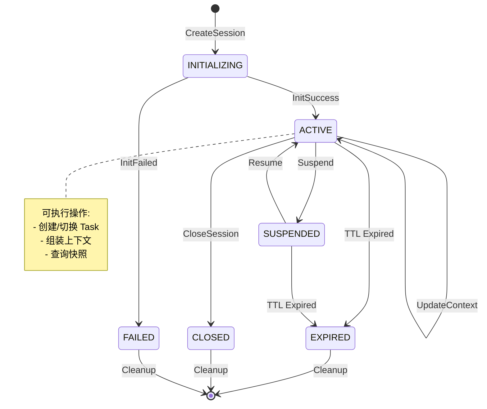
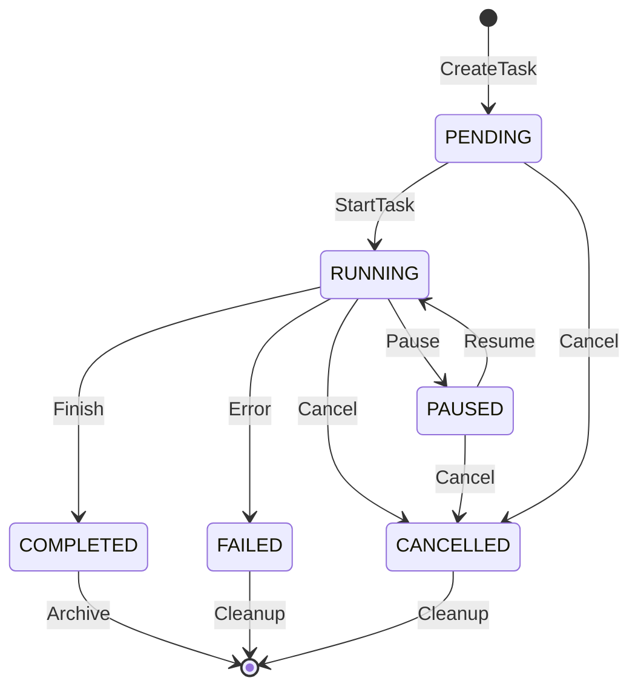
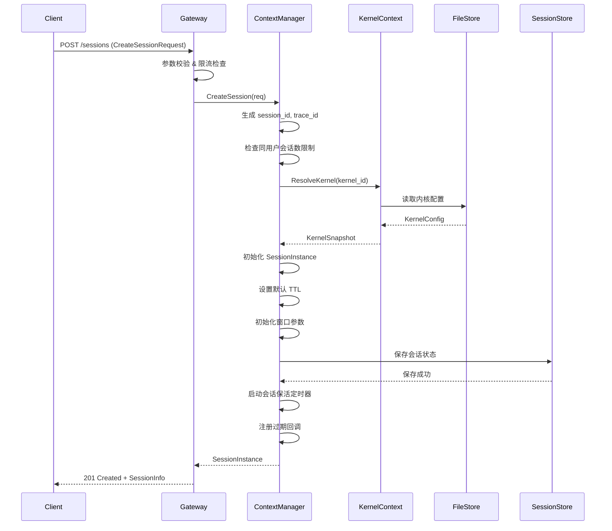
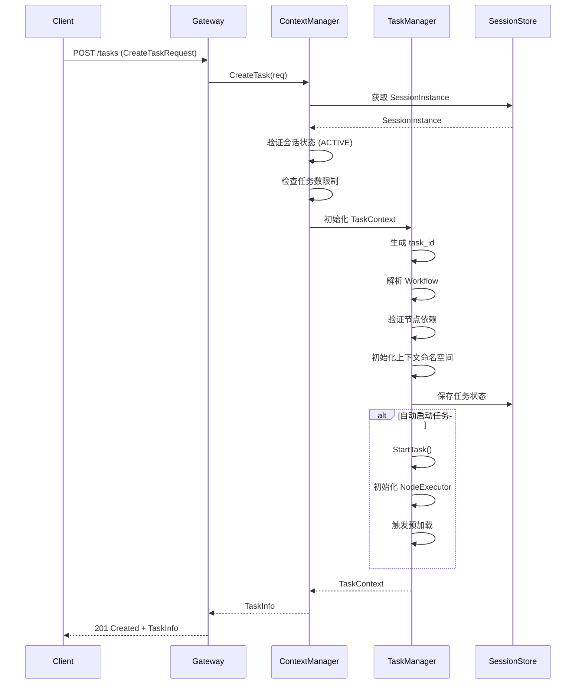
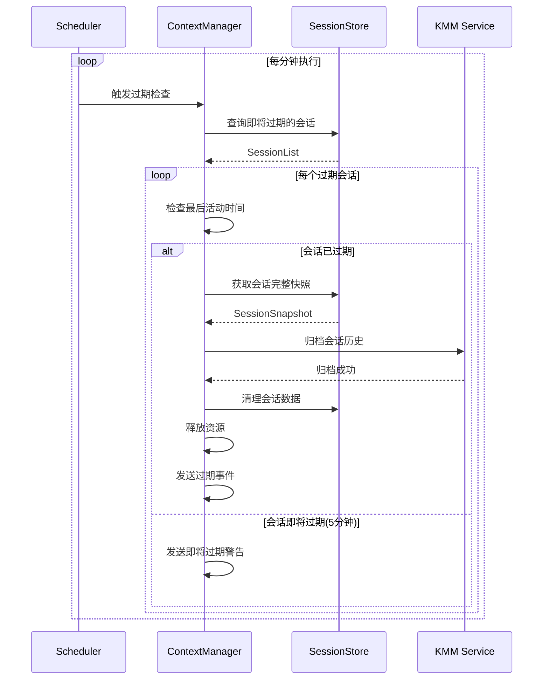
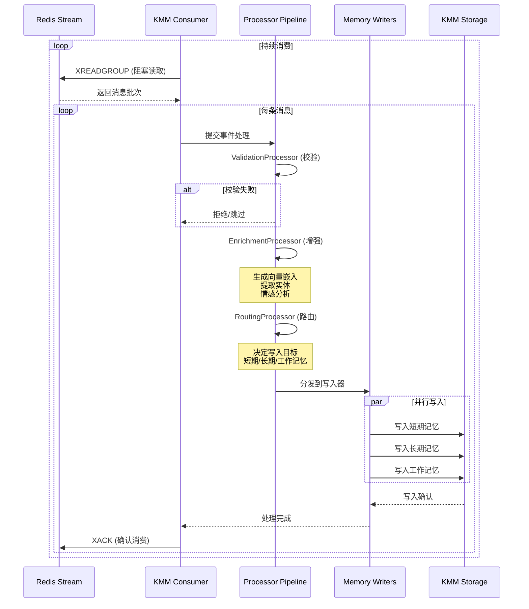
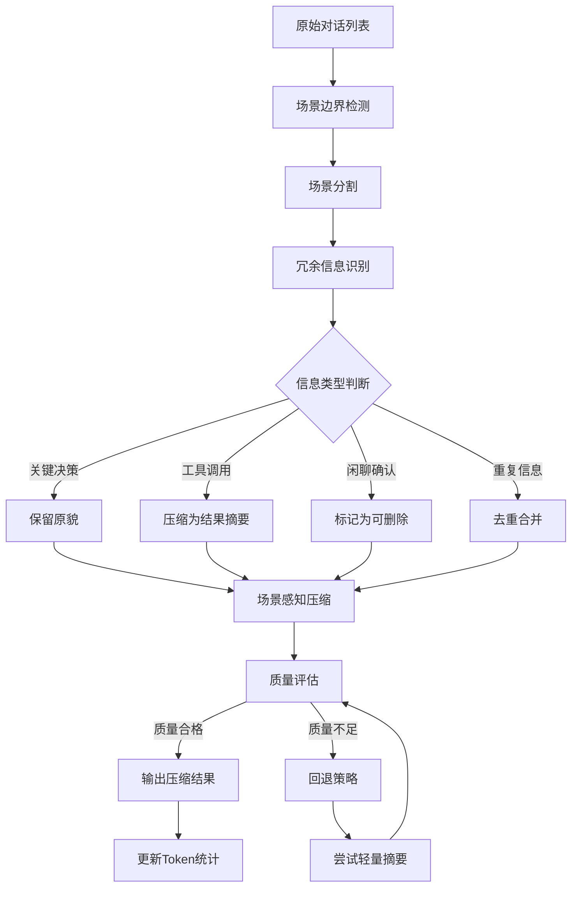
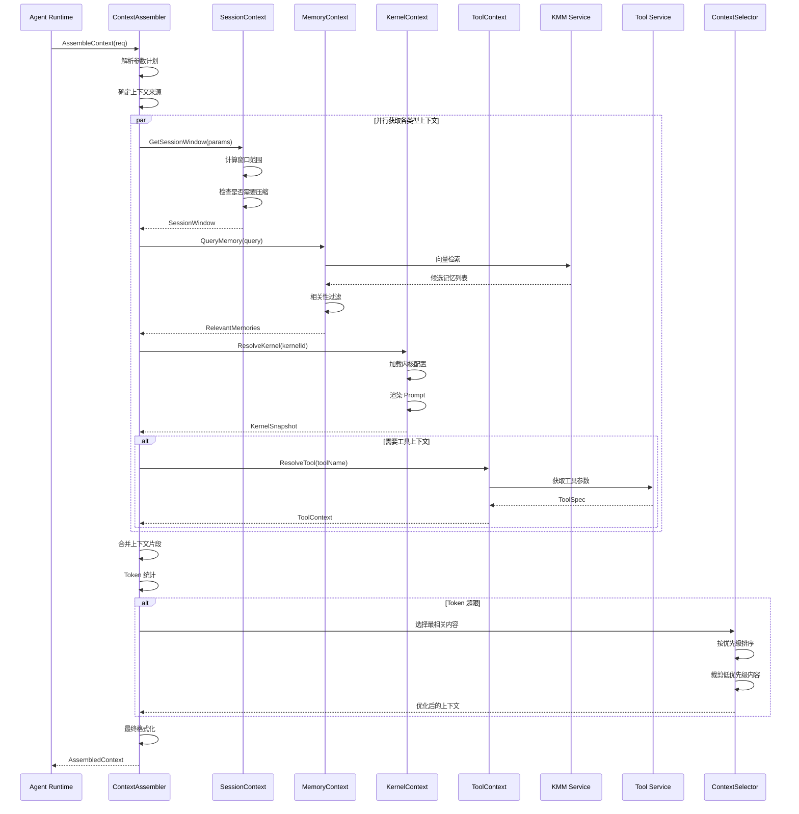

  ---------------------------------------------------------------
             **基础问答支持上下文管理-需求分析说明书**
  ---------------------------------------------------------------
                      

  ---------------------------------------------------------------

# 封面 {#封面 .Heading1-No-Number}

1.  

  -----------------------------------------------------------------------
  拟制              金立锋            日期              2026/3/3
  ----------------- ----------------- ----------------- -----------------
  审批                                日期              

  批准                                日期              

  签发                                                  
  -----------------------------------------------------------------------

# 修订记录 {#修订记录 .Heading1-No-Number}

修订记录

  -----------------------------------------------------------------------
  日期↵             修订版本↵         修改描述↵         作者↵
  ----------------- ----------------- ----------------- -----------------
  2026/03/03        1.0               设计初稿          金立锋 00799396

                                                        
  -----------------------------------------------------------------------

# 关键词 {#关键词 .Heading1-No-Number}

1、上下文

2、上下文压缩

3、上下文问答

4、基础问答

# 摘要 {#摘要 .Heading1-No-Number}

本文档设计Context Service 是
作为Agent系统中的元能力，为基础问答的Agent提供问答过程中调用模型前的上下文填充能力，保证基础问答在多轮对话过程中不"断片"，多轮对话意图识别准确率不下降，可以处理多轮对话中的矛盾信息。重点包含基础问答过程中的意图转折、前后矛盾、指代消解、50轮对话过程中时间和准确率不下降

# 术语及缩略语 {#术语及缩略语 .Heading1-No-Number}

| 术语 | 英文 | 说明 |
|------|------|------|
| **Session Context** | Session Context | 单次 Session 内的运行时动态状态，包含对话历史、会话窗口等实时数据 |
| **Memory Context** | Memory Context | 跨 Session 的长期记忆与用户画像，包括长期记忆、历史会话压缩结果等 |
| **Kernel Context** | Kernel Context | Agent 能力定义与执行策略，包含 Prompt、Skills、MCP 与策略配置 |
| **Tool Context** | Tool Context | 工具参数与工具结果的上下文化表示 |
| **Context Manager** | Context Manager | 会话实例与流程步骤状态管理组件 |
| **Context Assembler** | Context Assembler | 多源上下文组装与裁剪执行组件 |
| **Context Compressor** | Context Compressor | 上下文压缩组件，负责减少历史会话的 Token 占用 |
| **Context Selector** | Context Selector | 上下文选择组件，负责从候选内容中选择最相关的上下文 |
| **KMM** | Knowledge Memory Management | 知识记忆管理服务 |
| **Token Budget** | Token Budget | 模型调用可用的 token 预算 |
| **Degrade** | Degrade | 当南向依赖不可用时，降级返回最小可用上下文 |
| **Compression Ratio** | Compression Ratio | 压缩率，表示压缩后 Token 数与原始 Token 数的比例 |
| **AgentContext** | AgentContext | C++ SDK 核心类，业务 Agent 通过该类与 Context Service 交互 |
| **Workflow** | Workflow | 工作流定义，描述 Agent 执行流程及各节点所需上下文 |
| **ContextPackage** | ContextPackage | 上下文包，包含完整的模型输入上下文信息 |
| **DataBus** | DataBus | 消息总线服务，用于 Agent 服务与 KMM 服务间的数据同步 |

# 参考资料 {#参考资料 .Heading1-No-Number}

1. 《Agent 上下文服务软件架构需求说明书》(Context Service Architecture Specification)
2. 《Context Service 设计理念与原则》(Context Design Principles)
3. 《KMM 知识记忆服务接口规范》(KMM Service API Specification)
4. 《Agent Runtime 开发框架规范》(Agent Runtime Framework Specification)
5. 《基础问答业务需求规格说明书》(Basic Q&A Business Requirements)

# 目 录 {#目-录 .Contents}

[封面 [ii](#封面)](#封面)

[修订记录 [iii](#修订记录)](#修订记录)

[关键词 [iv](#关键词)](#关键词)

[摘要 [v](#摘要)](#摘要)

[术语及缩略语 [vi](#术语及缩略语)](#术语及缩略语)

[参考资料 [vii](#参考资料)](#参考资料)

[1 简介 [12](#简介)](#简介)

[1.1 目的 [12](#目的)](#目的)

[1.2 范围 [12](#范围)](#范围)

[1.3 术语及缩略语 [13](#术语及缩略语-1)](#术语及缩略语-1)

[1.4 假设和约束 [13](#假设和约束)](#假设和约束)

[1.4.1 出口管制 [13](#出口管制)](#出口管制)

[1.4.2 其它假设和约束 [13](#其它假设和约束)](#其它假设和约束)

[1.5 竞争分析 [13](#竞争分析)](#竞争分析)

[1.6 价值 [13](#价值)](#价值)

[1.7 参考资料V2 [13](#参考资料v2)](#参考资料v2)

[2 系统上下文 [13](#系统上下文)](#系统上下文)

[2.1 特性上下文 [13](#特性上下文)](#特性上下文)

[2.2 接口描述 [14](#接口描述)](#接口描述)

[2.3 分析思路 [15](#分析思路)](#分析思路)

[3 特性分析（可选） [15](#特性分析可选)](#特性分析可选)

[3.1 特性影响分析 [15](#特性影响分析)](#特性影响分析)

[4 需求场景分析 [15](#需求场景分析)](#需求场景分析)

[4.1 场景识别 [15](#场景识别)](#场景识别)

[4.2 场景列表 [15](#场景列表)](#场景列表)

[4.3 结构化IR [15](#结构化ir)](#结构化ir)

[5 功能性需求分析 [19](#功能性需求分析)](#功能性需求分析)

[6 非功能性需求分析 [19](#非功能性需求分析)](#非功能性需求分析)

[6.1 威胁分析 [19](#威胁分析)](#威胁分析)

[6.2 资料影响分析 [19](#资料影响分析)](#资料影响分析)

[7 VSR202603031414000001 基础问答支持上下文管理
[19](#vsr202603031414000001-基础问答支持上下文管理)](#vsr202603031414000001-基础问答支持上下文管理)

[7.1 设计约束 [19](#设计约束)](#设计约束)

[7.2 系统功能性规格设计 [19](#系统功能性规格设计)](#系统功能性规格设计)

[7.2.1 逻辑架构分析 [19](#逻辑架构分析)](#逻辑架构分析)

[7.2.2 部署结构设计部分 [19](#部署结构设计部分)](#部署结构设计部分)

[7.2.2.1 XXX架构形态下的部署结构设计
[19](#xxx架构形态下的部署结构设计)](#xxx架构形态下的部署结构设计)

[7.2.3 关键数据定义和依赖关系描述
[19](#关键数据定义和依赖关系描述)](#关键数据定义和依赖关系描述)

[7.2.4 关键机制 [19](#关键机制)](#关键机制)

[7.2.5 功能性规格设计 [19](#功能性规格设计)](#功能性规格设计)

[7.3 系统非功能性设计与规格
[19](#系统非功能性设计与规格)](#系统非功能性设计与规格)

[7.3.1 系统可靠性/可用性/ Safety需求设计
[19](#系统可靠性可用性-safety需求设计)](#系统可靠性可用性-safety需求设计)

[7.3.1.1 可靠性系统指标设计
[19](#可靠性系统指标设计)](#可靠性系统指标设计)

[7.3.1.1.1 可靠性建模预计 [19](#可靠性建模预计)](#可靠性建模预计)

[7.3.1.1.2 系统可靠性系统FMEA分析
[19](#系统可靠性系统fmea分析)](#系统可靠性系统fmea分析)

[7.3.1.1.3 其它可靠性设计指标
[19](#其它可靠性设计指标)](#其它可靠性设计指标)

[7.3.1.2 Safety系统指标设计
[19](#safety系统指标设计)](#safety系统指标设计)

[7.3.1.2.1 Safety失效率预计 [19](#safety失效率预计)](#safety失效率预计)

[7.3.1.2.2 FMEDA分析 [19](#fmeda分析)](#fmeda分析)

[7.3.1.2.3 CCA共因分析 [19](#cca共因分析)](#cca共因分析)

[7.3.1.2.4 功能安全度量指标 [19](#功能安全度量指标)](#功能安全度量指标)

[7.3.1.3 冗余设计 [19](#冗余设计)](#冗余设计)

[7.3.1.4 故障管理设计 [19](#故障管理设计)](#故障管理设计)

[7.3.1.5 过载控制设计 [19](#过载控制设计)](#过载控制设计)

[7.3.1.6 升级不中断业务设计
[19](#升级不中断业务设计)](#升级不中断业务设计)

[7.3.1.7 人因差错设计 [19](#人因差错设计)](#人因差错设计)

[7.3.1.8 故障预测预防设计 [19](#故障预测预防设计)](#故障预测预防设计)

[7.3.1.9 硬件容错设计 [20](#硬件容错设计)](#硬件容错设计)

[7.3.2 系统安全/韧性/隐私需求设计
[20](#系统安全韧性隐私需求设计)](#系统安全韧性隐私需求设计)

[7.3.2.1 系统安全可信设计目标
[20](#系统安全可信设计目标)](#系统安全可信设计目标)

[7.3.2.2 安全/韧性/隐私系统设计
[20](#安全韧性隐私系统设计)](#安全韧性隐私系统设计)

[7.3.2.2.1 认证与权限控制设计
[20](#认证与权限控制设计)](#认证与权限控制设计)

[7.3.2.3 系统可信保护设计 [20](#系统可信保护设计)](#系统可信保护设计)

[7.3.2.3.1 设计思想 [20](#设计思想)](#设计思想)

[7.3.2.3.2 功能介绍 [20](#功能介绍)](#功能介绍)

[7.3.2.3.3 功能实现原理和行为描述
[20](#功能实现原理和行为描述)](#功能实现原理和行为描述)

[7.3.2.4 安全隔离设计 [20](#安全隔离设计)](#安全隔离设计)

[7.3.2.4.1 设计思想 [20](#设计思想-1)](#设计思想-1)

[7.3.2.4.2 功能介绍 [20](#功能介绍-1)](#功能介绍-1)

[7.3.2.4.3 功能实现原理和行为描述
[20](#功能实现原理和行为描述-1)](#功能实现原理和行为描述-1)

[7.3.2.4.4 SR分解 [20](#sr分解)](#sr分解)

[7.3.2.5 数据保护设计 [20](#数据保护设计)](#数据保护设计)

[7.3.2.5.1 设计思想 [20](#设计思想-2)](#设计思想-2)

[7.3.2.5.2 功能介绍 [20](#功能介绍-2)](#功能介绍-2)

[7.3.2.5.3 功能实现原理和行为描述
[20](#功能实现原理和行为描述-2)](#功能实现原理和行为描述-2)

[7.3.2.5.4 SR分解 [20](#sr分解-1)](#sr分解-1)

[7.3.2.6 韧性（含安全检测响应）设计
[20](#韧性含安全检测响应设计)](#韧性含安全检测响应设计)

[7.3.2.6.1 设计思想 [20](#设计思想-3)](#设计思想-3)

[7.3.2.6.2 功能介绍 [20](#功能介绍-3)](#功能介绍-3)

[7.3.2.6.3 功能实现原理和行为描述
[20](#功能实现原理和行为描述-3)](#功能实现原理和行为描述-3)

[7.3.2.6.4 SR分解 [20](#sr分解-2)](#sr分解-2)

[7.3.2.7 安全管理设计 [20](#安全管理设计)](#安全管理设计)

[7.3.2.7.1 设计思想 [20](#设计思想-4)](#设计思想-4)

[7.3.2.7.2 功能介绍 [20](#功能介绍-4)](#功能介绍-4)

[7.3.2.7.3 功能实现原理和行为描述
[21](#功能实现原理和行为描述-4)](#功能实现原理和行为描述-4)

[7.3.2.7.4 SR分解 [21](#sr分解-3)](#sr分解-3)

[7.3.2.8 安全部署设计 [21](#安全部署设计)](#安全部署设计)

[7.3.2.8.1 设计思想 [21](#设计思想-5)](#设计思想-5)

[7.3.2.8.2 功能介绍 [21](#功能介绍-5)](#功能介绍-5)

[7.3.2.8.3 功能实现原理和行为描述
[21](#功能实现原理和行为描述-5)](#功能实现原理和行为描述-5)

[7.3.2.8.4 SR分解 [21](#sr分解-4)](#sr分解-4)

[7.3.2.9 隐私保护设计 [21](#隐私保护设计)](#隐私保护设计)

[7.3.2.9.1 设计思想 [21](#设计思想-6)](#设计思想-6)

[7.3.2.9.2 功能介绍 [21](#功能介绍-6)](#功能介绍-6)

[7.3.2.9.3 功能实现原理和行为描述
[21](#功能实现原理和行为描述-6)](#功能实现原理和行为描述-6)

[7.3.2.9.4 SR分解 [21](#sr分解-5)](#sr分解-5)

[7.3.2.10 漏洞修补方案设计 [21](#漏洞修补方案设计)](#漏洞修补方案设计)

[7.3.3 系统生命周期需求设计(DFLC)
[21](#系统生命周期需求设计dflc)](#系统生命周期需求设计dflc)

[7.3.3.1 产品系统生命周期设计
[21](#产品系统生命周期设计)](#产品系统生命周期设计)

[7.3.3.1.1 整机生命周期设计指标
[21](#整机生命周期设计指标)](#整机生命周期设计指标)

[7.3.3.1.2 数据销毁设计 [21](#数据销毁设计)](#数据销毁设计)

[7.3.3.2 单板生命周期设计 [21](#单板生命周期设计)](#单板生命周期设计)

[7.3.3.2.1 单板兼容性设计 [21](#单板兼容性设计)](#单板兼容性设计)

[7.3.3.2.2 单板硬件资源预留能力：
[21](#单板硬件资源预留能力)](#单板硬件资源预留能力)

[7.3.3.3 器件生命周期设计 [21](#器件生命周期设计)](#器件生命周期设计)

[7.3.3.3.1 IC类器件选型及供应期
[21](#ic类器件选型及供应期)](#ic类器件选型及供应期)

[7.3.3.3.2 存储类器件寿命设计
[21](#存储类器件寿命设计)](#存储类器件寿命设计)

[7.3.3.3.3 易损件寿命设计要求
[21](#易损件寿命设计要求)](#易损件寿命设计要求)

[7.3.3.4 网管生命周期设计 [21](#网管生命周期设计)](#网管生命周期设计)

[7.3.3.4.1 客户界面软件可替换单元的识别与定义
[21](#客户界面软件可替换单元的识别与定义)](#客户界面软件可替换单元的识别与定义)

[7.3.3.4.2 硬件模块生命周期匹配单板生命周期
[21](#硬件模块生命周期匹配单板生命周期)](#硬件模块生命周期匹配单板生命周期)

[7.3.4 性能 [21](#性能)](#性能)

[7.3.5 可服务性 [21](#可服务性)](#可服务性)

[7.3.6 可测试性 [22](#可测试性)](#可测试性)

[7.3.7 可采购性 [22](#可采购性)](#可采购性)

[7.3.8 可供应性 [22](#可供应性)](#可供应性)

[7.3.9 可制造性 [22](#可制造性)](#可制造性)

[7.3.10 被集成场景的可扩展性
[22](#被集成场景的可扩展性)](#被集成场景的可扩展性)

[7.3.11 节能减排 [22](#节能减排)](#节能减排)

[7.3.12 易用性 [22](#易用性)](#易用性)

[7.3.13 易学习性 [22](#易学习性)](#易学习性)

[7.3.14 AI子系统设计 [22](#ai子系统设计)](#ai子系统设计)

[7.3.14.1 数据集处理设计 [22](#数据集处理设计)](#数据集处理设计)

[7.3.14.2 训练模块设计 [22](#训练模块设计)](#训练模块设计)

[7.3.14.3 推理模块设计 [22](#推理模块设计)](#推理模块设计)

[7.3.14.4 集成设计方案 [22](#集成设计方案)](#集成设计方案)

[7.3.15 其它需求 [22](#其它需求)](#其它需求)

[7.3.15.1 成本 [22](#成本)](#成本)

[7.3.15.2 License [22](#license)](#license)

[7.3.15.3 资料 [22](#资料)](#资料)

[7.3.15.4 其它 [22](#其它)](#其它)

[8 系统需求列表 [22](#系统需求列表)](#系统需求列表)

[9 功能实现设计 [28](#功能实现设计)](#功能实现设计)

[9.1 SR20260303641763 【功能】上下文支持Agent级别上下文生命周期管理
[28](#sr20260303641763-功能上下文支持agent级别上下文生命周期管理)](#sr20260303641763-功能上下文支持agent级别上下文生命周期管理)

[9.2 SR20260303641431 【功能】KMM支持上下文写入
[28](#sr20260303641431-功能kmm支持上下文写入)](#sr20260303641431-功能kmm支持上下文写入)

[9.3 SR20260303642237 【功能】支持上下文压缩
[28](#sr20260303642237-功能支持上下文压缩)](#sr20260303642237-功能支持上下文压缩)

[9.4 SR20260303641682 【功能】上下文组装
[28](#sr20260303641682-功能上下文组装)](#sr20260303641682-功能上下文组装)

[9.5 SR20260303642151 【功能】提供上下文查询接口
[28](#sr20260303642151-功能提供上下文查询接口)](#sr20260303642151-功能提供上下文查询接口)

[9.6 SR20260303641801 【性能】上下文服务满足性能要求
[28](#sr20260303641801-性能上下文服务满足性能要求)](#sr20260303641801-性能上下文服务满足性能要求)

[9.7 SR20260303642351 【可维】上下文服务可维护性能力构筑
[28](#sr20260303642351-可维上下文服务可维护性能力构筑)](#sr20260303642351-可维上下文服务可维护性能力构筑)

[9.8 SR20260303641826 【构建】上下文服务构建
[28](#sr20260303641826-构建上下文服务构建)](#sr20260303641826-构建上下文服务构建)

[9.9 SR20260303642303 【模型】上下文依赖的模型包发布
[28](#sr20260303642303-模型上下文依赖的模型包发布)](#sr20260303642303-模型上下文依赖的模型包发布)

[9.10 SR20260303641929 【部署】上下文服务支持部署
[28](#sr20260303641929-部署上下文服务支持部署)](#sr20260303641929-部署上下文服务支持部署)

[9.11 SR20260303642455 【部署】模型包部署
[28](#sr20260303642455-部署模型包部署)](#sr20260303642455-部署模型包部署)

[9.12 SR20260303642638 【可测试性】上下文服务可测试性能力构筑
[28](#sr20260303642638-可测试性上下文服务可测试性能力构筑)](#sr20260303642638-可测试性上下文服务可测试性能力构筑)

[9.13 SR20260303642471 【记忆】上下文按需召回记忆
[28](#sr20260303642471-记忆上下文按需召回记忆)](#sr20260303642471-记忆上下文按需召回记忆)

[9.14 SR20260303643137 【适配】垂域Agent适配上下文能力
[28](#sr20260303643137-适配垂域agent适配上下文能力)](#sr20260303643137-适配垂域agent适配上下文能力)

[10 分配需求列表 [28](#分配需求列表)](#分配需求列表)

# 简介

## 目的

1\. 保证基础问答50轮对话，意图识别准确率依旧保证 \>
90%（对比开放式单一图准最多下降8个点，历史指标98%）

2\. 保证50轮对话，多意图识别准确率(3个）（历史指标90%，多意图识别准确率
\> 85%）


## 范围

本文主要描述了基础问答场景支持上下文能力，主要范围如下表：

+------------------+------------------------------+--------------------------------------------------------+
| 场景             | 范围                         | 描述                                                   |
+==================+==============================+========================================================+
| **功能性需求**   | **核心功能**                 | 1、支持上下文数据写入                                  |
|                  |                              |                                                        |
|                  |                              | 2、支持上下文查询                                      |
|                  |                              |                                                        |
|                  |                              | 3、支持上下文压缩                                      |
|                  |                              |                                                        |
|                  |                              | 4、支持动态上下文提前组装                              |
|                  |                              |                                                        |
|                  |                              | 5、支持记忆召回能力                                    |
|                  +------------------------------+--------------------------------------------------------+
|                  | **扩展功能**（生命周期管理） | 上下文服务生命周期管理（安装，卸载，进程拉起等）       |
|                  +------------------------------+--------------------------------------------------------+
|                  | **扩展功能**（部署）         | 支持单节点，服务部署形态为N-way                        |
|                  |                              |                                                        |
|                  |                              | 部署支持边缘裸机、虚机场景部署                         |
|                  |                              |                                                        |
|                  |                              | 支持arm操作系统部署（不支持x86）                       |
|                  +------------------------------+--------------------------------------------------------+
|                  | **扩展功能**（构建）         | 支持发布记忆Agent插件包                                |
|                  +------------------------------+--------------------------------------------------------+
|                  | **扩展功能**（通信）         | 支持IPV4                                               |
|                  |                              |                                                        |
|                  |                              | 业务通信走Fabric网络且使用CoreMesh通信？               |
+------------------+------------------------------+--------------------------------------------------------+
| **非功能性需求** | **可靠性**                   | 记忆服务内进程生命周期管理 -                           |
|                  |                              | 可靠性机制(资源检测管理、故障检测、多进程故障自愈联动) |
|                  +------------------------------+--------------------------------------------------------+
|                  | **安全性**                   | 上下文服务基础安全能力补齐                             |
|                  +------------------------------+--------------------------------------------------------+
|                  | **性能**                     | 上下文检索时延\<300ms                                  |
|                  +------------------------------+--------------------------------------------------------+
|                  | **可服务性**                 | 支持有损升级。                                         |
+------------------+------------------------------+--------------------------------------------------------+
| **关键依赖**     | **上游依赖**                 | 无                                                     |
|                  +------------------------------+--------------------------------------------------------+
|                  | **框架依赖**                 | Agent开发框架支持低码化框架和Agent发布包方式。         |
+------------------+------------------------------+--------------------------------------------------------+

## 术语及缩略语

List of abbreviations 缩略语清单：

+-----------------------+-----------------------+--------------------------+
| Abbreviations         | Full spelling         | Chinese explanation      |
|                       |                       |                          |
| 缩略语                | 英文全名              | 中文解释                 |
+=======================+=======================+==========================+
| Context Service       | Context Service       | 上下文服务               |
+-----------------------+-----------------------+--------------------------+
| KMM                   | Knowledge and Memory  | 知识和记忆管理，归属AISF |
|                       | Manager               |                          |
+-----------------------+-----------------------+--------------------------+

## 假设和约束

### 出口管制

### 其它假设和约束

## 竞争分析

## 价值

## 参考资料V2

# 系统上下文

## 特性上下文

**系统边界**

- **系统内**：

<!-- -->

- 会话实例与流程步骤状态管理

- 上下文窗口信息填充与组装

- 内核上下文版本管理与加载

- 工具上下文参数填充与结果治理

- 上下文治理能力（过期、回收、审计日志、降级控制）

- 快照查询、回放与调试接口

<!-- -->

- **系统外**：

<!-- -->

- KMM 知识记忆服务

- 工具服务

- 模型服务

- Agent服务


## 接口描述

**外部接口清单**

  ----------------------------------------------------------------------------------------------------------------------
  接口           方向           协议           数据格式       说明
  -------------- -------------- -------------- -------------- ----------------------------------------------------------
  Gateway API    入             HTTP REST      JSON           北向业务接口：会话初始化、上下文组装、快照查询、内核解析

  CLI            入             命令行         \-             运维与调试入口（Phase 2）

  Local Context  入             C++            参数           北向的业务接口：创建上下文实例，获取上下文内容
  Cache                                                       
  ----------------------------------------------------------------------------------------------------------------------

## 分析思路

# 特性分析（可选）

## 特性影响分析

  -------------------------------------------------------------------------------
  初始需求                 是否涉及关联特性   特性名称          说明
  ------------------------ ------------------ ----------------- -----------------
  基础问答支持上下文管理   NA                 NA                NA

  -------------------------------------------------------------------------------

  ------------------------------------------------------------------------
  初始需求                 是否涉及互斥特性        分析说明
  ------------------------ ----------------------- -----------------------
  基础问答支持上下文管理   NA                      NA

  ------------------------------------------------------------------------

# 需求场景分析

## 场景识别

## 场景列表

  -----------------------------------------------------------------------------------------------------------------
  场景名称     参与者   活动         生命周期   影响因素               业务编号           场景描述   场景影响描述
  ------------ -------- ------------ ---------- ---------------------- ------------------ ---------- --------------
  对话上下文   用户     对话上下文              业务空间/云侧/上下文   CJ20260227004364              

  -----------------------------------------------------------------------------------------------------------------

## 结构化IR

+----------------------+---------------------------------------------------------------------------------------------------------------------------------+-----------------------+
| 设计资产             | 描述                                                                                                                            | owner                 |
+======================+=================================================================================================================================+=======================+
| IR标识               | IR20260225000160                                                                                                                | MKT                   |
+----------------------+---------------------------------------------------------------------------------------------------------------------------------+-----------------------+
| 名称                 | 基础问答支持上下文管理                                                                                                          | MKT                   |
+----------------------+---------------------------------------------------------------------------------------------------------------------------------+-----------------------+
| 描述                 | 【需求场景】基础问答支持上下文管理                                                                                              | MKT                   |
|                      |                                                                                                                                 |                       |
|                      | 场景1：                                                                                                                         |                       |
|                      |                                                                                                                                 |                       |
|                      | 1\. 前置条件： 基础问答支持攻略内容                                                                                             |                       |
|                      |                                                                                                                                 |                       |
|                      | 2\. 对话："本周一去西安旅游"，...... 经过多轮对话后，"帮我做个旅游攻略"，意图执行"西安的旅游攻略"                               |                       |
|                      |                                                                                                                                 |                       |
|                      | 3\. 执行结果：可以准确识别"旅游攻略"指定的上下文中的"西安"                                                                      |                       |
|                      |                                                                                                                                 |                       |
|                      | 场景2：（处理矛盾信息）                                                                                                         |                       |
|                      |                                                                                                                                 |                       |
|                      | 1\. 前置条件：第3轮对话提到"帮我记住我住火星......"                                                                             |                       |
|                      |                                                                                                                                 |                       |
|                      | 2\. 第15轮对话："我昨天搬家到月球，新家很宽敞"； 第20轮对话："打车回家"                                                         |                       |
|                      |                                                                                                                                 |                       |
|                      | 3\. 执行结果：记忆修正家庭住址为"月球"，打车回家目的地只为"月球"                                                                |                       |
|                      |                                                                                                                                 |                       |
|                      | 场景:3：                                                                                                                        |                       |
|                      |                                                                                                                                 |                       |
|                      | 1\. 前置条件： 基础问答支持攻略内容                                                                                             |                       |
|                      |                                                                                                                                 |                       |
|                      | 2\. 对话："帮我推荐周星驰电影"，20轮对话后，"推荐刘德华电话""再换一批"                                                          |                       |
|                      |                                                                                                                                 |                       |
|                      | 3\. 执行结果，针对刘德华电影实现"换一批"                                                                                        |                       |
|                      |                                                                                                                                 |                       |
|                      | 【需求描述】                                                                                                                    |                       |
|                      |                                                                                                                                 |                       |
|                      | 0\. 1轮对话定义：1问1答算1轮对话                                                                                                |                       |
|                      |                                                                                                                                 |                       |
|                      | 2\. 50轮对话，意图识别准确率依旧保证 &gt;                                                                                       |                       |
|                      | 90%（对比开放式单一图准最多下降8个点，历史指标98%）(C\^3-Bench评测集80%（chat-gpt，80.7%）                                      |                       |
|                      |                                                                                                                                 |                       |
|                      | 3\. 50轮对话，多意图识别准确率(3个）（历史指标90%，多意图识别准确率 &gt; 85%）                                                  |                       |
|                      |                                                                                                                                 |                       |
|                      | 竞争要素：                                                                                                                      |                       |
|                      |                                                                                                                                 |                       |
|                      | 1\. 50轮对话中出现矛盾冲突的内容，能够识别并及时纠错。准确率 &gt; 85%(CDConv测试集， SOTA 80%)                                  |                       |
|                      |                                                                                                                                 |                       |
|                      | 所有内容有公开测试集，也需要有自建测试集                                                                                        |                       |
|                      |                                                                                                                                 |                       |
|                      | 2\. 50轮对话，针对公开测试集评分， 基于上下文识别多条推理、单跳推理、时间推理。意图识别准确率 &gt;                              |                       |
|                      | 85%（过程性指标）（LoCoMo，sota：92%）                                                                                          |                       |
|                      |                                                                                                                                 |                       |
|                      | 【需求价值】                                                                                                                    |                       |
|                      |                                                                                                                                 |                       |
|                      | 多轮对话意图识别准确率不下降，可以处理多轮对话中的矛盾信息                                                                      |                       |
|                      |                                                                                                                                 |                       |
|                      | 【解决方案需求分解】                                                                                                            |                       |
|                      |                                                                                                                                 |                       |
|                      | 1、SystemAgent支持重建上下文，用于任务分解\-\-\-\--6                                                                            |                       |
|                      |                                                                                                                                 |                       |
|                      | 2、SystemAgent支持重建上下文，用于携带必选信息给ServiceAgent\-\-\-\--8人月                                                      |                       |
|                      |                                                                                                                                 |                       |
|                      | 3、SystemAgent支持意图变换，转折意图，话题切换等\-\-\--4人月                                                                    |                       |
|                      |                                                                                                                                 |                       |
|                      | 4、SystemAgent的上下文中，中间过程某句话也支持多意图分解\-\-\-\--6人月                                                          |                       |
|                      |                                                                                                                                 |                       |
|                      | 5、KMM Agent短期记忆支持语义，KW和向量检索，工具使用提参后缺少参数，优先从短期上下文和长期记忆中获取，短期上下文检索时延 &lt;   |                       |
|                      | 300ms \-\-\-\-\-\-\-\-\-\-\-\-\-\-\-\-\--KMM 6人月                                                                              |                       |
+----------------------+---------------------------------------------------------------------------------------------------------------------------------+-----------------------+
| RR标识               |                                                                                                                                 | MKT                   |
+----------------------+---------------------------------------------------------------------------------------------------------------------------------+-----------------------+
| 优先级               |                                                                                                                                 | MKT                   |
+----------------------+---------------------------------------------------------------------------------------------------------------------------------+-----------------------+
| Who                  | 用户                                                                                                                            | SE,MKT                |
+----------------------+---------------------------------------------------------------------------------------------------------------------------------+-----------------------+
| What                 | 对话上下文                                                                                                                      | SE                    |
+----------------------+---------------------------------------------------------------------------------------------------------------------------------+-----------------------+
| Why                  |                                                                                                                                 | SE                    |
+----------------------+---------------------------------------------------------------------------------------------------------------------------------+-----------------------+
| When                 |                                                                                                                                 | SE                    |
+----------------------+---------------------------------------------------------------------------------------------------------------------------------+-----------------------+
| Where                |                                                                                                                                 | SE                    |
+----------------------+---------------------------------------------------------------------------------------------------------------------------------+-----------------------+
| How                  |                                                                                                                                 | SE                    |
+----------------------+---------------------------------------------------------------------------------------------------------------------------------+-----------------------+
| How much             |                                                                                                                                 | SE                    |
+----------------------+---------------------------------------------------------------------------------------------------------------------------------+-----------------------+
| 类别                 |                                                                                                                                 | SE                    |
+----------------------+---------------------------------------------------------------------------------------------------------------------------------+-----------------------+
| 场景列表             | 对话上下文                                                                                                                      | SE                    |
+----------------------+---------------------------------------------------------------------------------------------------------------------------------+-----------------------+
| 系统接口定义(可选)   | 设备间接口定义，或用户接口定义（命令行、告警等），需求分析阶段可以粗略定义有哪些用户接口；但具体的命令行设计、告警设计应当是TR2 | SE                    |
|                      | 设计阶段的内容                                                                                                                  |                       |
+----------------------+---------------------------------------------------------------------------------------------------------------------------------+-----------------------+

# 功能性需求分析

## 核心功能需求

### FR1: 上下文数据写入
- **需求描述**: Agent 服务通过 DataBus 将对话数据写入上下文服务，支持实时数据同步
- **优先级**: P0
- **验收标准**:
  - 支持 HTTP REST API 写入
  - 支持 C++ SDK 本地缓存写入
  - 写入延迟 < 50ms

### FR2: 上下文查询
- **需求描述**: 支持按 session_id、agent_id 查询组装后的上下文，用于模型调用
- **优先级**: P0
- **验收标准**:
  - 查询响应时间 < 20ms
  - 支持 Token 预算控制
  - 支持降级返回

### FR3: 上下文压缩
- **需求描述**: 对历史对话进行压缩，减少 Token 占用，保持语义完整性
- **优先级**: P0
- **验收标准**:
  - 压缩率 ≥ 30%
  - 压缩耗时 < 100ms
  - 支持多种压缩策略（摘要、向量提取、规则截断等）

### FR4: 上下文组装
- **需求描述**: 支持 Session Context、Memory Context、Kernel Context、Tool Context 的多源组装
- **优先级**: P0
- **验收标准**:
  - 组装耗时 < 200ms（含南向调用）
  - 支持降级处理
  - Token 超限按优先级裁剪

### FR5: 记忆召回
- **需求描述**: 基于当前 Query 召回相关的长期记忆和历史会话
- **优先级**: P0
- **验收标准**:
  - 召回准确率 ≥ 85%
  - 召回耗时 < 50ms
  - 支持语义相似度、时序衰减等多种算法

### FR6: 上下文生命周期管理
- **需求描述**: 支持 Agent 级别、Session 级别、Task 级别的上下文生命周期管理
- **优先级**: P1
- **验收标准**:
  - 支持会话创建、销毁、过期管理
  - 支持子任务(Task)上下文隔离
  - 支持上下文版本控制

## 扩展功能需求

### FR7: C++ SDK 本地缓存
- **需求描述**: 提供 C++ SDK 供业务 Agent 本地缓存上下文，支持异步预加载
- **优先级**: P1
- **验收标准**:
  - 支持 Workflow 驱动的上下文填充
  - 支持节点级上下文预加载
  - 线程安全访问

### FR8: 上下文一致性管理
- **需求描述**: 支持本地缓存与远程服务的缓存一致性
- **优先级**: P1
- **验收标准**:
  - 支持版本向量机制
  - 支持多级一致性级别
  - 冲突检测与解决

# 非功能性需求分析

## 性能需求

| 指标 | 目标值 | 说明 |
|------|--------|------|
| 会话初始化响应时间 | < 50ms | P99 延迟 |
| 上下文组装响应时间 | < 200ms | 含南向调用，P99 |
| 上下文查询响应时间 | < 20ms | P99 |
| 上下文压缩响应时间 | < 100ms | P99 |
| 上下文选择响应时间 | < 50ms | P99 |
| 系统吞吐量 | > 1000 TPS | 单实例 |

## 可靠性需求

| 指标 | 目标值 | 说明 |
|------|--------|------|
| 系统可用性 | ≥ 99.9% | 月度 |
| 错误率 | < 0.1% | 5xx 响应占比 |
| 降级成功率 | > 99% | 南向故障时 |

## 可扩展性需求

- 支持水平扩展（Phase 2）
- 支持插件化扩展（压缩策略、选择算法）
- 预留 CacheAdapter 接口，支持 Redis 替换

## 可维护性需求

- 支持结构化日志输出
- 支持链路追踪（Trace ID）
- 支持健康检查接口
- 支持动态配置更新

## 威胁分析

| 威胁 | 风险等级 | 缓解措施 |
|------|----------|----------|
| 南向依赖故障 | 高 | 降级机制、熔断器 |
| Token 预算超限 | 中 | 优先级裁剪、告警 |
| 缓存不一致 | 中 | 版本向量、一致性协议 |
| 并发访问冲突 | 中 | 读写锁、原子操作 |

## 资料影响分析

本文档影响以下资料：
- 《Agent 上下文服务用户指南》
- 《Agent 上下文服务 API 参考》
- 《Agent 上下文服务运维手册》

# VSR202603031414000001 基础问答支持上下文管理

## 设计约束

### 技术约束
- **开发语言**: Go 1.21+（后端服务）、C++17（本地缓存 SDK）
- **部署环境**: 边缘裸机/虚机，ARM 架构
- **存储**: Phase 1 使用内存存储，预留 Redis 接口
- **通信协议**: HTTP REST/gRPC，支持 IPv4

### 业务约束
- 50 轮对话意图识别准确率 > 90%
- 多意图识别准确率 > 85%
- 支持矛盾信息检测与纠错（准确率 > 85%）

## 系统功能性规格设计

### 逻辑架构分析

系统采用分层单体架构，包含以下层次：

```
┌─────────────────────────────────────────────────────────────┐
│                    L0 本地上下文缓存层（C++ SDK）              │
│                   AgentContext / Async Preloader             │
├─────────────────────────────────────────────────────────────┤
│                    L1 北向业务接口层                          │
│                       Gateway (HTTP/gRPC)                    │
├─────────────────────────────────────────────────────────────┤
│                    L2 组装层                                  │
│                   ContextAssembler                           │
├─────────────────────────────────────────────────────────────┤
│                    L3 管理层                                  │
│                   ContextManager                             │
├─────────────────────────────────────────────────────────────┤
│                    L4 数据层                                  │
│  SessionContext │ MemoryContext │ KernelContext │ ToolContext│
│  ContextCompressor │ ContextSelector                         │
├─────────────────────────────────────────────────────────────┤
│                    L5 南向适配层                              │
│  MemoryAdapter │ FileStore │ CacheAdapter │ ToolAdapter     │
├─────────────────────────────────────────────────────────────┤
│                    L6 基础设施层                              │
│  KMM │ FileSystem │ Cache │ ToolService │ LLM               │
└─────────────────────────────────────────────────────────────┘
```

### 部署结构设计部分

#### 边缘部署架构形态下的部署结构设计

```
┌──────────────────────────────────────────────────────────────┐
│                      边缘节点 (ARM)                           │
│  ┌────────────────────────────────────────────────────────┐  │
│  │              Context Service 服务                       │  │
│  │  ┌──────────┐ ┌──────────┐ ┌──────────┐ ┌──────────┐  │  │
│  │  │ Gateway  │ │Assembler │ │ Manager  │ │ Context  │  │  │
│  │  └──────────┘ └──────────┘ └──────────┘ └──────────┘  │  │
│  └────────────────────────────────────────────────────────┘  │
│                         │                                    │
│  ┌────────────────────────────────────────────────────────┐  │
│  │              Agent 业务进程 (C++ SDK)                   │  │
│  │           ┌──────────────────────┐                     │  │
│  │           │   AgentContext       │                     │  │
│  │           │   - 本地缓存          │                     │  │
│  │           │   - 异步预加载        │                     │  │
│  │           └──────────────────────┘                     │  │
│  └────────────────────────────────────────────────────────┘  │
│                         │                                    │
│  ┌────────────────────────────────────────────────────────┐  │
│  │                  DataBus / Redis                        │  │
│  │              (数据同步，可选部署)                        │  │
│  └────────────────────────────────────────────────────────┘  │
└──────────────────────────────────────────────────────────────┘
```

### 关键数据定义和依赖关系描述

#### 核心实体定义

**SessionInstance（会话实例）**

| 字段 | 类型 | 约束 | 说明 |
|------|------|------|------|
| `session_id` | string | PK | 会话标识，全局唯一 |
| `agent_id` | string | - | Agent 标识 |
| `user_id` | string | - | 用户标识 |
| `kernel_id` | string | FK | 当前使用的内核标识 |
| `status` | enum | - | ACTIVE / EXPIRED / CLOSED |
| `session_version` | int64 | - | 会话版本号，乐观并发控制 |
| `created_at` | datetime | - | 创建时间 |
| `updated_at` | datetime | - | 最后更新时间 |
| `expired_at` | datetime | - | 过期时间 |

**AssembledContext（组装上下文）**

| 字段 | 类型 | 约束 | 说明 |
|------|------|------|------|
| `flow_step_id` | string | PK | 所属步骤 ID |
| `assembled_context` | object | - | 最终模型输入数据 |
| `token_usage` | object | - | Token 统计信息 |
| `degraded` | bool | - | 是否降级 |
| `degrade_reason` | string | - | 降级原因 |
| `assembled_at` | datetime | - | 组装完成时间 |

#### 依赖关系

- SessionInstance 1:N AssembledContext
- SessionInstance 1:1 FlowState
- SessionInstance N:1 KernelSnapshot
- AssembledContext N:M ContextCandidate

### 关键机制

#### 1. 上下文压缩机制

**SmartPruningCompression 策略**

```
输入: 原始历史对话列表
步骤:
1. 场景识别与边界划分
2. 冗余信息识别与标记
3. 场景感知压缩决策
4. 多层级压缩执行
5. 质量评估与补偿
输出: 压缩后的上下文
```

#### 2. 上下文选择机制

**PrecisionRecallSelector 算法**

```
输入: Query, 候选上下文列表
步骤:
1. 查询理解与意图抽取
2. 粗粒度召回（向量检索）
3. 细粒度精确排序
4. 多样性优化
5. 结果组装与输出
输出: 排序后的相关上下文列表
```

#### 3. 缓存一致性机制

**VersionBasedConsistency 协议**

```
L1: 软失效 - 版本号变化但内容未变 → 仅更新版本号
L2: 硬失效 - 版本号与内容均变化 → 重新加载缓存
L3: 强制失效 - 显式失效请求 → 清除缓存并重新加载
```

#### 4. 线程安全机制

**ThreadSafeContextAccess 级别**

- **Level 1**: 线程安全 - 支持多线程并发访问
- **Level 2**: 外部同步 - 需要调用方加锁
- **Level 3**: 回调线程安全 - 回调函数在多线程环境中执行

### 功能性规格设计

## 系统非功能性设计与规格

### 系统可靠性/可用性/ Safety需求设计

#### 可靠性系统指标设计

##### 可靠性建模预计

系统采用单节点部署（Phase 1），无硬件冗余，依赖进程级故障自愈：

| 组件 | MTBF (小时) | MTTR (分钟) | 可用性 |
|------|-------------|-------------|--------|
| Context Service | 720 | 5 | 99.93% |
| C++ SDK (本地缓存) | 8760 | 2 | 99.996% |
| DataBus | 2160 | 3 | 99.86% |

**系统整体可用性目标**: ≥ 99.9%

##### 系统可靠性系统FMEA分析

| 故障模式 | 影响 | 严重程度 | 发生概率 | 检测方法 | 缓解措施 |
|----------|------|----------|----------|----------|----------|
| 南向依赖超时 | 降级返回 | 中 | 中 | 超时检测 | 熔断器、降级 |
| 内存溢出 | 服务崩溃 | 高 | 低 | 资源监控 | 限流、自动重启 |
| 缓存不一致 | 数据错误 | 中 | 低 | 版本校验 | 一致性协议 |
| 并发冲突 | 数据竞争 | 中 | 低 | 锁监控 | 读写锁、原子操作 |

##### 其它可靠性设计指标

- **会话数据持久化**: Phase 1 不持久化，Phase 2 支持 Redis 持久化
- **故障恢复时间**: < 30 秒（进程重启）
- **降级响应率**: > 99%（南向故障时）

#### Safety系统指标设计

本系统不涉及 Safety 相关功能（无硬件控制、无人员安全风险），故无需 Safety 失效率预计、FMEDA 分析和 CCA 共因分析。

#### 冗余设计

Phase 1 无冗余设计，单节点部署。Phase 2 计划支持：
- 多实例部署（N-way）
- Redis 集群（主从复制）

#### 故障管理设计

**故障检测**:
- 健康检查接口: `GET /health`
- 心跳机制: SDK 每 30 秒上报心跳
- 资源监控: CPU、内存、 Goroutine 数

**故障恢复**:
- 进程崩溃: systemd 自动重启
- 内存超限: 触发 GC，必要时重启
- 南向故障: 自动降级，故障恢复后自动恢复

#### 过载控制设计

**限流策略**:
- 令牌桶算法，默认 1000 TPS
- 单 Session 限流: 10 TPS

**背压机制**:
- 队列长度超过阈值时拒绝新请求
- 返回 `429 Too Many Requests`

#### 升级不中断业务设计

Phase 1: 有损升级，升级期间服务中断 < 30 秒
Phase 2: 支持滚动升级（多实例场景）

### 系统安全/韧性/隐私需求设计

#### 系统安全可信设计目标

- 数据传输: 使用 TLS 1.3 加密
- 接口认证: API Key 认证
- 审计日志: 记录所有敏感操作

#### 安全/韧性/隐私系统设计

##### 认证与权限控制设计

**设计思想**:
- 最小权限原则
- 北向接口统一认证
- 南向接口白名单

**功能介绍**:
- Gateway 层统一鉴权
- 支持 API Key、JWT 两种模式
- 支持 RBAC 权限模型（Phase 2）

**功能实现原理和行为描述**:
1. 请求到达 Gateway
2. 提取认证信息（Header: Authorization）
3. 校验 API Key / JWT 签名
4. 解析权限列表
5. 判断是否有权访问目标资源
6. 通过则转发，否则返回 401/403

**SR分解**:
| SR ID | 描述 | 优先级 |
|-------|------|--------|
| SR-SEC-001 | Gateway 统一认证 | P0 |
| SR-SEC-002 | API Key 管理接口 | P1 |
| SR-SEC-003 | 审计日志记录 | P1 |

#### 数据保护设计

**设计思想**:
- 敏感数据加密存储
- 传输过程 TLS 加密
- 定期清理过期数据

**功能介绍**:
- Session 数据内存存储，不持久化到磁盘
- 支持敏感字段脱敏（用户身份证号、手机号等）
- 过期数据自动清理（TTL）

**SR分解**:
| SR ID | 描述 | 优先级 |
|-------|------|--------|
| SR-DP-001 | 敏感数据脱敏 | P1 |
| SR-DP-002 | 过期数据自动清理 | P0 |

### 性能

| 指标 | 目标值 | 测试方法 |
|------|--------|----------|
| 会话初始化 | < 50ms | P99，压力测试 |
| 上下文组装 | < 200ms | P99，含南向调用 |
| 上下文查询 | < 20ms | P99，本地缓存 |
| 上下文压缩 | < 100ms | P99，50轮对话 |
| 上下文选择 | < 50ms | P99，100候选 |
| 系统吞吐 | > 1000 TPS | 单实例 |

### 可服务性

**运维接口**:
- `GET /health` - 健康检查
- `GET /metrics` - Prometheus 指标
- `GET /debug/pprof` - Go 性能分析

**日志规范**:
- 结构化 JSON 日志
- 日志级别: DEBUG/INFO/WARN/ERROR
- 包含 Trace ID、Session ID、Agent ID

**监控告警**:
| 告警级别 | 条件 | 通知方式 |
|----------|------|----------|
| P1 | 可用性 < 99.5% | 短信/电话 |
| P2 | P99 延迟 > 500ms | 邮件/IM |
| P3 | 降级率 > 5% | 邮件 |

### 系统安全/韧性/隐私需求设计

#### 系统安全可信设计目标

#### 安全/韧性/隐私系统设计

##### 认证与权限控制设计

7.3.2.2.1.1 设计思想

7.3.2.2.1.2 功能介绍

7.3.2.2.1.3 功能实现原理和行为描述

7.3.2.2.1.4 SR分解

#### 系统可信保护设计

##### 设计思想

##### 功能介绍

##### 功能实现原理和行为描述

#### 安全隔离设计

##### 设计思想

##### 功能介绍

##### 功能实现原理和行为描述

##### SR分解

#### 数据保护设计

##### 设计思想

##### 功能介绍

##### 功能实现原理和行为描述

##### SR分解

#### 韧性（含安全检测响应）设计

##### 设计思想

##### 功能介绍

##### 功能实现原理和行为描述

##### SR分解

#### 安全管理设计

##### 设计思想

##### 功能介绍

##### 功能实现原理和行为描述

##### SR分解

#### 安全部署设计

##### 设计思想

##### 功能介绍

##### 功能实现原理和行为描述

##### SR分解

#### 隐私保护设计

##### 设计思想

##### 功能介绍

##### 功能实现原理和行为描述

##### SR分解

#### 漏洞修补方案设计

### 系统生命周期需求设计(DFLC)

#### 产品系统生命周期设计

##### 整机生命周期设计指标

##### 数据销毁设计

7.3.3.1.2.1 功能介绍

7.3.3.1.2.2 功能实现原理和行为描述

#### 单板生命周期设计

##### 单板兼容性设计

##### 单板硬件资源预留能力：

#### 器件生命周期设计

##### IC类器件选型及供应期

##### 存储类器件寿命设计

##### 易损件寿命设计要求

#### 网管生命周期设计

##### 客户界面软件可替换单元的识别与定义

##### 硬件模块生命周期匹配单板生命周期

### 性能

### 可服务性

### 可测试性

### 可采购性

### 可供应性

### 可制造性

### 被集成场景的可扩展性

### 节能减排

### 易用性

### 易学习性

### AI子系统设计

#### 数据集处理设计

#### 训练模块设计

#### 推理模块设计

#### 集成设计方案

### 其它需求

#### 成本

#### License

#### 资料

#### 其它

# 系统需求列表

FuR列表

+-------+------------------+------------------------+------------------+-----------------------------------------------+------------------------------------------------------------------------------------------------------------------------------------------------------------------+------------+------------+
| 序号  | IR编号           | IR：初始需求           | FuR编号          | FuR标题                                       | FuR:系统需求描述                                                                                                                                                 | 关联功能   | 设计责任人 |
+=======+==================+========================+==================+===============================================+==================================================================================================================================================================+============+============+
| 1     | IR20260225000160 | 基础问答支持上下文管理 | SR20260303641763 | 【功能】上下文支持Agent级别上下文生命周期管理 | 系统需支持根据agent_id和session_id创建或加载会话实例，解析关联的内核（Kernel）配置，管理agent、会话、任务、node级别的上下文                                      | 上下文组装 |            |
+-------+------------------+------------------------+------------------+-----------------------------------------------+------------------------------------------------------------------------------------------------------------------------------------------------------------------+------------+------------+
| 2     | IR20260225000160 | 基础问答支持上下文管理 | SR20260303641431 | 【功能】KMM支持上下文写入                     | KMM服务通过订阅Databus的上下文数据写入，来同步上下文数据写入记忆服务中，在写入后按照agent、会话、任务来整理每个维度的上下文信息                                  | 上下文组装 |            |
+-------+------------------+------------------------+------------------+-----------------------------------------------+------------------------------------------------------------------------------------------------------------------------------------------------------------------+------------+------------+
| 3     | IR20260225000160 | 基础问答支持上下文管理 | SR20260303642237 | 【功能】支持上下文压缩                        | 系统需能对历史会话内容进行压缩，以控制Token消耗，支持摘要、向量、规则、分层及智能裁剪等多种压缩策略。                                                            | 上下文组装 |            |
+-------+------------------+------------------------+------------------+-----------------------------------------------+------------------------------------------------------------------------------------------------------------------------------------------------------------------+------------+------------+
| 4     | IR20260225000160 | 基础问答支持上下文管理 | SR20260303641682 | 【功能】上下文组装                            | 能根据当前会话步骤的参数定义，并行从会话窗口、记忆服务、工具服务等南向依赖获取数据，合并并裁剪为可供模型推理的完整上下文，从可用上下文中选择最相关的内容用于组装 | 上下文组装 |            |
+-------+------------------+------------------------+------------------+-----------------------------------------------+------------------------------------------------------------------------------------------------------------------------------------------------------------------+------------+------------+
| 5     | IR20260225000160 | 基础问答支持上下文管理 | SR20260303642151 | 【功能】提供上下文查询接口                    | 支持业务Agent能够基于提供的上下文接口，创建上下文对象实例，根据传入的workflow配置识别需要准备的上下文，在查询上下文时能否准备好已经预填装的上下文                | 上下文组装 |            |
+-------+------------------+------------------------+------------------+-----------------------------------------------+------------------------------------------------------------------------------------------------------------------------------------------------------------------+------------+------------+
| 6     | IR20260225000160 | 基础问答支持上下文管理 | SR20260303641801 | 【性能】上下文服务满足性能要求                | 上下文召回时延\<300ms                                                                                                                                            | 上下文组装 |            |
|       |                  |                        |                  |                                               |                                                                                                                                                                  |            |            |
|       |                  |                        |                  |                                               | 50轮对话，意图识别准确率依旧保证 \> 90%                                                                                                                          |            |            |
|       |                  |                        |                  |                                               |                                                                                                                                                                  |            |            |
|       |                  |                        |                  |                                               | 50轮对话，多意图识别准确率(3个）（历史指标90%，多意图识别准确率 \> 85%）                                                                                         |            |            |
+-------+------------------+------------------------+------------------+-----------------------------------------------+------------------------------------------------------------------------------------------------------------------------------------------------------------------+------------+------------+
| 7     | IR20260225000160 | 基础问答支持上下文管理 | SR20260303642351 | 【可维】上下文服务可维护性能力构筑            | 1、日志打印                                                                                                                                                      | 上下文组装 |            |
|       |                  |                        |                  |                                               |                                                                                                                                                                  |            |            |
|       |                  |                        |                  |                                               | 2、日志收集                                                                                                                                                      |            |            |
|       |                  |                        |                  |                                               |                                                                                                                                                                  |            |            |
|       |                  |                        |                  |                                               | 3、上下文服务参数配置                                                                                                                                            |            |            |
+-------+------------------+------------------------+------------------+-----------------------------------------------+------------------------------------------------------------------------------------------------------------------------------------------------------------------+------------+------------+
| 8     | IR20260225000160 | 基础问答支持上下文管理 | SR20260303641826 | 【构建】上下文服务构建                        | 上下文服务包构建                                                                                                                                                 | 上下文组装 |            |
+-------+------------------+------------------------+------------------+-----------------------------------------------+------------------------------------------------------------------------------------------------------------------------------------------------------------------+------------+------------+
| 9     | IR20260225000160 | 基础问答支持上下文管理 | SR20260303642303 | 【模型】上下文依赖的模型包发布                | 上下文依赖的模型包由AI Lab发布，包括开源引入的模型包                                                                                                             | 上下文组装 |            |
+-------+------------------+------------------------+------------------+-----------------------------------------------+------------------------------------------------------------------------------------------------------------------------------------------------------------------+------------+------------+
| 10    | IR20260225000160 | 基础问答支持上下文管理 | SR20260303641929 | 【部署】上下文服务支持部署                    | 在裸机、虚机、ARM场景部署，拉起上下文服务的进程，并做生命周期管理                                                                                                | 上下文组装 |            |
+-------+------------------+------------------------+------------------+-----------------------------------------------+------------------------------------------------------------------------------------------------------------------------------------------------------------------+------------+------------+
| 11    | IR20260225000160 | 基础问答支持上下文管理 | SR20260303642455 | 【部署】模型包部署                            | AI Lab发布的上下文服务使用的模型包需要部署，包括上下文服务独立使用的模型                                                                                         | 上下文组装 |            |
+-------+------------------+------------------------+------------------+-----------------------------------------------+------------------------------------------------------------------------------------------------------------------------------------------------------------------+------------+------------+
| 12    | IR20260225000160 | 基础问答支持上下文管理 | SR20260303642638 | 【可测试性】上下文服务可测试性能力构筑        | 1、构筑针对问答场景的评测集                                                                                                                                      | 上下文组装 |            |
|       |                  |                        |                  |                                               |                                                                                                                                                                  |            |            |
|       |                  |                        |                  |                                               | 2、构筑上下文服务的可测试性工程能力                                                                                                                              |            |            |
+-------+------------------+------------------------+------------------+-----------------------------------------------+------------------------------------------------------------------------------------------------------------------------------------------------------------------+------------+------------+
| 13    | IR20260225000160 | 基础问答支持上下文管理 | SR20260303642471 | 【记忆】上下文按需召回记忆                    | 上下文按照合理的召回时机召回记忆                                                                                                                                 | 上下文组装 |            |
|       |                  |                        |                  |                                               |                                                                                                                                                                  |            |            |
|       |                  |                        |                  |                                               | KMM支持记忆召回时延\<300ms                                                                                                                                       |            |            |
+-------+------------------+------------------------+------------------+-----------------------------------------------+------------------------------------------------------------------------------------------------------------------------------------------------------------------+------------+------------+
| 14    | IR20260225000160 | 基础问答支持上下文管理 | SR20260303643137 | 【适配】垂域Agent适配上下文能力               | 垂域Agent适配上下文接口能力，包含的agent有：                                                                                                                     | 上下文组装 |            |
|       |                  |                        |                  |                                               |                                                                                                                                                                  |            |            |
|       |                  |                        |                  |                                               | sysAgent、SrvAgent（购物、美食、出行）                                                                                                                           |            |            |
|       |                  |                        |                  |                                               |                                                                                                                                                                  |            |            |
|       |                  |                        |                  |                                               | 注：观影、穿搭、陪学、伴聊在算力主机场景适配，不在本需求内适配                                                                                                   |            |            |
+-------+------------------+------------------------+------------------+-----------------------------------------------+------------------------------------------------------------------------------------------------------------------------------------------------------------------+------------+------------+

# 功能实现设计

## SR20260303641763 【功能】上下文支持Agent级别上下文生命周期管理

### 需求描述
系统需支持根据 agent_id 和 session_id 创建或加载会话实例，解析关联的内核（Kernel）配置，管理 agent、会话、任务、node 级别的上下文。

### 详细设计方案

#### 1. 多级上下文生命周期架构

```
┌─────────────────────────────────────────────────────────────────────────────┐
│                           Agent Context Scope                               │
│  ┌───────────────────────────────────────────────────────────────────────┐  │
│  │                        Session Context Scope                          │  │
│  │  ┌─────────────────────────────────────────────────────────────────┐  │  │
│  │  │                      Task Context Scope                         │  │  │
│  │  │  ┌───────────────────────────────────────────────────────────┐  │  │  │
│  │  │  │                    Node Context Scope                     │  │  │  │
│  │  │  │  ┌─────────────┐  ┌─────────────┐  ┌─────────────────┐   │  │  │  │
│  │  │  │  │   Node 1    │  │   Node 2    │  │     Node N      │   │  │  │  │
│  │  │  │  └─────────────┘  └─────────────┘  └─────────────────┘   │  │  │  │
│  │  │  └───────────────────────────────────────────────────────────┘  │  │  │
│  │  │  Task State: ACTIVE/COMPLETED/FAILED                            │  │  │
│  │  └─────────────────────────────────────────────────────────────────┘  │  │
│  │  Session State: ACTIVE/EXPIRED/CLOSED                               │  │
│  └───────────────────────────────────────────────────────────────────────┘  │
│  Agent State: ONLINE/OFFLINE/ERROR                                          │
└─────────────────────────────────────────────────────────────────────────────┘
```

#### 2. 详细状态机设计

##### 2.1 Session 状态机



##### 2.2 Task 状态机



#### 3. 详细数据模型

##### 3.1 AgentContext (Agent 级上下文)

```protobuf
message AgentContext {
  // 基础信息
  string agent_id = 1;
  string agent_name = 2;
  string agent_version = 3;

  // 内核配置
  KernelConfig kernel_config = 4;

  // 会话管理
  repeated SessionInfo sessions = 5;

  // Agent 级共享状态
  map<string, bytes> shared_state = 6;

  // 元数据
  int64 created_at = 7;
  int64 updated_at = 8;
  string status = 9;  // ONLINE/OFFLINE/ERROR

  // 资源限制
  ResourceLimits resource_limits = 10;
}

message KernelConfig {
  string kernel_id = 1;
  string kernel_version = 2;
  map<string, string> parameters = 3;
  repeated SkillConfig skills = 4;
  MCPConfig mcp_config = 5;
}

message ResourceLimits {
  int32 max_sessions = 1;      // 最大并发会话数
  int32 max_tasks_per_session = 2;
  int64 max_context_size = 3;   // 最大上下文大小(字节)
  int32 max_tokens_per_request = 4;
}
```

##### 3.2 SessionInstance (会话实例)

```protobuf
message SessionInstance {
  // 标识信息
  string session_id = 1;
  string agent_id = 2;
  string user_id = 3;
  string trace_id = 4;

  // 状态管理
  SessionStatus status = 5;
  int64 session_version = 6;  // 乐观锁版本号

  // 内核关联
  string kernel_id = 7;
  KernelSnapshot kernel_snapshot = 8;

  // 任务管理
  string current_task_id = 9;
  repeated TaskInfo tasks = 10;

  // 会话窗口
  SessionWindow window = 11;

  // 统计信息
  SessionStats stats = 12;

  // 时间戳
  int64 created_at = 13;
  int64 updated_at = 14;
  int64 expired_at = 15;
  int64 last_activity_at = 16;

  // TTL 配置
  TTLConfig ttl_config = 17;
}

enum SessionStatus {
  SESSION_STATUS_UNSPECIFIED = 0;
  SESSION_STATUS_INITIALIZING = 1;
  SESSION_STATUS_ACTIVE = 2;
  SESSION_STATUS_SUSPENDED = 3;
  SESSION_STATUS_EXPIRED = 4;
  SESSION_STATUS_CLOSED = 5;
  SESSION_STATUS_FAILED = 6;
}

message SessionWindow {
  int32 max_turns = 1;           // 最大轮数
  int32 current_turns = 2;       // 当前轮数
  int32 window_size = 3;         // 窗口大小
  repeated TurnHistory history = 4;
  CompressionStatus compression = 5;
}

message TurnHistory {
  int32 turn_id = 1;
  int64 timestamp = 2;
  Message user_message = 3;
  Message assistant_message = 4;
  repeated ToolCall tool_calls = 5;
  map<string, bytes> metadata = 6;
}

message SessionStats {
  int32 total_turns = 1;
  int32 total_tokens = 2;
  int32 compression_count = 3;
  int64 total_duration_ms = 4;
  map<string, int32> error_counts = 5;
}
```

##### 3.3 TaskContext (任务上下文)

```protobuf
message TaskContext {
  string task_id = 1;
  string session_id = 2;
  string parent_task_id = 3;  // 支持子任务层级

  // 任务定义
  string task_name = 4;
  string task_type = 5;  // SYSTEM/USER/TOOL
  TaskPriority priority = 6;

  // 执行状态
  TaskStatus status = 7;
  string current_node_id = 8;
  Workflow workflow = 9;

  // 上下文数据
  map<string, bytes> context_data = 10;
  repeated string context_keys = 11;  // 用于追踪依赖

  // 执行历史
  repeated NodeExecution node_history = 12;

  // 时间戳
  int64 created_at = 13;
  int64 started_at = 14;
  int64 completed_at = 15;
  int64 timeout_at = 16;

  // 资源使用
  ResourceUsage resource_usage = 17;
}

enum TaskStatus {
  TASK_STATUS_UNSPECIFIED = 0;
  TASK_STATUS_PENDING = 1;
  TASK_STATUS_RUNNING = 2;
  TASK_STATUS_PAUSED = 3;
  TASK_STATUS_COMPLETED = 4;
  TASK_STATUS_FAILED = 5;
  TASK_STATUS_CANCELLED = 6;
  TASK_STATUS_TIMEOUT = 7;
}

enum TaskPriority {
  TASK_PRIORITY_LOW = 0;
  TASK_PRIORITY_NORMAL = 1;
  TASK_PRIORITY_HIGH = 2;
  TASK_PRIORITY_CRITICAL = 3;
}

message NodeExecution {
  string node_id = 1;
  string node_type = 2;
  int64 start_time = 3;
  int64 end_time = 4;
  NodeStatus status = 5;
  string error_message = 6;
  ContextSnapshot input_context = 7;
  ContextSnapshot output_context = 8;
}

enum NodeStatus {
  NODE_STATUS_UNSPECIFIED = 0;
  NODE_STATUS_PENDING = 1;
  NODE_STATUS_EXECUTING = 2;
  NODE_STATUS_WAITING = 3;  // 等待外部输入
  NODE_STATUS_COMPLETED = 4;
  NODE_STATUS_FAILED = 5;
  NODE_STATUS_SKIPPED = 6;
}
```

#### 4. 详细接口设计

##### 4.1 SessionManager 完整接口

```go
// SessionManager 会话管理器接口
type SessionManager interface {
    // ========== 会话生命周期管理 ==========

    // CreateSession 创建新会话
    // 前置条件: agent_id 有效且 agent 处于 ONLINE 状态
    // 后置条件: 返回的 session 状态为 INITIALIZING
    CreateSession(ctx context.Context, req CreateSessionRequest) (*SessionInstance, error)

    // LoadSession 加载已存在的会话
    // 支持从内存或持久化存储加载
    LoadSession(ctx context.Context, req LoadSessionRequest) (*SessionInstance, error)

    // CloseSession 关闭会话
    // 触发会话清理和归档
    CloseSession(ctx context.Context, req CloseSessionRequest) error

    // SuspendSession 挂起会话
    // 临时释放资源，会话状态保留
    SuspendSession(ctx context.Context, req SuspendSessionRequest) error

    // ResumeSession 恢复挂起的会话
    ResumeSession(ctx context.Context, req ResumeSessionRequest) (*SessionInstance, error)

    // UpdateSessionTTL 更新会话过期时间
    UpdateSessionTTL(ctx context.Context, req UpdateTTLRequest) error

    // ========== 任务管理 ==========

    // CreateTask 在会话中创建新任务
    // 支持父子任务层级结构
    CreateTask(ctx context.Context, req CreateTaskRequest) (*TaskContext, error)

    // StartTask 启动任务
    StartTask(ctx context.Context, req StartTaskRequest) error

    // PauseTask 暂停任务
    PauseTask(ctx context.Context, req PauseTaskRequest) error

    // ResumeTask 恢复暂停的任务
    ResumeTask(ctx context.Context, req ResumeTaskRequest) error

    // CompleteTask 完成任务
    CompleteTask(ctx context.Context, req CompleteTaskRequest) error

    // CancelTask 取消任务
    CancelTask(ctx context.Context, req CancelTaskRequest) error

    // SwitchTask 切换当前活动任务
    // 自动暂停当前任务，激活目标任务
    SwitchTask(ctx context.Context, req SwitchTaskRequest) error

    // GetTaskHierarchy 获取任务层级结构
    GetTaskHierarchy(ctx context.Context, req GetHierarchyRequest) (*TaskHierarchy, error)

    // ========== 查询接口 ==========

    // GetSessionSnapshot 获取会话完整快照
    GetSessionSnapshot(ctx context.Context, req GetSnapshotRequest) (*SessionSnapshot, error)

    // ListActiveSessions 列出指定 Agent 的所有活跃会话
    ListActiveSessions(ctx context.Context, req ListSessionsRequest) ([]*SessionInfo, error)

    // GetSessionStats 获取会话统计信息
    GetSessionStats(ctx context.Context, req GetStatsRequest) (*SessionStats, error)

    // ========== 状态同步 ==========

    // SyncAgentState 同步 Agent 状态变更
    SyncAgentState(ctx context.Context, req SyncAgentStateRequest) error

    // RegisterSessionListener 注册会话状态监听器
    RegisterSessionListener(listener SessionEventListener)
}

// CreateSessionRequest 创建会话请求
type CreateSessionRequest struct {
    AgentID         string
    UserID          string
    KernelID        string
    TraceID         string
    InitialParams   map[string]interface{}
    TTLSeconds      int32
    MaxTurns        int32
    ParentSessionID string  // 支持会话继承
}

// LoadSessionRequest 加载会话请求
type LoadSessionRequest struct {
    SessionID       string
    ForceReload     bool    // 强制从存储重新加载
    IncludeArchived bool    // 包含已归档数据
}

// CreateTaskRequest 创建任务请求
type CreateTaskRequest struct {
    SessionID     string
    ParentTaskID  string
    TaskName      string
    TaskType      TaskType
    Priority      TaskPriority
    Workflow      *Workflow
    TimeoutMs     int64
    InitialContext map[string]interface{}
}

// SessionEventListener 会话事件监听器
type SessionEventListener interface {
    OnSessionCreated(event SessionCreatedEvent)
    OnSessionStateChanged(event SessionStateChangedEvent)
    OnTaskCreated(event TaskCreatedEvent)
    OnTaskStateChanged(event TaskStateChangedEvent)
    OnSessionExpired(event SessionExpiredEvent)
}
```

##### 4.2 AgentGovernance 同步接口

```go
// AgentGovernanceAdapter AgentGov 同步适配器
type AgentGovernanceAdapter interface {
    // OnAgentRegistered Agent 注册回调
    OnAgentRegistered(event AgentRegisteredEvent) error

    // OnAgentUpdated Agent 更新回调
    OnAgentUpdated(event AgentUpdatedEvent) error

    // OnAgentUnregistered Agent 注销回调
    OnAgentUnregistered(event AgentUnregisteredEvent) error

    // OnAgentStateChanged Agent 状态变更回调
    OnAgentStateChanged(event AgentStateChangedEvent) error
}

type AgentRegisteredEvent struct {
    AgentID       string
    AgentName     string
    AgentVersion  string
    KernelConfig  *KernelConfig
    Timestamp     int64
}

type AgentUpdatedEvent struct {
    AgentID       string
    UpdateType    string  // KERNEL_CONFIG/SKILL_CONFIG/PARAMS
    OldValue      interface{}
    NewValue      interface{}
    Timestamp     int64
}

type AgentUnregisteredEvent struct {
    AgentID       string
    Reason        string
    Timestamp     int64
}
```

#### 5. 核心流程设计

##### 5.1 会话创建流程



##### 5.2 任务创建与切换流程



##### 5.3 会话过期检查流程



#### 6. 错误处理与降级策略

| 错误类型 | 错误码 | 处理策略 | 降级行为 |
|----------|--------|----------|----------|
| 会话不存在 | ErrSessionNotFound | 返回 404 | 建议客户端创建新会话 |
| 会话版本冲突 | ErrSessionVersionConflict | 返回 409 | 返回最新版本，客户端重试 |
| 会话已过期 | ErrSessionExpired | 返回 410 | 尝试恢复，失败则重新创建 |
| 任务数超限 | ErrTaskLimitExceeded | 返回 429 | 等待或关闭旧任务 |
| 内核配置无效 | ErrInvalidKernelConfig | 返回 400 | 使用默认内核 |
| 存储故障 | ErrStorageUnavailable | 返回 503 | 内存模式降级运行 |

#### 7. 配置参数

```yaml
# session_manager.yaml
session:
  default_ttl_seconds: 3600  # 默认会话过期时间
  max_ttl_seconds: 86400     # 最大会话过期时间
  cleanup_interval_seconds: 60  # 清理检查间隔

  limits:
    max_sessions_per_agent: 100
    max_tasks_per_session: 10
    max_concurrent_tasks: 3
    max_context_size_mb: 10

  window:
    default_max_turns: 50
    default_window_size: 10
    compression_threshold: 20  # 超过此轮数触发压缩

  persistence:
    enabled: false  # Phase 1 不启用
    type: "redis"   # redis/memory
    sync_interval_seconds: 30

task:
  default_timeout_ms: 300000  # 5分钟
  max_timeout_ms: 1800000     # 30分钟
  auto_start: true
  inherit_parent_context: true

governance:
  sync_interval_seconds: 10
  cache_ttl_seconds: 300
  event_buffer_size: 1000
```

#### 8. 监控指标

| 指标名称 | 类型 | 说明 |
|----------|------|------|
| session_active_total | Gauge | 活跃会话数 |
| session_created_total | Counter | 创建的会话总数 |
| session_expired_total | Counter | 过期的会话总数 |
| session_duration_seconds | Histogram | 会话持续时间分布 |
| task_active_total | Gauge | 活跃任务数 |
| task_state_changes_total | Counter | 任务状态变更次数 |
| task_execution_duration_seconds | Histogram | 任务执行时间分布 |
| context_manager_operations_total | Counter | 管理操作次数 |
| context_manager_operation_errors_total | Counter | 管理操作错误数 |

## SR20260303641431 【功能】KMM支持上下文写入

### 需求描述
KMM 服务通过订阅 Databus 的上下文数据写入，来同步上下文数据写入记忆服务中，在写入后按照 agent、会话、任务来整理每个维度的上下文信息。

### 详细设计方案

#### 1. 数据流向与架构

```
┌─────────────────────────────────────────────────────────────────────────────┐
│                              数据流向架构                                     │
│                                                                             │
│   ┌──────────────┐      ┌──────────────┐      ┌──────────────────────────┐  │
│   │  Agent 服务   │      │   DataBus    │      │    Redis Stream          │  │
│   │              │──────▶│   服务       │──────▶│   (消息队列)             │  │
│   │  - 上下文生成 │      │   - 路由     │      │                          │  │
│   │  - 事件发布   │      │   - 缓冲     │      │  ┌────────────────────┐  │  │
│   └──────────────┘      │   - 失败重试 │      │  │ Stream: context    │  │  │
│                         └──────────────┘      │  │ Consumer Group: KMM│  │  │
│                                                │  │ - Pending List     │  │  │
│                                                │  └────────────────────┘  │  │
│                                                └──────────────────────────┘  │
│                                                           │                   │
│                                                           ▼                   │
│   ┌─────────────────────────────────────────────────────────────────────┐    │
│   │                         KMM 消费服务                                 │    │
│   │  ┌──────────────┐  ┌──────────────┐  ┌──────────────┐              │    │
│   │  │   消息消费    │  │   数据解析    │  │   数据写入    │              │    │
│   │  │  Consumer    │──▶│   Parser     │──▶│   Writer     │              │    │
│   │  │  - 批量消费  │  │  - 格式校验   │  │  - 向量编码   │              │    │
│   │  │  - ACK 机制  │  │  - 去重处理   │  │  - 索引构建   │              │    │
│   │  └──────────────┘  └──────────────┘  └──────────────┘              │    │
│   └─────────────────────────────────────────────────────────────────────┘    │
│                                    │                                          │
│                                    ▼                                          │
│   ┌─────────────────────────────────────────────────────────────────────┐    │
│   │                      KMM 记忆存储 (向量数据库)                         │    │
│   │                                                                     │    │
│   │   存储结构: agent_id/session_id/task_id/node_id/turn_id             │    │
│   │                                                                     │    │
│   │   - 短期记忆: 热数据 (内存 + SSD)                                    │    │
│   │   - 长期记忆: 冷数据 (对象存储)                                      │    │
│   │                                                                     │    │
│   └─────────────────────────────────────────────────────────────────────┘    │
│                                                                             │
└─────────────────────────────────────────────────────────────────────────────┘
```

#### 2. 消息协议设计

##### 2.1 ContextEvent 消息结构 (Protobuf)

```protobuf
// ContextEvent 上下文事件
message ContextEvent {
  // 事件标识
  string event_id = 1;           // UUID v4
  ContextEventType event_type = 2;

  // 归属信息 (层级结构)
  string agent_id = 3;
  string session_id = 4;
  string task_id = 5;
  string node_id = 6;            // 工作流节点
  int32 turn_id = 7;             // 对话轮次

  // 事件载荷
  oneof payload {
    SessionEvent session = 10;
    TaskEvent task = 11;
    TurnEvent turn = 12;
    ContextUpdateEvent context_update = 13;
    ContextDeleteEvent context_delete = 14;
  }

  // 元数据
  int64 timestamp_ms = 20;
  string trace_id = 21;
  string source_service = 22;
  map<string, string> labels = 23;

  // 版本控制
  int64 sequence_number = 30;
  string content_hash = 31;      // 用于去重
}

enum ContextEventType {
  CONTEXT_EVENT_TYPE_UNSPECIFIED = 0;
  CONTEXT_EVENT_TYPE_SESSION_CREATED = 1;
  CONTEXT_EVENT_TYPE_SESSION_UPDATED = 2;
  CONTEXT_EVENT_TYPE_SESSION_CLOSED = 3;
  CONTEXT_EVENT_TYPE_TASK_CREATED = 4;
  CONTEXT_EVENT_TYPE_TASK_COMPLETED = 5;
  CONTEXT_EVENT_TYPE_TURN_ADDED = 6;
  CONTEXT_EVENT_TYPE_CONTEXT_UPDATED = 7;
  CONTEXT_EVENT_TYPE_CONTEXT_DELETED = 8;
  CONTEXT_EVENT_TYPE_CONTEXT_COMPRESSED = 9;
}

// 会话事件
message SessionEvent {
  SessionSnapshot snapshot = 1;
  SessionStats stats = 2;
  bool is_final = 3;             // 是否为最终快照
}

// 任务事件
message TaskEvent {
  string task_name = 1;
  string task_type = 2;
  TaskStatus status = 3;
  WorkflowSnapshot workflow = 4;
}

// 对话轮次事件
message TurnEvent {
  int32 turn_number = 1;
  Message user_message = 2;
  Message assistant_message = 3;
  repeated ToolCall tool_calls = 4;
  repeated ThoughtProcess thoughts = 5;
  TokenUsage token_usage = 6;
}

// 上下文更新事件
message ContextUpdateEvent {
  string context_key = 1;
  bytes context_value = 2;
  ContextValueType value_type = 3;
  UpdateOperation operation = 4;  // SET/DELETE/MERGE
}

enum ContextValueType {
  CONTEXT_VALUE_TYPE_UNSPECIFIED = 0;
  CONTEXT_VALUE_TYPE_JSON = 1;
  CONTEXT_VALUE_TYPE_TEXT = 2;
  CONTEXT_VALUE_TYPE_BINARY = 3;
  CONTEXT_VALUE_TYPE_VECTOR = 4;
}
```

##### 2.2 Redis Stream 配置

```yaml
# databus_redis.yaml
redis:
  # 连接配置
  host: "localhost"
  port: 6379
  password: "${REDIS_PASSWORD}"
  db: 0

  # 连接池
  pool:
    max_connections: 100
    min_idle: 10
    max_idle_time: 300s
    connection_timeout: 5s

stream:
  # Stream 配置
  name: "context_events"
  max_length: 1000000          # 最大消息数
  trim_strategy: "MAXLEN"      # 修剪策略

  # 消费者组配置
  consumer_group:
    name: "kmm_consumers"
    consumers:
      - name: "kmm-consumer-1"
        prefetch_count: 100
      - name: "kmm-consumer-2"
        prefetch_count: 100

  # 消费配置
  consumption:
    block_timeout_ms: 5000
    claim_idle_time_ms: 60000   # 消息认领超时
    batch_size: 50              # 批量消费大小
    retry_max_attempts: 3
    retry_backoff_ms: 1000

  # 消息确认
  acknowledgment:
    auto_ack: false
    ack_timeout_ms: 30000
```

#### 3. KMM 消费服务详细设计

##### 3.1 消费服务架构

```go
// KMMConsumerService KMM 消费服务
type KMMConsumerService struct {
    // Redis 客户端
    redisClient *redis.Client

    // 消费组配置
    consumerGroup string
    consumerName  string

    // 处理器链
    processors []EventProcessor

    // 写入器
    writers map[MemoryType]MemoryWriter

    // 控制
    ctx    context.Context
    cancel context.CancelFunc
    wg     sync.WaitGroup
}

// EventProcessor 事件处理器接口
type EventProcessor interface {
    Name() string
    Process(ctx context.Context, event *ContextEvent) (*ProcessResult, error)
    Priority() int
}

// 处理器链实现

// 1. ValidationProcessor 校验处理器
type ValidationProcessor struct {}
func (p *ValidationProcessor) Process(ctx context.Context, event *ContextEvent) (*ProcessResult, error) {
    // 校验事件完整性
    if event.EventId == "" || event.AgentId == "" {
        return nil, ErrInvalidEvent
    }
    // 校验时间戳
    if event.TimestampMs > time.Now().Add(time.Minute).UnixMilli() {
        return nil, ErrFutureTimestamp
    }
    // 去重检查
    if isDuplicate(event.EventId) {
        return &ProcessResult{Skip: true}, nil
    }
    return &ProcessResult{Continue: true}, nil
}

// 2. EnrichmentProcessor 增强处理器
type EnrichmentProcessor struct {
    embeddingClient EmbeddingClient
}
func (p *EnrichmentProcessor) Process(ctx context.Context, event *ContextEvent) (*ProcessResult, error) {
    turn := event.GetTurn()
    if turn == nil {
        return &ProcessResult{Continue: true}, nil
    }

    // 生成向量嵌入
    content := turn.UserMessage.Content + " " + turn.AssistantMessage.Content
    embedding, err := p.embeddingClient.Encode(ctx, content)
    if err != nil {
        return nil, err
    }

    // 提取实体
    entities := extractEntities(content)

    // 情感分析
    sentiment := analyzeSentiment(content)

    // 附加到事件
    turn.Embedding = embedding
    turn.Entities = entities
    turn.Sentiment = sentiment

    return &ProcessResult{Continue: true}, nil
}

// 3. RoutingProcessor 路由处理器
type RoutingProcessor struct {}
func (p *RoutingProcessor) Process(ctx context.Context, event *ContextEvent) (*ProcessResult, error) {
    // 根据事件类型和数据特征决定写入目标
    var targets []MemoryTarget

    switch event.EventType {
    case CONTEXT_EVENT_TYPE_TURN_ADDED:
        turn := event.GetTurn()
        // 短期记忆：最近 N 轮
        if isRecentTurn(event.SessionId, turn.TurnNumber) {
            targets = append(targets, MemoryTarget{
                Type: MEMORY_TYPE_SHORT_TERM,
                TTL:  time.Hour * 24,
            })
        }
        // 长期记忆：关键信息
        if containsImportantInfo(turn) {
            targets = append(targets, MemoryTarget{
                Type: MEMORY_TYPE_LONG_TERM,
                TTL:  0, // 永久存储
            })
        }
        // 工作记忆：当前任务相关
        if isTaskActive(event.TaskId) {
            targets = append(targets, MemoryTarget{
                Type: MEMORY_TYPE_WORKING,
                TTL:  time.Hour,
            })
        }
    }

    return &ProcessResult{
        Continue: true,
        Targets:  targets,
    }, nil
}
```

##### 3.2 消费流程详细设计



##### 3.3 存储结构设计

```protobuf
// MemoryRecord 记忆记录
message MemoryRecord {
  // 复合主键: agent_id#session_id#task_id#turn_id
  string record_id = 1;

  // 层级标识
  string agent_id = 2;
  string session_id = 3;
  string task_id = 4;
  int32 turn_id = 5;

  // 内容
  string content = 6;
  bytes embedding = 7;           // 向量嵌入
  repeated float embedding_vec = 8;

  // 语义标签
  repeated string entities = 10;
  repeated string intents = 11;
  string sentiment = 12;
  repeated string topics = 13;

  // 时间维度
  int64 timestamp_ms = 20;
  int64 expiration_ms = 21;      // 过期时间(0表示永久)

  // 访问统计
  int32 access_count = 30;
  int64 last_accessed_ms = 31;

  // 元数据
  map<string, string> metadata = 40;
  MemoryType memory_type = 41;
}

enum MemoryType {
  MEMORY_TYPE_UNSPECIFIED = 0;
  MEMORY_TYPE_SHORT_TERM = 1;   // 短期记忆 (24h TTL)
  MEMORY_TYPE_LONG_TERM = 2;    // 长期记忆 (永久)
  MEMORY_TYPE_WORKING = 3;      // 工作记忆 (1h TTL)
  MEMORY_TYPE_EPHEMERAL = 4;    // 临时记忆 (5m TTL)
}
```

#### 4. 消费组负载均衡

```go
// ConsumerGroupBalancer 消费组负载均衡器
type ConsumerGroupBalancer struct {
    redisClient *redis.Client
    streamName  string
    groupName   string
}

// Rebalance 重新分配分区
func (b *ConsumerGroupBalancer) Rebalance(consumers []string) error {
    // 获取 Stream 信息
    info, err := b.redisClient.XInfoStream(b.streamName).Result()
    if err != nil {
        return err
    }

    // 计算每个消费者的分区范围
    partitionSize := int(info.Length) / len(consumers)

    for i, consumer := range consumers {
        start := i * partitionSize
        end := start + partitionSize - 1
        if i == len(consumers)-1 {
            end = int(info.Length) - 1
        }

        // 分配分区
        err := b.assignPartition(consumer, start, end)
        if err != nil {
            return err
        }
    }

    return nil
}

// 消息认领机制 (处理消费者故障)
func (b *ConsumerGroupBalancer) ClaimIdleMessages(consumer string, idleTime time.Duration) error {
    // 获取 Pending 列表
    pending, err := b.redisClient.XPendingExt(&redis.XPendingExtArgs{
        Stream: b.streamName,
        Group:  b.groupName,
        Idle:   idleTime,
    }).Result()

    if err != nil {
        return err
    }

    // 认领空闲消息
    for _, msg := range pending {
        _, err := b.redisClient.XClaim(&redis.XClaimArgs{
            Stream:   b.streamName,
            Group:    b.groupName,
            Consumer: consumer,
            MinIdle:  idleTime,
            Messages: []string{msg.ID},
        }).Result()

        if err != nil {
            log.Printf("Failed to claim message %s: %v", msg.ID, err)
        }
    }

    return nil
}
```

#### 5. 容错与恢复机制

| 故障场景 | 检测机制 | 恢复策略 | 数据保障 |
|----------|----------|----------|----------|
| 消费者崩溃 | 心跳超时(30s) | 消息认领给其他消费者 | 消息不丢失(Pending List) |
| 消息处理失败 | 异常返回 | 重试3次后转入死信队列 | 记录失败原因 |
| Redis 故障 | 连接检测 | 降级到本地队列缓冲 | 定期重连恢复 |
| 写入KMM失败 | 超时/错误码 | 指数退避重试 | 消息保留在Pending |
| 网络分区 | 心跳检测 | 自动切换可用节点 | 多副本冗余 |

#### 6. 性能指标

| 指标 | 目标值 | 优化措施 |
|------|--------|----------|
| 消费延迟(P99) | < 500ms | 批量消费+并行处理 |
| 写入吞吐量 | > 5000 msg/s | 批量写入+连接池 |
| 消息积压 | < 10000 | 动态扩缩容 |
| 消费成功率 | > 99.9% | 重试+死信队列 |

## SR20260303642237 【功能】支持上下文压缩

### 需求描述
系统需能对历史会话内容进行压缩，以控制 Token 消耗，支持摘要、向量、规则、分层及智能裁剪等多种压缩策略。

### 详细设计方案

#### 1. 压缩策略体系

```
┌─────────────────────────────────────────────────────────────────────────────┐
│                          压缩策略架构图                                      │
│                                                                             │
│   ┌─────────────────────────────────────────────────────────────────────┐  │
│   │                     ContextCompressor (压缩器总控)                   │  │
│   │                                                                     │  │
│   │   ┌─────────────┐  ┌─────────────┐  ┌─────────────┐  ┌───────────┐ │  │
│   │   │  Lightweight│  │    Deep     │  │   Vector    │  │   Rule    │ │  │
│   │   │  Summarizer │  │  Summarizer │  │  Extractor  │  │ Truncator │ │  │
│   │   └─────────────┘  └─────────────┘  └─────────────┘  └───────────┘ │  │
│   │                                                                     │  │
│   │   ┌─────────────────────────────────────────────────────────────┐  │  │
│   │   │              SmartPruningCompressor (智能裁剪)               │  │  │
│   │   │  ┌─────────────┐  ┌─────────────┐  ┌─────────────────────┐  │  │  │
│   │   │  │   Scene     │  │   Redundant │  │   Scene-Aware       │  │  │  │
│   │   │  │   Detector  │  │   Pruner    │  │   Compressor        │  │  │  │
│   │   │  └─────────────┘  └─────────────┘  └─────────────────────┘  │  │  │
│   │   └─────────────────────────────────────────────────────────────┘  │  │
│   └─────────────────────────────────────────────────────────────────────┘  │
│                                                                             │
└─────────────────────────────────────────────────────────────────────────────┘
```

#### 2. 策略对比与选型

| 策略 | 压缩率 | 语义保留 | 延迟 | 适用场景 | 资源消耗 |
|------|--------|----------|------|----------|----------|
| **summary_lite** | 40-50% | 高 | 50ms | 正常场景 | 低 |
| **summary_deep** | 60-70% | 中 | 200ms | Token紧张 | 高 |
| **vector_extract** | 50-60% | 高 | 100ms | 语义检索场景 | 中 |
| **rule_truncate** | 20-30% | 低 | 5ms | 紧急降级 | 极低 |
| **smart_pruning** | 45-60% | 高 | 150ms | 综合场景 | 中高 |
| **hierarchical** | 自适应 | 自适应 | 80ms | 动态决策 | 中 |

#### 3. SmartPruningCompressor 详细设计

##### 3.1 处理流程



##### 3.2 场景边界检测算法

```go
// SceneBoundaryDetector 场景边界检测器
type SceneBoundaryDetector struct {
    similarityThreshold float64
    minSceneLength      int
    embeddingClient     EmbeddingClient
}

// DetectBoundaries 检测场景边界
func (d *SceneBoundaryDetector) DetectBoundaries(turns []Turn) []int {
    var boundaries []int

    for i := 1; i < len(turns); i++ {
        prevTurn := turns[i-1]
        currTurn := turns[i]

        // 多维度相似度计算
        semanticSim := d.calculateSemanticSimilarity(prevTurn, currTurn)
        entityOverlap := d.calculateEntityOverlap(prevTurn, currTurn)
        intentChange := d.detectIntentChange(prevTurn, currTurn)

        // 综合边界判断
        score := 0.3*semanticSim + 0.4*entityOverlap + 0.3*intentChange

        if score < d.similarityThreshold {
            boundaries = append(boundaries, i)
        }
    }

    return boundaries
}

// calculateSemanticSimilarity 计算语义相似度
func (d *SceneBoundaryDetector) calculateSemanticSimilarity(t1, t2 Turn) float64 {
    // 获取向量嵌入
    emb1 := d.embeddingClient.GetOrCompute(t1.Content)
    emb2 := d.embeddingClient.GetOrCompute(t2.Content)

    // 余弦相似度
    return cosineSimilarity(emb1, emb2)
}

// calculateEntityOverlap 计算实体重叠度
func (d *SceneBoundaryDetector) calculateEntityOverlap(t1, t2 Turn) float64 {
    entities1 := extractEntities(t1.Content)
    entities2 := extractEntities(t2.Content)

    intersection := len(intersect(entities1, entities2))
    union := len(union(entities1, entities2))

    return float64(intersection) / float64(union)
}

// detectIntentChange 检测意图变化
func (d *SceneBoundaryDetector) detectIntentChange(t1, t2 Turn) float64 {
    intent1 := classifyIntent(t1.Content)
    intent2 := classifyIntent(t2.Content)

    if intent1 == intent2 {
        return 1.0
    }

    // 意图切换惩罚
    if isTopicSwitch(intent1, intent2) {
        return 0.0
    }

    return 0.5
}
```

##### 3.3 冗余信息识别

```go
// RedundancyType 冗余类型
enum RedundancyType {
    REDUNDANCY_NONE = 0;
    REDUNDANCY_TOOL_SUCCESS = 1;     // 成功工具调用(可压缩为结果)
    REDUNDANCY_TOOL_FAILURE = 2;     // 失败工具调用(保留错误信息)
    REDUNDANCY_CONFIRMATION = 3;     // 确认对话(可删除)
    REDUNDANCY_GREETING = 4;         // 问候语(场景切换时可删除)
    REDUNDANCY_REPETITION = 5;       // 重复信息(去重)
    REDUNDANCY_OFF_TOPIC = 6;        // 偏离主题(可压缩)
}

// RedundancyAnalyzer 冗余分析器
type RedundancyAnalyzer struct {
    rules []RedundancyRule
}

type RedundancyRule struct {
    Type       RedundancyType
    Condition  func(Turn) bool
    Action     CompressionAction
    Priority   int
}

func NewRedundancyAnalyzer() *RedundancyAnalyzer {
    return &RedundancyAnalyzer{
        rules: []RedundancyRule{
            {
                Type: REDUNDANCY_TOOL_SUCCESS,
                Condition: func(t Turn) bool {
                    return t.HasToolCall && t.ToolStatus == "success" && !t.ToolHasSideEffect
                },
                Action: COMPRESS_TO_RESULT,
                Priority: 100,
            },
            {
                Type: REDUNDANCY_CONFIRMATION,
                Condition: func(t Turn) bool {
                    return isConfirmationDialog(t.Content)
                },
                Action: MARK_DELETABLE,
                Priority: 90,
            },
            {
                Type: REDUNDANCY_REPETITION,
                Condition: func(t Turn) bool {
                    return isRepetition(t.Content, t.PreviousTurns)
                },
                Action: DEDUPLICATE,
                Priority: 80,
            },
        },
    }
}

func (a *RedundancyAnalyzer) Analyze(turns []Turn) map[int]RedundancyInfo {
    result := make(map[int]RedundancyInfo)

    for i, turn := range turns {
        for _, rule := range a.rules {
            if rule.Condition(turn) {
                result[i] = RedundancyInfo{
                    Type:     rule.Type,
                    Action:   rule.Action,
                    Priority: rule.Priority,
                }
                break
            }
        }
    }

    return result
}
```

##### 3.4 场景感知压缩

```go
// SceneAwareCompressor 场景感知压缩器
type SceneAwareCompressor struct {
    summarizer Summarizer
}

// CompressScene 压缩单个场景
func (c *SceneAwareCompressor) CompressScene(scene Scene, redundancy map[int]RedundancyInfo) (*CompressedScene, error) {
    var compressedTurns []CompressedTurn

    for i, turn := range scene.Turns {
        if red, ok := redundancy[i]; ok {
            switch red.Action {
            case COMPRESS_TO_RESULT:
                // 压缩为结果摘要
                compressed := c.compressToResult(turn)
                compressedTurns = append(compressedTurns, compressed)

            case MARK_DELETABLE:
                // 标记为可删除(跳过)
                continue

            case DEDUPLICATE:
                // 去重:只保留第一次出现
                if !c.alreadyIncluded(turn, compressedTurns) {
                    compressedTurns = append(compressedTurns, CompressedTurn{
                        OriginalIndex: i,
                        Content:      turn.Content,
                    })
                }

            case COMPRESS_TO_SUMMARY:
                // 生成摘要
                summary := c.summarizer.Summarize(turn.Content, SUMMARY_LIGHT)
                compressedTurns = append(compressedTurns, CompressedTurn{
                    OriginalIndex: i,
                    Content:      summary,
                    IsSummary:    true,
                })
            }
        } else {
            // 非冗余信息:保留原貌
            compressedTurns = append(compressedTurns, CompressedTurn{
                OriginalIndex: i,
                Content:      turn.Content,
                IsOriginal:   true,
            })
        }
    }

    return &CompressedScene{
        OriginalTurns:   len(scene.Turns),
        CompressedTurns: compressedTurns,
        CompressionRatio: float64(len(compressedTurns)) / float64(len(scene.Turns)),
    }, nil
}

// compressToResult 将工具调用压缩为结果摘要
func (c *SceneAwareCompressor) compressToResult(turn Turn) CompressedTurn {
    // 保留: 工具名称、关键参数、执行结果
    // 删除: 详细调用过程、中间日志

    return CompressedTurn{
        OriginalIndex: turn.Index,
        Content: fmt.Sprintf("[Tool: %s] Params: %s → Result: %s",
            turn.ToolName,
            summarizeParams(turn.ToolParams),
            turn.ToolResult),
        IsToolSummary: true,
        ToolName:     turn.ToolName,
    }
}
```

#### 4. 质量评估与回退机制

```go
// CompressionQuality 压缩质量
type CompressionQuality struct {
    SemanticPreservation float64  // 语义保留度 (0-1)
    InformationRetention float64  // 信息保留率 (0-1)
    CoherenceScore      float64  // 连贯性分数 (0-1)
    OverallScore        float64  // 综合评分
}

// QualityEvaluator 质量评估器
type QualityEvaluator struct {
    embeddingClient EmbeddingClient
    threshold       float64
}

func (e *QualityEvaluator) Evaluate(original []Turn, compressed []CompressedTurn) (*CompressionQuality, error) {
    // 1. 语义保留度:原始与压缩后的向量相似度
    semanticPreservation := e.evaluateSemanticPreservation(original, compressed)

    // 2. 信息保留率:关键信息是否保留
    informationRetention := e.evaluateInformationRetention(original, compressed)

    // 3. 连贯性:压缩后的可读性
    coherenceScore := e.evaluateCoherence(compressed)

    overall := 0.4*semanticPreservation + 0.4*informationRetention + 0.2*coherenceScore

    return &CompressionQuality{
        SemanticPreservation: semanticPreservation,
        InformationRetention: informationRetention,
        CoherenceScore:      coherenceScore,
        OverallScore:        overall,
    }, nil
}

// 回退策略
func (e *QualityEvaluator) ShouldRollback(quality *CompressionQuality) bool {
    return quality.OverallScore < e.threshold ||
           quality.SemanticPreservation < 0.6 ||
           quality.InformationRetention < 0.5
}
```

#### 5. 配置参数

```yaml
compression:
  # 默认策略
  default_strategy: "smart_pruning"

  # 触发阈值
  triggers:
    token_threshold: 3000        # Token 数超过此值触发压缩
    turn_threshold: 20           # 轮数超过此值触发压缩
    ratio_threshold: 0.8         # 预算使用超过80%触发

  # 策略配置
  strategies:
    smart_pruning:
      scene_detection:
        similarity_threshold: 0.7
        min_scene_length: 3
      redundancy_rules:
        - type: "tool_success"
          action: "compress_to_result"
        - type: "confirmation"
          action: "mark_deletable"
      quality_threshold: 0.75

    summary_lite:
      model: "gpt-3.5-turbo"
      max_summary_length: 100
      preserve_entities: true

    summary_deep:
      model: "gpt-4"
      max_summary_length: 50
      preserve_intent: true

  # 质量评估
  quality_evaluation:
    enabled: true
    rollback_threshold: 0.7
    evaluation_model: "embedding-model-v1"

  # 降级配置
  degrade:
    on_failure: "rule_truncate"   # 压缩失败时降级为规则截断
    preserve_last_n_turns: 5      # 始终保留最近N轮
```

## SR20260303641682 【功能】上下文组装

### 需求描述
能根据当前会话步骤的参数定义，并行从会话窗口、记忆服务、工具服务等南向依赖获取数据，合并并裁剪为可供模型推理的完整上下文，从可用上下文中选择最相关的内容用于组装。

### 设计方案

#### 1. 组装流程

```
开始组装
    │
    ▼
解析步骤参数计划
    │
    ▼
并行获取上下文 ─┬─→ SessionContext (窗口计算)
                ├─→ MemoryContext (记忆检索)
                ├─→ KernelContext (内核配置)
                └─→ ToolContext (工具参数)
    │
    ▼
合并上下文片段
    │
    ▼
Token 预算裁剪
    │
    ▼
更新步骤状态
    │
    ▼
返回组装结果
```

#### 2. 详细组装流程



#### 3. ContextAssembler 详细接口

```go
// ContextAssembler 上下文组装器接口
type ContextAssembler interface {
    // Assemble 执行上下文组装
    Assemble(ctx context.Context, req AssembleRequest) (*AssembleResult, error)

    // AssembleWithStrategy 使用指定策略组装
    AssembleWithStrategy(ctx context.Context, req AssembleRequest, strategy AssemblyStrategy) (*AssembleResult, error)

    // PreviewAssembly 预览组装结果(不执行)
    PreviewAssembly(ctx context.Context, req AssembleRequest) (*AssemblyPreview, error)
}

// AssembleRequest 组装请求
type AssembleRequest struct {
    SessionID       string
    FlowStepID      string
    AgentID         string

    // 参数计划
    ParamPlan       *ParameterPlan

    // Token 预算
    TokenBudget     int
    ReservedTokens  int  // 预留 Token 数

    // 上下文选择配置
    ContextConfig   ContextSelectionConfig

    // 降级配置
    DegradeConfig   DegradeConfig
}

// ParameterPlan 参数计划
type ParameterPlan struct {
    RequiredSources []ContextSource  // 必需来源
    OptionalSources []ContextSource  // 可选来源
    PriorityOrder   []string         // 优先级顺序
    Constraints     []Constraint     // 约束条件
}

type ContextSource struct {
    Type      ContextType           // SESSION/MEMORY/KERNEL/TOOL
    Params    map[string]interface{} // 来源特定参数
    Weight    float64               // 权重
    Required  bool                  // 是否必需
}

// AssembleResult 组装结果
type AssembleResult struct {
    // 组装后的上下文
    Context *AssembledContext

    // Token 使用情况
    TokenUsage TokenUsage

    // 来源明细
    Sources []ContextSourceInfo

    // 降级信息
    Degraded   bool
    DegradeReason string

    // 性能指标
    LatencyMs int64
    CacheHit  bool
}

type AssembledContext struct {
    // 各部分上下文
    SessionContext  *SessionContextData
    MemoryContext   *MemoryContextData
    KernelContext   *KernelContextData
    ToolContext     *ToolContextData

    // 完整上下文(序列化后)
    Serialized []byte

    // 元数据
    Checksum    string
    Timestamp   int64
    Version     int64
}
```

#### 4. 上下文选择器详细设计

```go
// PrecisionRecallSelector 精确召回选择器
type PrecisionRecallSelector struct {
    // 召回组件
    retrievers []ContextRetriever

    // 排序组件
    ranker ContextRanker

    // 多样性优化器
    diversityOptimizer DiversityOptimizer

    // 配置
    config SelectorConfig
}

// Select 执行上下文选择
func (s *PrecisionRecallSelector) Select(ctx context.Context, query string, candidates []ContextCandidate, budget TokenBudget) (*SelectionResult, error) {
    // 阶段1: 粗粒度召回
    recalled, err := s.recall(ctx, query, candidates)
    if err != nil {
        return nil, err
    }

    // 阶段2: 细粒度排序
    ranked, err := s.rank(ctx, query, recalled)
    if err != nil {
        return nil, err
    }

    // 阶段3: 多样性优化
    optimized, err := s.diversityOptimizer.Optimize(ctx, ranked)
    if err != nil {
        return nil, err
    }

    // 阶段4: 预算裁剪
    selected, tokenUsage := s.selectWithinBudget(optimized, budget)

    return &SelectionResult{
        Selected:    selected,
        TokenUsage:  tokenUsage,
        TotalCandidates: len(candidates),
        RecalledCount: len(recalled),
        SelectedCount: len(selected),
    }, nil
}

// 相关性评分算法
func (s *PrecisionRecallSelector) calculateScore(query string, candidate ContextCandidate) float64 {
    // 1. 语义相似度 (40%)
    semanticScore := s.calculateSemanticSimilarity(query, candidate)

    // 2. 时序衰减 (30%)
    temporalScore := s.calculateTemporalDecay(candidate)

    // 3. 结构化匹配 (20%)
    structuredScore := s.calculateStructuredMatch(query, candidate)

    // 4. 来源权重 (10%)
    sourceScore := s.getSourceWeight(candidate.SourceType)

    return 0.4*semanticScore + 0.3*temporalScore + 0.2*structuredScore + 0.1*sourceScore
}

// 语义相似度计算
func (s *PrecisionRecallSelector) calculateSemanticSimilarity(query string, candidate ContextCandidate) float64 {
    queryEmbedding := s.embed(query)
    candidateEmbedding := candidate.Embedding

    return cosineSimilarity(queryEmbedding, candidateEmbedding)
}

// 时序衰减计算
func (s *PrecisionRecallSelector) calculateTemporalDecay(candidate ContextCandidate) float64 {
    age := time.Since(candidate.Timestamp)

    // 指数衰减: e^(-λt)
    lambda := 0.1 // 衰减系数
    return math.Exp(-lambda * age.Hours())
}
```

#### 5. Token 预算管理

```go
// TokenBudgetManager Token 预算管理器
type TokenBudgetManager struct {
    totalBudget     int
    reservedTokens  int
}

// Allocate 分配预算给各上下文来源
func (m *TokenBudgetManager) Allocate(sources []ContextSourceInfo) BudgetAllocation {
    available := m.totalBudget - m.reservedTokens

    allocation := BudgetAllocation{
        TotalBudget:    m.totalBudget,
        ReservedTokens: m.reservedTokens,
        AvailableTokens: available,
        SourceAllocations: make(map[string]int),
    }

    // 按优先级和权重分配
    remaining := available

    for _, source := range sources {
        // 计算分配额度
        allocated := int(float64(available) * source.Weight)

        // 不超过剩余预算
        if allocated > remaining {
            allocated = remaining
        }

        allocation.SourceAllocations[source.Type] = allocated
        remaining -= allocated

        if remaining <= 0 {
            break
        }
    }

    return allocation
}

// EnforceBudget 强制执行预算限制
func (m *TokenBudgetManager) EnforceBudget(context *AssembledContext, allocation BudgetAllocation) *AssembledContext {
    result := &AssembledContext{}

    // 按优先级顺序裁剪
    sources := []struct {
        name     string
        data     []byte
        priority int
    }{
        {"kernel", context.KernelContext.Serialized, 100},
        {"session", context.SessionContext.Serialized, 90},
        {"memory", context.MemoryContext.Serialized, 80},
        {"tool", context.ToolContext.Serialized, 70},
    }

    totalTokens := 0
    for _, source := range sources {
        limit := allocation.SourceAllocations[source.name]
        tokens := estimateTokens(source.data)

        if totalTokens+tokens > m.totalBudget {
            // 需要裁剪
            remainingBudget := m.totalBudget - totalTokens
            truncated := truncateToTokenLimit(source.data, remainingBudget)
            tokens = estimateTokens(truncated)
            source.data = truncated
        }

        totalTokens += tokens
        // 设置到结果中...
    }

    return result
}
```

#### 6. 降级策略

| 降级级别 | 触发条件 | 降级措施 | 影响 |
|----------|----------|----------|------|
| L1 | KMM 超时 | 仅使用 Session Context | 无长期记忆 |
| L2 | Token 超限50% | 启用激进压缩 | 可能丢失细节 |
| L3 | Token 超限80% | 截断历史对话 | 仅保留最近N轮 |
| L4 | 多依赖故障 | 仅保留 Kernel Context | 基本功能可用 |
| L5 | 完全故障 | 返回空上下文 | 模型自主处理 |

## SR20260303642151 【功能】提供上下文查询接口

### 需求描述
支持业务 Agent 能够基于提供的上下文接口，创建上下文对象实例，根据传入的 workflow 配置识别需要准备的上下文，在查询上下文时能否准备好已经预填装的上下文。

### 设计方案

#### 1. C++ SDK 接口 (AgentContext)

```cpp
class AgentContext {
public:
    // 构造函数
    AgentContext(const std::string& agent_id,
                 const std::optional<std::string>& session_id,
                 const Workflow& workflow,
                 const Config& config);

    // 同步获取上下文
    ContextPackage GetContext(const std::string& node_id, uint32_t timeout_ms = 5000);

    // 异步预加载
    void PreloadContext(const std::string& node_id);

    // 任务管理
    std::string CreateTask(const std::string& task_name);
    void SwitchTask(const std::string& task_id);
};
```

#### 2. 预加载机制

- 根据 Workflow 定义分析节点依赖
- 提前异步获取后续节点所需上下文
- 本地缓存减少远程调用

## SR20260303641801 【性能】上下文服务满足性能要求

### 需求描述
- 上下文召回时延 < 300ms
- 50 轮对话意图识别准确率 > 90%
- 50 轮对话多意图识别准确率 > 85%

### 设计方案

#### 1. 性能优化策略

| 优化点 | 策略 | 预期效果 |
|--------|------|----------|
| 本地缓存 | C++ SDK 本地缓存热点数据 | 减少 80% 远程调用 |
| 异步预加载 | Workflow 驱动的预加载 | 消除阻塞等待 |
| 并行获取 | 多源上下文并行组装 | 减少 60% 组装时间 |
| 压缩优化 | 分层压缩策略 | 控制 Token 增长 |

#### 2. 准确率保障

- **上下文选择**: PrecisionRecallSelector 确保召回准确率 ≥ 85%
- **矛盾检测**: 场景感知机制识别矛盾信息并纠错
- **长期记忆**: KMM 语义检索补充历史信息

## SR20260303642351 【可维】上下文服务可维护性能力构筑

### 需求描述
1. 日志打印
2. 日志收集
3. 上下文服务参数配置

### 设计方案

#### 1. 日志规范

**日志级别**: DEBUG/INFO/WARN/ERROR

**日志字段**:
```json
{
  "timestamp": "2026-03-03T10:00:00Z",
  "level": "INFO",
  "trace_id": "xxx",
  "session_id": "yyy",
  "agent_id": "zzz",
  "message": "...",
  "fields": {}
}
```

#### 2. 监控指标

| 指标 | 类型 | 说明 |
|------|------|------|
| request_latency | Histogram | 请求延迟分布 |
| request_count | Counter | 请求计数 |
| error_rate | Gauge | 错误率 |
| cache_hit_rate | Gauge | 缓存命中率 |

## SR20260303641826 【构建】上下文服务构建

### 需求描述
上下文服务包构建

### 设计方案

- 使用 Go Modules 管理依赖
- Makefile 构建脚本
- Docker 镜像打包
- 支持交叉编译（ARM 架构）

## SR20260303642303 【模型】上下文依赖的模型包发布

### 需求描述
上下文依赖的模型包由 AI Lab 发布，包括开源引入的模型包

### 设计方案

- 文本摘要模型（用于上下文压缩）
- 语义相似度模型（用于上下文选择）
- 向量编码模型（用于记忆召回）

## SR20260303641929 【部署】上下文服务支持部署

### 需求描述
在裸机、虚机、ARM 场景部署，拉起上下文服务的进程，并做生命周期管理

### 设计方案

- systemd 服务管理
- 配置文件管理（YAML/JSON）
- 健康检查端点
- 平滑升级支持（Phase 2）

## SR20260303642455 【部署】模型包部署

### 需求描述
AI Lab 发布的上下文服务使用的模型包需要部署，包括上下文服务独立使用的模型

### 设计方案

- 模型文件统一管理
- 版本控制
- 热加载支持

## SR20260303642638 【可测试性】上下文服务可测试性能力构筑

### 需求描述
1. 构筑针对问答场景的评测集
2. 构筑上下文服务的可测试性工程能力

### 设计方案

#### 1. 评测集设计

- C^3-Bench: 多轮对话意图识别
- CDConv: 矛盾信息检测
- LoCoMo: 长上下文推理

#### 2. 测试工程

- 单元测试覆盖率 > 80%
- 集成测试（含南向 Mock）
- 性能测试（压力、负载）
- 端到端测试

## SR20260303642471 【记忆】上下文按需召回记忆

### 需求描述
上下文按照合理的召回时机召回记忆，KMM 支持记忆召回时延 < 300ms

### 设计方案

#### 1. 召回触发时机

- 会话初始化时
- 意图识别需要背景信息时
- Token 预算充足时

#### 2. 召回流程

```
Query → 向量化 → KMM 检索 → 相关性过滤 → 结果合并
```

## SR20260303643137 【适配】垂域Agent适配上下文能力

### 需求描述
垂域 Agent 适配上下文接口能力，包含的 agent 有：sysAgent、SrvAgent（购物、美食、出行）

### 设计方案

#### 适配 Agent 列表

| Agent | 适配内容 | 状态 |
|-------|----------|------|
| SysAgent | 系统级上下文管理 | 计划中 |
| FoodAgent | 美食场景上下文 | 计划中 |
| ShoppingAgent | 购物场景上下文 | 计划中 |
| TravelAgent | 出行场景上下文 | 计划中 |
| QAAgent | 问答场景上下文 | 计划中 |

# 分配需求列表

+------------------+-----------------------------------------------+------------------+----------------------------------------------------------+---------------------------------------------------------------------------------------------------------------------------------------------------+--------------+----------+
| 系统需求编号     | 系统需求标题                                  | 分配需求编号     | 分配需求标题                                             | 分配需求描述                                                                                                                                      | 工作量(千行) | 系统元素 |
+==================+===============================================+==================+==========================================================+===================================================================================================================================================+==============+==========+
| SR20260303643137 | 【适配】垂域Agent适配上下文能力               | US20260303645740 | 【适配】FoodAgent适配上下文能力                          | 垂域Agent适配上下文接口能力，包含的agent有：                                                                                                      | 0.1          | 不涉及   |
|                  |                                               |                  |                                                          |                                                                                                                                                   |              |          |
|                  |                                               |                  |                                                          | sysAgent、SrvAgent（购物、美食、出行）                                                                                                            |              |          |
|                  |                                               |                  |                                                          |                                                                                                                                                   |              |          |
|                  |                                               |                  |                                                          | 注：观影、穿搭、陪学、伴聊在算力主机场景适配，不在本需求内适配                                                                                    |              |          |
+------------------+-----------------------------------------------+------------------+----------------------------------------------------------+---------------------------------------------------------------------------------------------------------------------------------------------------+--------------+----------+
| SR20260303643137 | 【适配】垂域Agent适配上下文能力               | US20260303645839 | 【适配】QAAgent适配上下文能力                            | 垂域Agent适配上下文接口能力，包含的agent有：                                                                                                      | 0.1          | 不涉及   |
|                  |                                               |                  |                                                          |                                                                                                                                                   |              |          |
|                  |                                               |                  |                                                          | sysAgent、SrvAgent（购物、美食、出行）                                                                                                            |              |          |
|                  |                                               |                  |                                                          |                                                                                                                                                   |              |          |
|                  |                                               |                  |                                                          | 注：观影、穿搭、陪学、伴聊在算力主机场景适配，不在本需求内适配                                                                                    |              |          |
+------------------+-----------------------------------------------+------------------+----------------------------------------------------------+---------------------------------------------------------------------------------------------------------------------------------------------------+--------------+----------+
| SR20260303643137 | 【适配】垂域Agent适配上下文能力               | US20260303645432 | 【适配】购物Agent适配上下文能力                          | 垂域Agent适配上下文接口能力，包含的agent有：                                                                                                      | 0.1          | 不涉及   |
|                  |                                               |                  |                                                          |                                                                                                                                                   |              |          |
|                  |                                               |                  |                                                          | sysAgent、SrvAgent（购物、美食、出行）                                                                                                            |              |          |
|                  |                                               |                  |                                                          |                                                                                                                                                   |              |          |
|                  |                                               |                  |                                                          | 注：观影、穿搭、陪学、伴聊在算力主机场景适配，不在本需求内适配                                                                                    |              |          |
+------------------+-----------------------------------------------+------------------+----------------------------------------------------------+---------------------------------------------------------------------------------------------------------------------------------------------------+--------------+----------+
| SR20260303643137 | 【适配】垂域Agent适配上下文能力               | US20260303645861 | 【适配】SysAgent适配上下文能力-继承                      | 垂域Agent适配上下文接口能力，包含的agent有：                                                                                                      | 0.1          | 不涉及   |
|                  |                                               |                  |                                                          |                                                                                                                                                   |              |          |
|                  |                                               |                  |                                                          | sysAgent、SrvAgent（购物、美食、出行）                                                                                                            |              |          |
|                  |                                               |                  |                                                          |                                                                                                                                                   |              |          |
|                  |                                               |                  |                                                          | 注：观影、穿搭、陪学、伴聊在算力主机场景适配，不在本需求内适配                                                                                    |              |          |
+------------------+-----------------------------------------------+------------------+----------------------------------------------------------+---------------------------------------------------------------------------------------------------------------------------------------------------+--------------+----------+
| SR20260303643137 | 【适配】垂域Agent适配上下文能力               | US20260303645585 | 【适配】出行Agent适配上下文能力-继承                     | 垂域Agent适配上下文接口能力，包含的agent有：                                                                                                      | 0.1          | 不涉及   |
|                  |                                               |                  |                                                          |                                                                                                                                                   |              |          |
|                  |                                               |                  |                                                          | sysAgent、SrvAgent（购物、美食、出行）                                                                                                            |              |          |
|                  |                                               |                  |                                                          |                                                                                                                                                   |              |          |
|                  |                                               |                  |                                                          | 注：观影、穿搭、陪学、伴聊在算力主机场景适配，不在本需求内适配                                                                                    |              |          |
+------------------+-----------------------------------------------+------------------+----------------------------------------------------------+---------------------------------------------------------------------------------------------------------------------------------------------------+--------------+----------+
| SR20260303642471 | 【记忆】上下文按需召回记忆                    | US20260303645691 | 【记忆】上下文按需召回记忆                               | 上下文按照合理的召回时机召回记忆                                                                                                                  | 0.2          | 不涉及   |
+------------------+-----------------------------------------------+------------------+----------------------------------------------------------+---------------------------------------------------------------------------------------------------------------------------------------------------+--------------+----------+
| SR20260303642471 | 【记忆】上下文按需召回记忆                    | US20260303646070 | 【记忆】KMM支持记忆召回时延\<300ms                       | KMM支持记忆召回时延\<300ms                                                                                                                        | 0.2          | 不涉及   |
+------------------+-----------------------------------------------+------------------+----------------------------------------------------------+---------------------------------------------------------------------------------------------------------------------------------------------------+--------------+----------+
| SR20260303642638 | 【可测试性】上下文服务可测试性能力构筑        | US20260303644827 | 【可测试性】上下文服务可测试性能力构筑                   | 1、构筑针对问答场景的评测集                                                                                                                       | 0.5          | 不涉及   |
|                  |                                               |                  |                                                          |                                                                                                                                                   |              |          |
|                  |                                               |                  |                                                          | 2、构筑上下文服务的可测试性工程能力                                                                                                               |              |          |
+------------------+-----------------------------------------------+------------------+----------------------------------------------------------+---------------------------------------------------------------------------------------------------------------------------------------------------+--------------+----------+
| SR20260303642455 | 【部署】模型包部署                            | US20260303645446 | 【部署】模型包部署                                       | AI Lab发布的上下文服务使用的模型包需要部署，包括上下文服务独立使用的模型                                                                          | 0.3          | 不涉及   |
+------------------+-----------------------------------------------+------------------+----------------------------------------------------------+---------------------------------------------------------------------------------------------------------------------------------------------------+--------------+----------+
| SR20260303641929 | 【部署】上下文服务支持部署                    | US20260303645444 | 【部署】上下文服务支持部署                               | 在裸机、虚机、ARM场景部署，拉起上下文服务的进程，并做生命周期管理                                                                                 | 0.2          | 不涉及   |
+------------------+-----------------------------------------------+------------------+----------------------------------------------------------+---------------------------------------------------------------------------------------------------------------------------------------------------+--------------+----------+
| SR20260303642303 | 【模型】上下文依赖的模型包发布                | US20260303644916 | 【模型】上下文依赖的模型包发布                           | 上下文依赖的模型包由AI Lab发布，包括开源引入的模型包                                                                                              | 0.5          | 不涉及   |
+------------------+-----------------------------------------------+------------------+----------------------------------------------------------+---------------------------------------------------------------------------------------------------------------------------------------------------+--------------+----------+
| SR20260303641826 | 【构建】上下文服务构建                        | US20260303644914 | 【构建】上下文服务构建                                   | 上下文服务包构建                                                                                                                                  | 0.2          | 不涉及   |
+------------------+-----------------------------------------------+------------------+----------------------------------------------------------+---------------------------------------------------------------------------------------------------------------------------------------------------+--------------+----------+
| SR20260303642351 | 【可维】上下文服务可维护性能力构筑            | US20260303645017 | 【可维】上下文服务可维护性能力构筑                       | 1、日志打印                                                                                                                                       | 0.3          | 不涉及   |
|                  |                                               |                  |                                                          |                                                                                                                                                   |              |          |
|                  |                                               |                  |                                                          | 2、日志收集                                                                                                                                       |              |          |
|                  |                                               |                  |                                                          |                                                                                                                                                   |              |          |
|                  |                                               |                  |                                                          | 3、上下文服务参数配置                                                                                                                             |              |          |
+------------------+-----------------------------------------------+------------------+----------------------------------------------------------+---------------------------------------------------------------------------------------------------------------------------------------------------+--------------+----------+
| SR20260303641801 | 【性能】上下文服务满足性能要求                | US20260303645372 | 【性能】上下文检索时延\<300ms                            | 上下文召回时延\<300ms                                                                                                                             | 0.3          | 不涉及   |
+------------------+-----------------------------------------------+------------------+----------------------------------------------------------+---------------------------------------------------------------------------------------------------------------------------------------------------+--------------+----------+
| SR20260303641801 | 【性能】上下文服务满足性能要求                | US20260303645199 | 【性能】上下文服务满足意图识别准确率\>90%                | 50轮对话，意图识别准确率依旧保证 \> 90%                                                                                                           | 0.5          | 不涉及   |
|                  |                                               |                  |                                                          |                                                                                                                                                   |              |          |
|                  |                                               |                  |                                                          | 50轮对话，多意图识别准确率(3个）（历史指标90%，多意图识别准确率 \> 85%）                                                                          |              |          |
+------------------+-----------------------------------------------+------------------+----------------------------------------------------------+---------------------------------------------------------------------------------------------------------------------------------------------------+--------------+----------+
| SR20260303642151 | 【功能】提供上下文查询接口                    | US20260303645258 | 【功能】提供上下文查询接口                               | 支持业务Agent能够基于提供的上下文接口，创建上下文对象实例，根据传入的workflow配置识别需要准备的上下文，在查询上下文时能否准备好已经预填装的上下文 | 0.5          | 不涉及   |
+------------------+-----------------------------------------------+------------------+----------------------------------------------------------+---------------------------------------------------------------------------------------------------------------------------------------------------+--------------+----------+
| SR20260303642151 | 【功能】提供上下文查询接口                    | US20260303645065 | 【功能】上下文客户端缓存支持从上下文服务端同步上下文内容 | 订阅上下文变更，上下文内容更新后同步到上下文客户端中                                                                                              | 0.5          | 不涉及   |
+------------------+-----------------------------------------------+------------------+----------------------------------------------------------+---------------------------------------------------------------------------------------------------------------------------------------------------+--------------+----------+
| SR20260303641682 | 【功能】上下文组装                            | US20260303645147 | 【功能】上下文按照flow流程组装上下文信息                 | 上下文按照flow流程组装上下文信息                                                                                                                  | 0.5          | 不涉及   |
+------------------+-----------------------------------------------+------------------+----------------------------------------------------------+---------------------------------------------------------------------------------------------------------------------------------------------------+--------------+----------+
| SR20260303641682 | 【功能】上下文组装                            | US20260303645055 | 【功能】上下文服务按照窗口大小动态选择上下文             | 上下文服务按照窗口大小动态选择上下文                                                                                                              | 0.5          | 不涉及   |
+------------------+-----------------------------------------------+------------------+----------------------------------------------------------+---------------------------------------------------------------------------------------------------------------------------------------------------+--------------+----------+
| SR20260303642237 | 【功能】支持上下文压缩                        | US20260303645037 | 【功能】支持上下文无感压缩                               | 使用LLMLingua方案对上下文历史对话粗压缩                                                                                                           | 0.5          | 不涉及   |
+------------------+-----------------------------------------------+------------------+----------------------------------------------------------+---------------------------------------------------------------------------------------------------------------------------------------------------+--------------+----------+
| SR20260303642237 | 【功能】支持上下文压缩                        | US20260303645041 | 【功能】支持上下文场景化压缩                             | 通过场景标签控制按场景使用LLM来压缩                                                                                                               | 0.5          | 不涉及   |
+------------------+-----------------------------------------------+------------------+----------------------------------------------------------+---------------------------------------------------------------------------------------------------------------------------------------------------+--------------+----------+
| SR20260303641431 | 【功能】KMM支持上下文写入                     | US20260303644183 | 【功能】KMM支持上下文写入                                | KMM服务通过订阅Databus的上下文数据写入，来同步上下文数据写入记忆服务中，在写入后按照agent、会话、任务来整理每个维度的上下文信息                   | 0.5          | 不涉及   |
+------------------+-----------------------------------------------+------------------+----------------------------------------------------------+---------------------------------------------------------------------------------------------------------------------------------------------------+--------------+----------+
| SR20260303641763 | 【功能】上下文支持Agent级别上下文生命周期管理 | US20260303644265 | 【功能】上下文服务从AgentGov同步Agent变更信息            | 上下文服务从AgentGov同步Agent变更信息                                                                                                             | 0.5          | 不涉及   |
+------------------+-----------------------------------------------+------------------+----------------------------------------------------------+---------------------------------------------------------------------------------------------------------------------------------------------------+--------------+----------+
| SR20260303641763 | 【功能】上下文支持Agent级别上下文生命周期管理 | US20260303644023 | 【功能】上下文服务管理每个Agent的上下文生命周期          | 上下文服务管理每个Agent的上下文生命周期                                                                                                           | 0.5          | 不涉及   |
+------------------+-----------------------------------------------+------------------+----------------------------------------------------------+---------------------------------------------------------------------------------------------------------------------------------------------------+--------------+----------+
