# 上下文工程架构设计文档

**项目名称**: Context Engineering System (CES)  
**版本**: v1.0  
**状态**: 架构设计稿  
**作者**: 架构师团队  
**日期**: 2025-01-20

---

## 文档概述

本文档描述了一个面向大语言模型(LLM)应用的多轮对话管理系统——上下文工程系统(Context Engineering System, CES)的完整架构设计。该系统致力于解决以下核心挑战：

- **上下文窗口限制**：LLM的上下文窗口有限，需要对历史对话进行智能压缩
- **上下文持久化**：将对话历史保存到持久化存储，支持跨会话恢复
- **上下文选择**：从海量历史中选择最相关的上下文片段
- **工具编排**：管理对话中的工具调用链和状态
- **长期记忆**：实现跨会话的信息保留和检索

---

## 一、用例视图

### 1.1 系统上下文模型

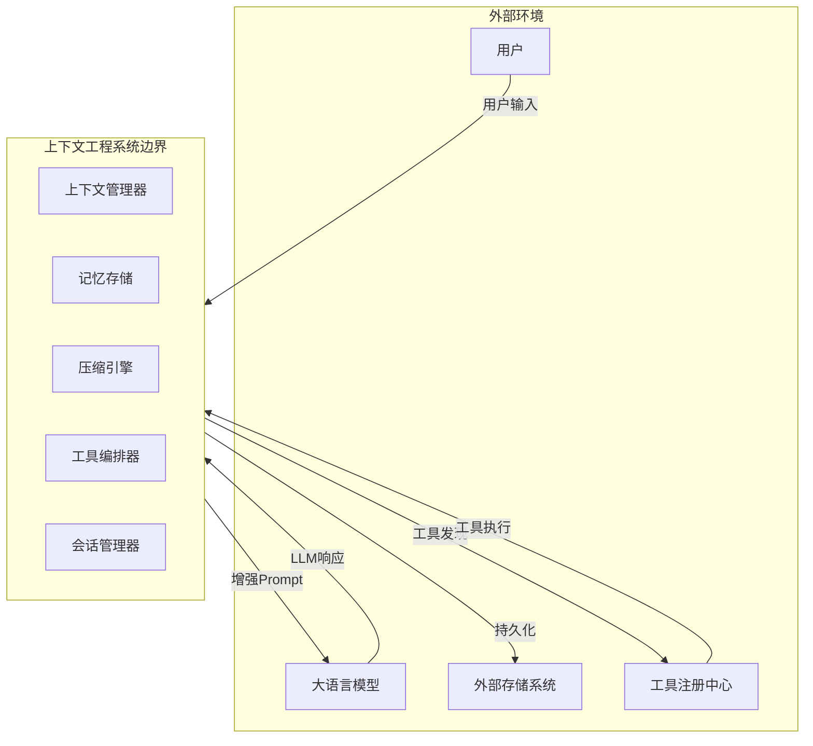

**系统边界定义**：

| 组件 | 职责 | 外部接口 |
|------|------|----------|
| 上下文管理器 | 统一管理上下文生命周期 | ContextAPI |
| 记忆存储 | 提供持久化和检索能力 | StorageAPI |
| 压缩引擎 | 实现上下文压缩算法 | CompressionAPI |
| 工具编排器 | 管理工具调用链 | ToolAPI |
| 会话管理器 | 处理会话隔离和恢复 | SessionAPI |

### 1.2 关键用例与交互模型

```mermaid
useCase
    actor User as "用户"
    actor LLM as "LLM Agent"
    
    uc1 as "发送消息"
    uc2 as "压缩上下文"
    uc3 as "保存对话"
    uc4 as "检索记忆"
    uc5 as "调用工具"
    uc6 as "恢复会话"
    
    User --> uc1
    uc1 --> uc2
    uc2 --> uc3
    uc1 --> uc4
    uc4 --> uc2
    uc1 --> uc5
    uc5 --> User
    uc6 --> uc1
```

**关键用例描述**：

#### UC1: 发送消息
- **参与者**: 用户、LLM
- **前置条件**: 会话已建立
- **基本流**:
  1. 用户输入消息
  2. 系统检索相关记忆
  3. 系统压缩上下文（必要时）
  4. 构建增强Prompt发送给LLM
  5. LLM返回响应
  6. 系统保存对话到存储

#### UC2: 压缩上下文
- **参与者**: 压缩引擎
- **前置条件**: 当前上下文超过阈值
- **基本流**:
  1. 计算当前token数量
  2. 选择压缩策略（摘要/保留/混合）
  3. 执行压缩算法
  4. 验证压缩后上下文完整性

#### UC3: 检索记忆
- **参与者**: 记忆存储、用户
- **前置条件**: 存在历史记忆
- **基本流**:
  1. 解析用户当前查询意图
  2. 从记忆存储中检索相关片段
  3. 按相关性排序
  4. 返回Top-K结果

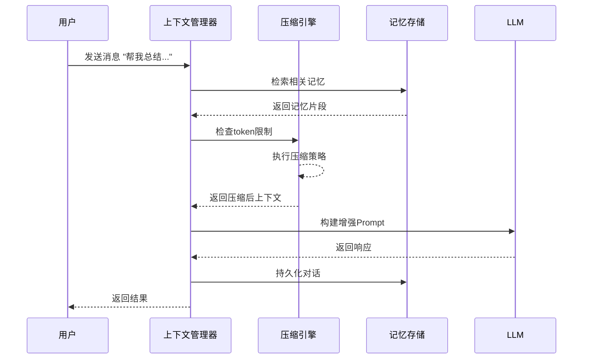

---

## 二、逻辑视图

### 2.1 结构模型

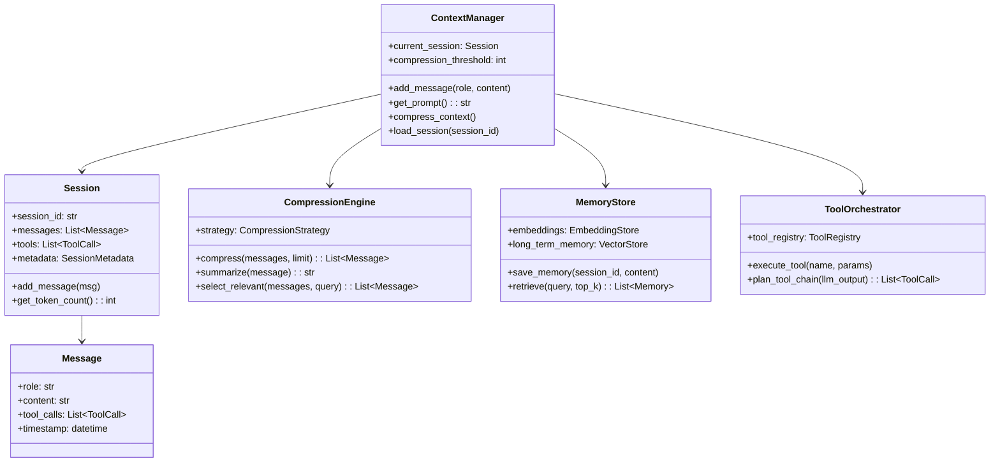

**核心组件说明**：

| 组件 | 职责 | 关键方法 |
|------|------|----------|
| ContextManager | 上下文统一入口 | add_message(), get_prompt(), compress_context() |
| Session | 会话状态容器 | add_message(), get_token_count() |
| CompressionEngine | 上下文压缩 | compress(), summarize(), select_relevant() |
| MemoryStore | 长期记忆存储 | save_memory(), retrieve() |
| ToolOrchestrator | 工具编排 | execute_tool(), plan_tool_chain() |

### 2.2 行为模型

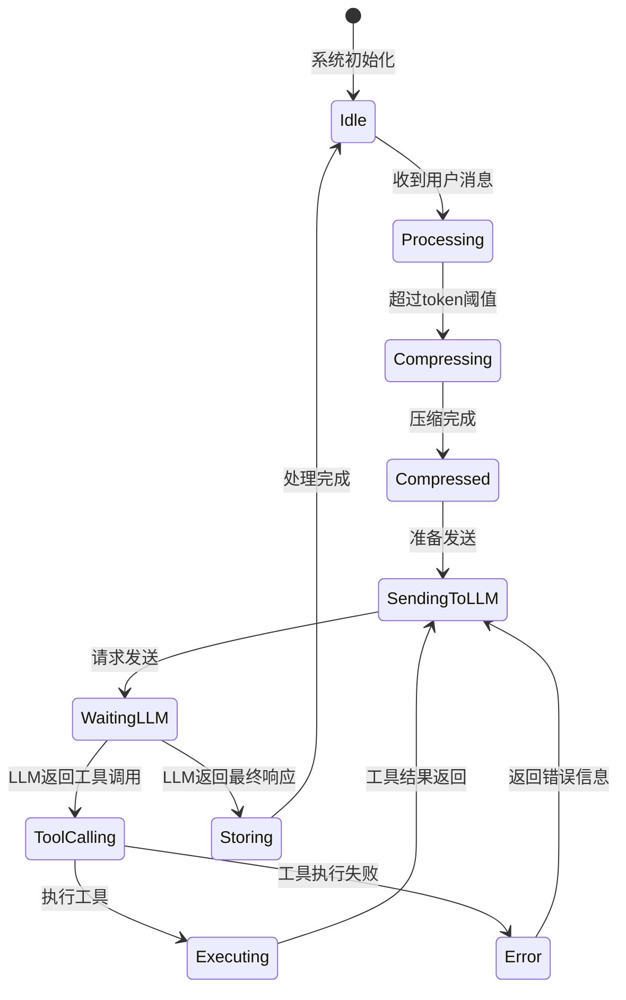

**核心流程状态机**：

| 状态 | 说明 | 转换条件 |
|------|------|----------|
| Idle | 空闲等待 | 收到消息→Processing |
| Processing | 处理消息 | token超限→Compressing |
| Compressing | 执行压缩 | 压缩完成→Compressed |
| SendingToLLM | 发送LLM | 等待响应→WaitingLLM |
| ToolCalling | 工具调用 | 需要工具→Executing |
| Storing | 持久化 | 保存完成→Idle |

### 2.3 数据模型

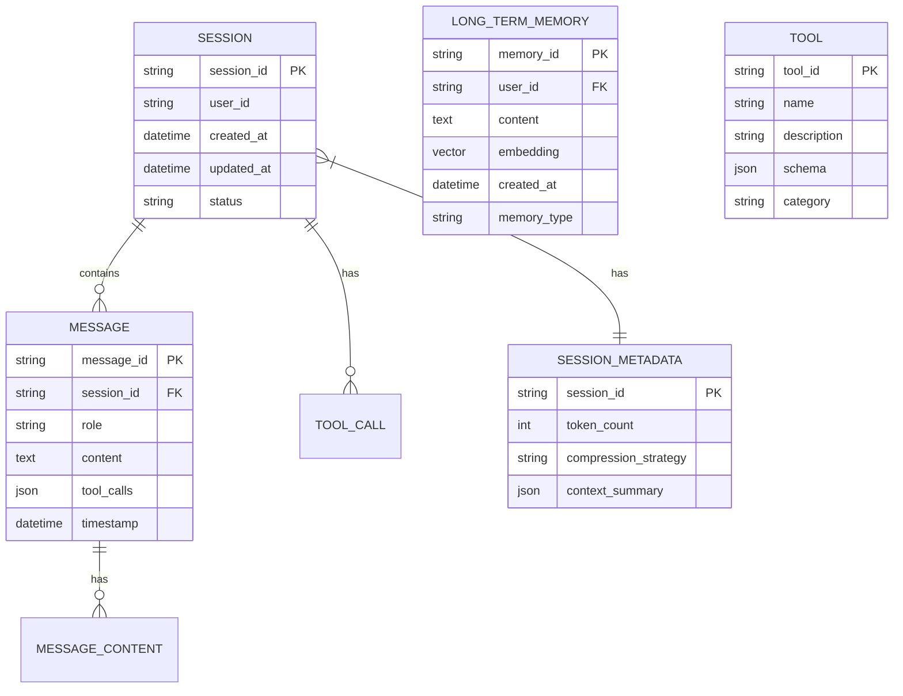

**数据模型详细说明**：

#### 会话(Session)
```python
class Session:
    session_id: str              # 唯一标识符
    user_id: str                 # 用户ID
    messages: List[Message]      # 消息列表
    created_at: datetime         # 创建时间
    updated_at: datetime         # 更新时间
    metadata: SessionMetadata    # 元数据
    status: SessionStatus        # 会话状态
```

#### 消息(Message)
```python
class Message:
    message_id: str              # 消息ID
    role: Role                   # 角色: user/assistant/system
    content: str                 # 消息内容
    tool_calls: Optional[List[ToolCall]]  # 工具调用
    token_count: int             # token数
    timestamp: datetime          # 时间戳
```

#### 长期记忆(LongTermMemory)
```python
class LongTermMemory:
    memory_id: str               # 记忆ID
    user_id: str                 # 用户ID
    content: str                 # 记忆内容
    embedding: List[float]       # 向量嵌入
    memory_type: MemoryType      # 记忆类型: fact/preference/context
    importance: float            # 重要性分数
    created_at: datetime         # 创建时间
    accessed_at: datetime        # 最后访问时间
```

### 2.4 技术模型

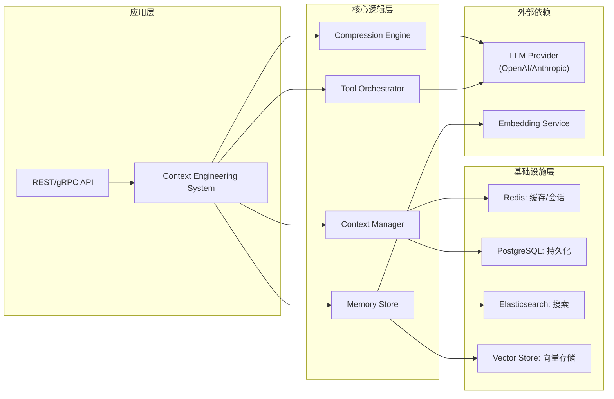

**技术栈选型**：

| 层级 | 技术组件 | 选型理由 |
|------|----------|----------|
| 应用层 | FastAPI/Gradio | 高性能API服务 |
| 核心逻辑 | Python 3.10+ | 丰富AI生态 |
| 会话缓存 | Redis | 高性能内存存储 |
| 持久化 | PostgreSQL | 可靠关系型存储 |
| 向量存储 | Milvus/QDrant | 高效向量检索 |
| 搜索 | Elasticsearch | 全文搜索能力 |
| LLM | OpenAI/Anthropic | 主流LLM支持 |

---

## 三、开发视图

### 3.1 代码模型

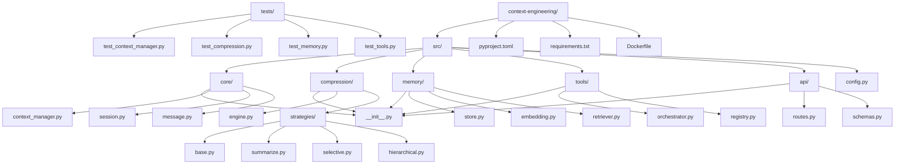

**核心模块说明**：

```
src/
├── core/                    # 核心领域模型
│   ├── context_manager.py  # 上下文管理器
│   ├── session.py          # 会话管理
│   └── message.py          # 消息模型
├── compression/            # 压缩引擎
│   ├── engine.py           # 压缩主引擎
│   └── strategies/         # 压缩策略
│       ├── summarize.py    # 摘要策略
│       ├── selective.py    # 选择策略
│       └── hierarchical.py # 分层策略
├── memory/                 # 记忆存储
│   ├── store.py            # 存储接口
│   ├── embedding.py        # 向量化
│   └── retriever.py        # 检索器
├── tools/                  # 工具编排
│   ├── orchestrator.py     # 编排器
│   └── registry.py         # 注册中心
├── api/                    # API层
│   ├── routes.py           # 路由定义
│   └── schemas.py          # 数据模型
└── config.py               # 配置管理
```

### 3.2 构建模型

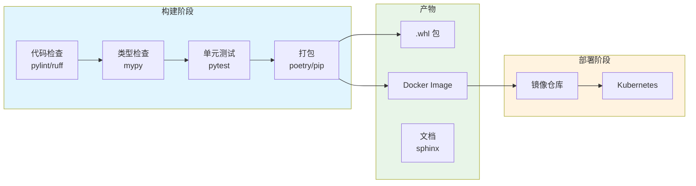

**构建配置** (pyproject.toml):

```toml
[project]
name = "context-engineering"
version = "1.0.0"
description = "Multi-turn conversation management system"
requires-python = ">=3.10"

dependencies = [
    "fastapi>=0.104.0",
    "redis>=5.0.0",
    "sqlalchemy>=2.0.0",
    "pymilvus>=2.3.0",
    "openai>=1.3.0",
    "tiktoken>=0.5.0",
    "pydantic>=2.0.0",
]

[project.optional-dependencies]
dev = [
    "pytest>=7.4.0",
    "pytest-cov>=4.1.0",
    "ruff>=0.1.0",
    "mypy>=1.7.0",
]

[tool.pytest.ini_options]
testpaths = ["tests"]
python_files = ["test_*.py"]

[tool.ruff]
line-length = 100
target-version = "py310"
```

### 3.3 硬件模型

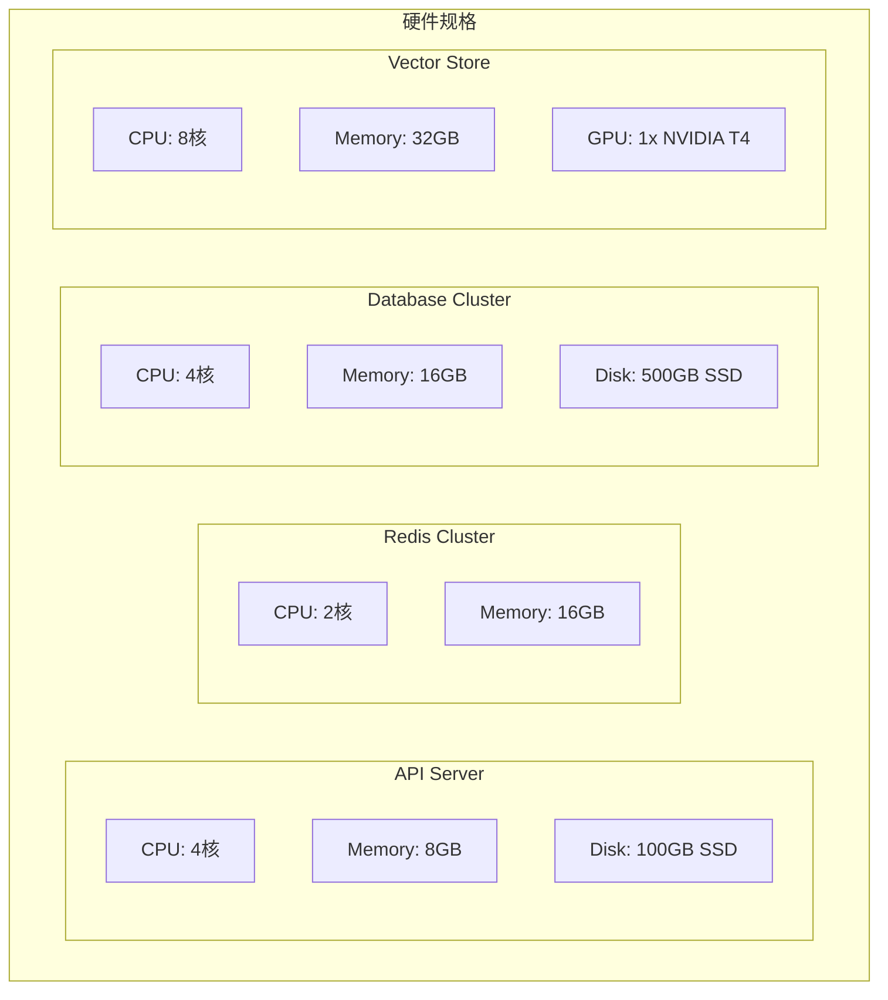

**硬件规格要求**：

| 组件 | CPU | 内存 | 存储 | GPU |
|------|-----|------|------|-----|
| API Server | 4核 | 8GB | 100GB SSD | - |
| Redis Cache | 2核 | 16GB | - | - |
| PostgreSQL |4核 | 16GB | 500GB SSD | - |
| Vector Store | 8核 | 32GB | 200GB SSD | NVIDIA T4 |

---

## 四、运行视图

### 4.1 运行模型

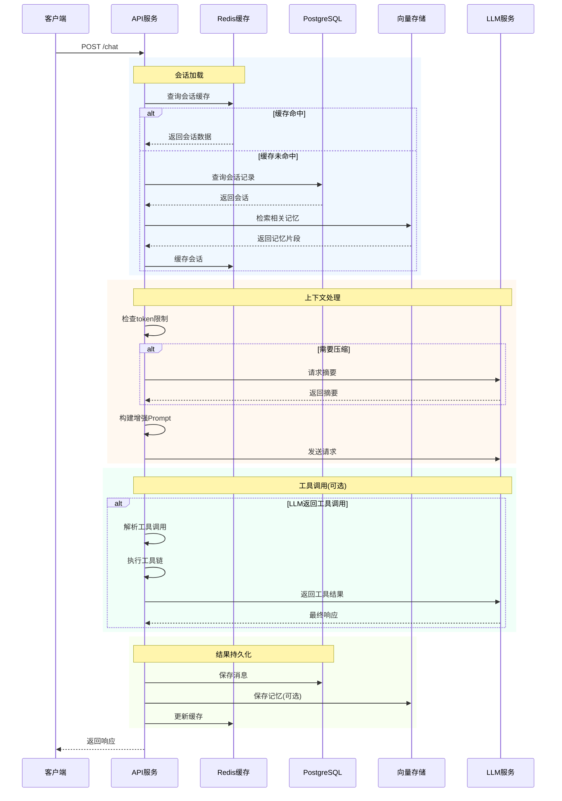

**并发与高可用设计**：

| 特性 | 实现方案 | 说明 |
|------|----------|------|
| 会话隔离 | Redis Session | 每个会话独立Key |
| 并发控制 | 乐观锁 | 消息追加使用版本号 |
| 高可用 | 主从复制 | Redis/PG主从部署 |
| 弹性伸缩 | K8s HPA | 根据CPU/内存自动扩缩 |
| 熔断 | CircuitBreaker | 工具调用失败熔断 |

### 4.2 运维模型

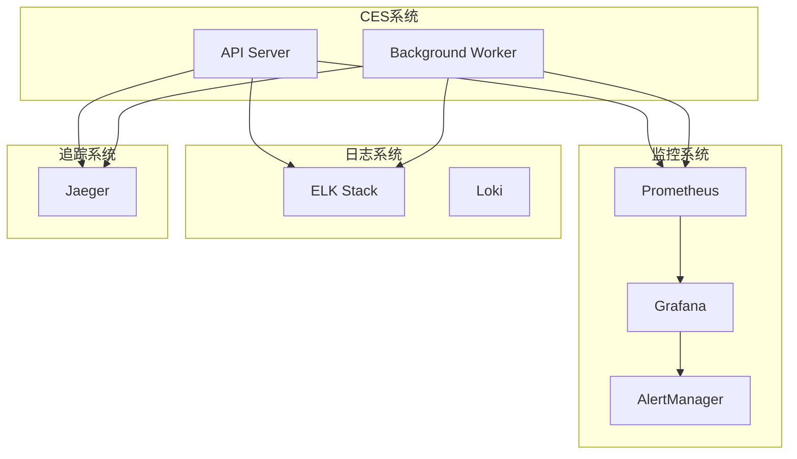

**关键运维指标**：

| 指标 | 告警阈值 | 说明 |
|------|----------|------|
| API响应时间P99 | >2s | API延迟告警 |
| Token使用率 | >90% | 上下文即将满载 |
| 压缩失败率 | >5% | 压缩引擎异常 |
| LLM调用失败率 | >10% | LLM服务异常 |
| 内存使用率 | >80% | 内存资源告警 |

---

## 五、部署视图

### 5.1 交付模型

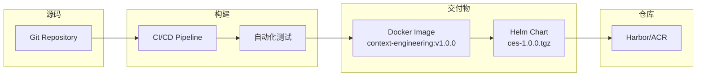

**交付物定义**：

| 交付物 | 格式 | 命名规范 | 位置 |
|--------|------|----------|------|
| Docker镜像 | OCI | ces-{version} | registry.example.com/ces |
| Helm Chart | TGZ | ces-{version}.tgz | chartrepo.example.com |
| API文档 | OpenAPI JSON | openapi.json | 内嵌 |

### 5.2 部署模型

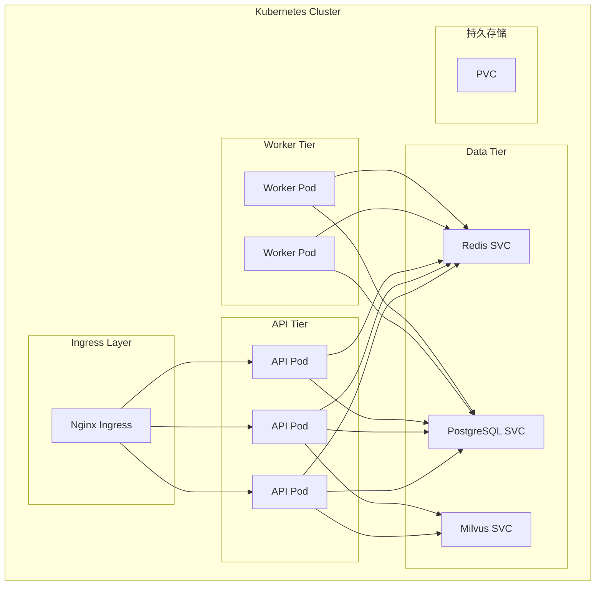

**部署拓扑**：

| 组件 | 副本数 | 资源请求 | 资源限制 |
|------|--------|----------|----------|
| API Server | 3 | 2CPU, 4GB | 4CPU, 8GB |
| Worker | 2 | 1CPU, 2GB | 2CPU, 4GB |
| Redis | 3(集群) | 1CPU, 4GB | 2CPU, 8GB |
| PostgreSQL | 主从 | 2CPU, 8GB | 4CPU, 16GB |
| Milvus | 3节点 | 4CPU, 16GB | 8CPU, 32GB |

**高可用策略**：

- **API层**: 3副本 + HPA + 负载均衡
- **Redis**: 3节点哨兵模式
- **PostgreSQL**: 1主2从流复制
- **Milvus**: 3节点集群

---

## 六、架构决策记录(ADR)

### ADR-001: 采用混合压缩策略

| 属性 | 值 |
|------|-----|
| 状态 | 已通过 |
| 决策者 | 架构团队 |
| 决策日期 | 2025-01-15 |

**背景**: 
单一压缩策略无法满足所有场景需求。摘要策略会丢失细节，选择策略可能遗漏关键信息。

**决策**:
采用分层混合压缩策略：
1. 近期消息（窗口内）→ 保留完整
2. 中期消息 → 选择性保留
3. 早期消息 → 摘要压缩

**后果**:
- 正面：平衡信息完整性与token使用
- 负面：实现复杂度增加

### ADR-002: 使用向量检索增强记忆

| 属性 | 值 |
|------|-----|
| 状态 | 已通过 |
| 决策者 | 架构团队 |
| 决策日期 | 2025-01-16 |

**背景**:
传统关键词匹配无法理解语义，用户意图与历史对话表述差异导致检索失败。

**决策**:
引入向量语义检索：
1. 使用Text-Embedding-Ada-002生成嵌入
2. 存储到Milvus向量数据库
3. 检索时使用语义相似度排序

**后果**:
- 正面：语义理解增强，检索准确率提升
- 负面：额外向量存储和计算成本

### ADR-003: 工具调用采用有向无环图编排

| 属性 | 值 |
|------|-----|
| 状态 | 已通过 |
| 决策者 | 架构团队 |
| 决策日期 | 2025-01-17 |

**背景**:
复杂任务可能需要多工具顺序/并行调用，需要统一编排。

**决策**:
采用DAG编排器：
1. LLM输出工具调用计划
2. 构建工具调用DAG
3. 拓扑排序执行
4. 结果汇总返回LLM

**后果**:
- 正面：支持复杂工具链，错误可追溯
- 负面：执行时间可能增加

---

## 七、附录

### 附录A: API接口定义

```yaml
openapi: 3.0.0
info:
  title: Context Engineering System API
  version: 1.0.0

paths:
  /api/v1/sessions:
    post:
      summary: 创建新会话
      responses:
        '201':
          description: 会话创建成功
          
  /api/v1/sessions/{session_id}/messages:
    post:
      summary: 发送消息
      parameters:
        - name: session_id
          in: path
          required: true
      requestBody:
        content:
          application/json:
            schema:
              type: object
              properties:
                content:
                  type: string
    get:
      summary: 获取会话历史
      
  /api/v1/sessions/{session_id}/compress:
    post:
      summary: 手动触发压缩
```

### 附录B: 配置示例

```yaml
# config.yaml
system:
  name: context-engineering
  version: 1.0.0
  
context:
  max_tokens: 128000
  compression_threshold: 110000
  compression_strategy: hierarchical
  
memory:
  enabled: true
  vector_store: milvus
  top_k: 5
  importance_threshold: 0.7
  
tools:
  enabled: true
  max_parallel: 3
  timeout: 30
  retry_count: 2
  
storage:
  redis:
    host: redis-cluster
    port: 6379
  postgres:
    host: postgres-master
    port: 5432
    
llm:
  provider: openai
  model: gpt-4-turbo
  temperature: 0.7
```

---

## 文档版本历史

| 版本 | 日期 | 作者 | 变更说明 |
|------|------|------|----------|
| 1.0.0 | 2025-01-20 | 架构团队 | 初始版本 |

---

*本文档由Context Engineering System架构团队编写，遵循Kruchten 4+1视图方法论，可直接指导开发团队进行代码实现。* 
