# 上下文工程架构设计文档

## 文档信息

| 项目 | 内容 |
|------|------|
| 项目名称 | 上下文工程 (Context Engineering) |
| 版本 | v1.0.0 |
| 状态 | 架构设计稿 |
| 作者 | 架构团队 |

---

## 一、用例视图

用例视图从用户（Actor）视角描述系统的功能需求，展示系统在整个产品中的位置、主要功能以及与外部环境的交互关系。

### 1.1 系统上下文模型

#### 1.1.1 领域边界定义

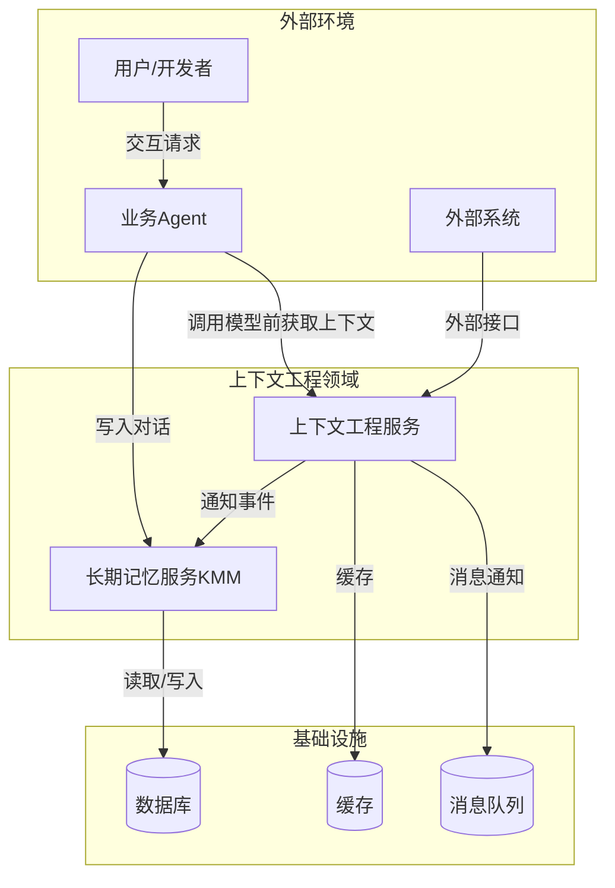

#### 1.1.2 外部接口定义

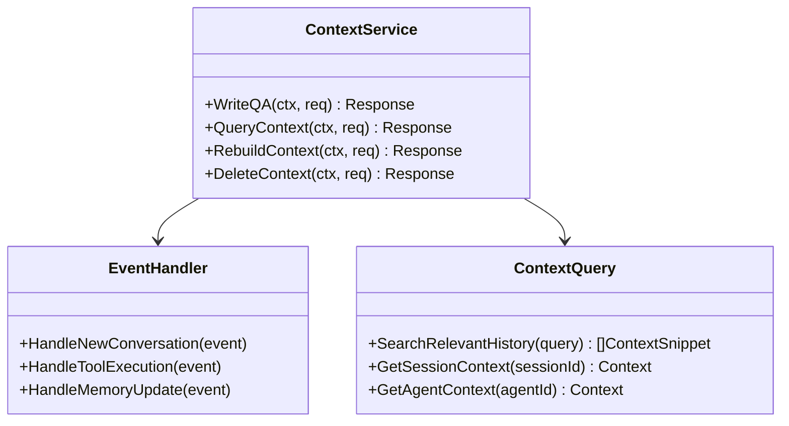

**外部接口列表：**

| 接口名称 | 方向 | 描述 | 参数 |
|----------|------|------|------|
| WriteQA | 入口 | 写入问答对到上下文 | sessionId, conversation, metadata |
| QueryContext | 入口 | 查询相关上下文 | query, agentId, options |
| RebuildContext | 入口 | 重建上下文窗口 | sessionId, strategy |
| DeleteContext | 入口 | 删除上下文 | sessionId, contextIds |
| HandleNewConversation | 事件 | 处理新对话事件 | conversationEvent |
| HandleToolExecution | 事件 | 处理工具执行事件 | toolEvent |
| HandleMemoryUpdate | 事件 | 处理记忆更新事件 | memoryEvent |

### 1.2 关键用例与交互模型

#### 1.2.1 核心用例图

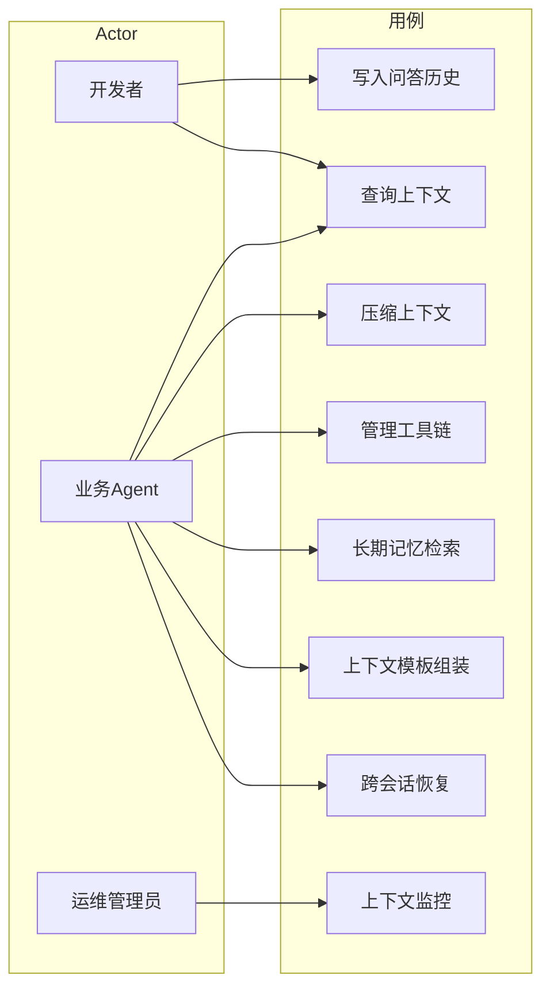

#### 1.2.2 关键场景交互模型

**场景1：模型调用前获取上下文**

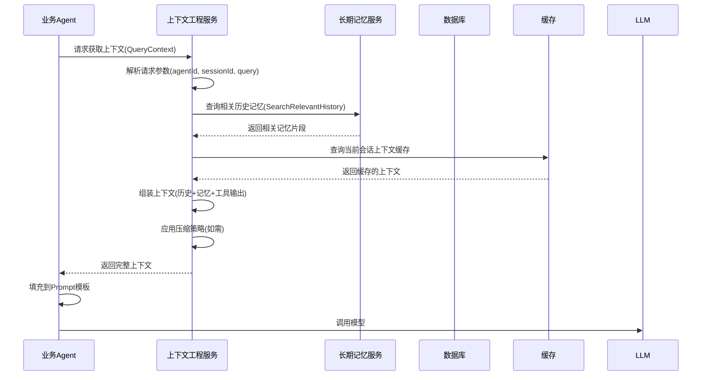

**场景2：新对话写入触发上下文管理**

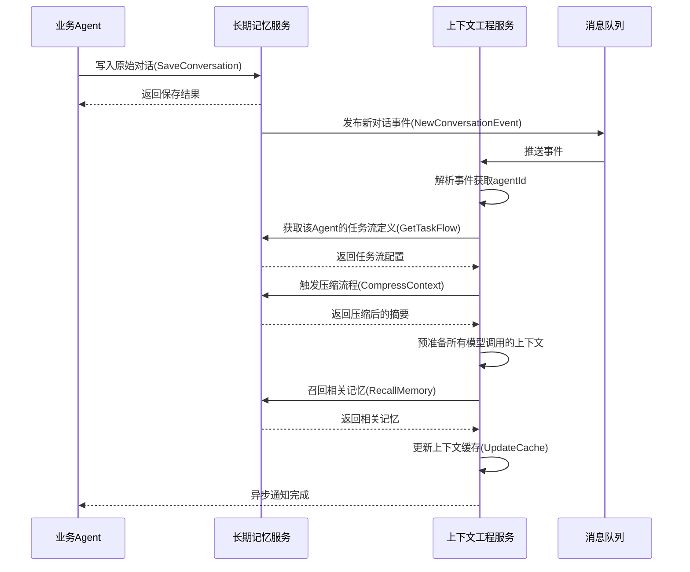

**场景3：工具调用链管理**

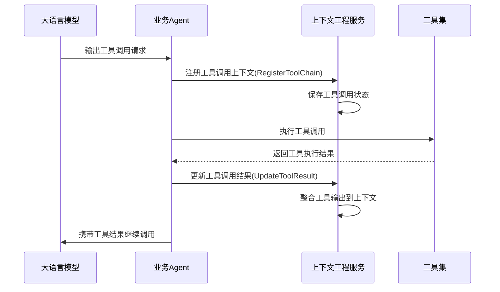

---

## 二、逻辑视图

逻辑视图从业务角度描述系统的组成元素、它们之间的关系以及采用的架构模式。

### 2.1 结构模型

#### 2.1.1 系统架构分层

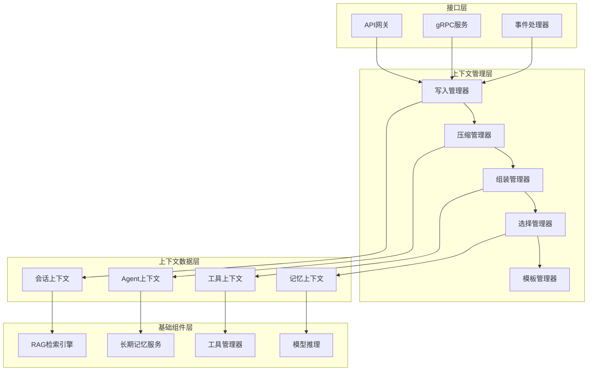

#### 2.1.2 核心组件设计

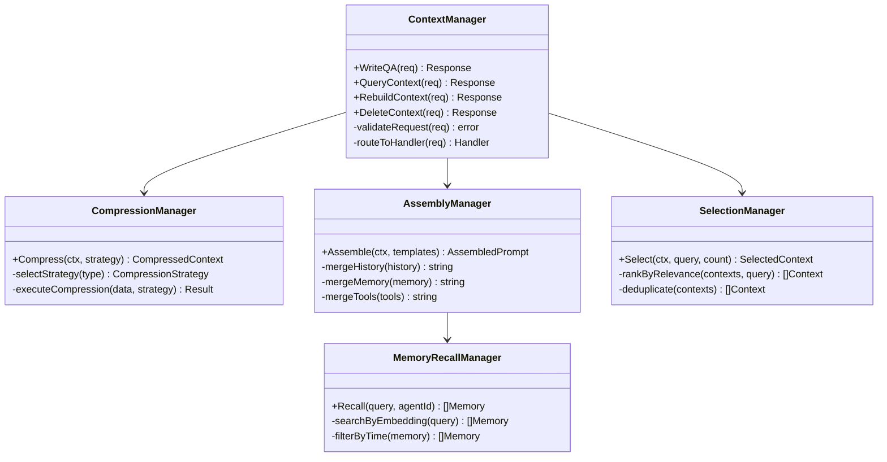

#### 2.1.3 架构模式选择

**采用分层架构 + 事件驱动架构**

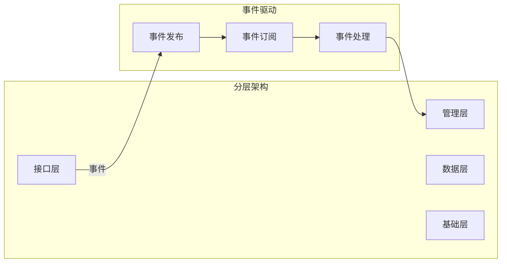

### 2.2 行为模型

#### 2.2.1 上下文写入流程

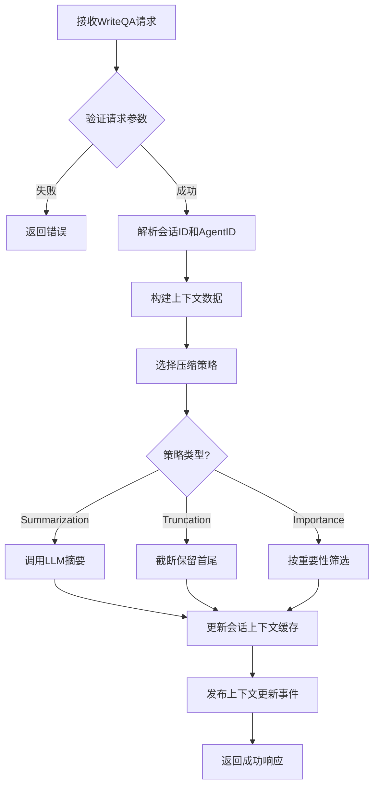

#### 2.2.2 上下文查询流程

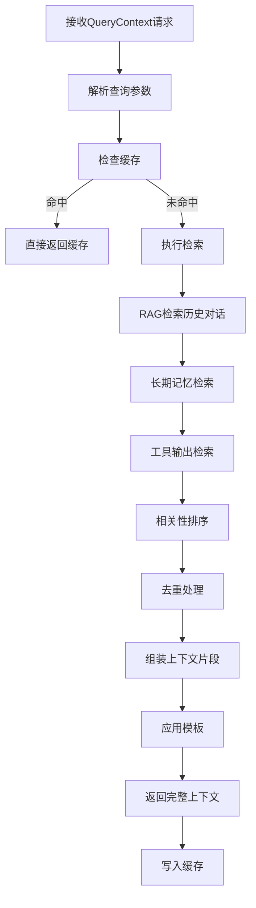

### 2.3 数据模型

#### 2.3.1 核心实体关系

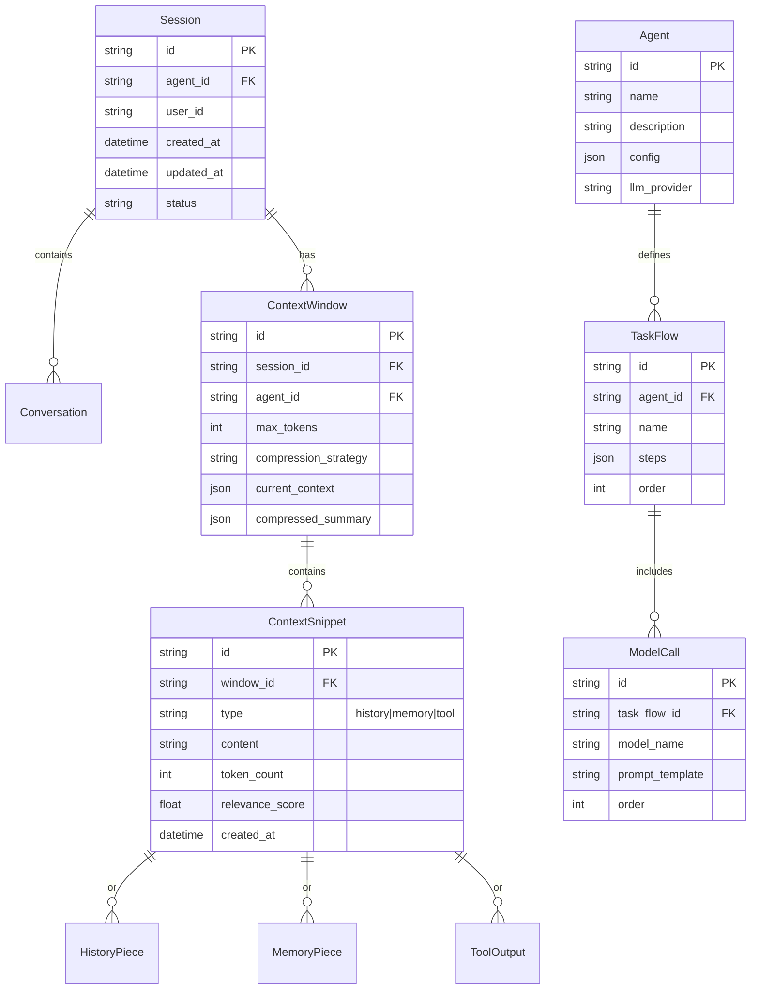

#### 2.3.2 数据流设计

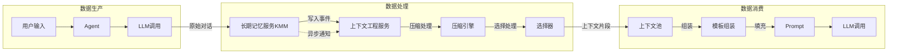

#### 2.3.3 数据所有权与隔离

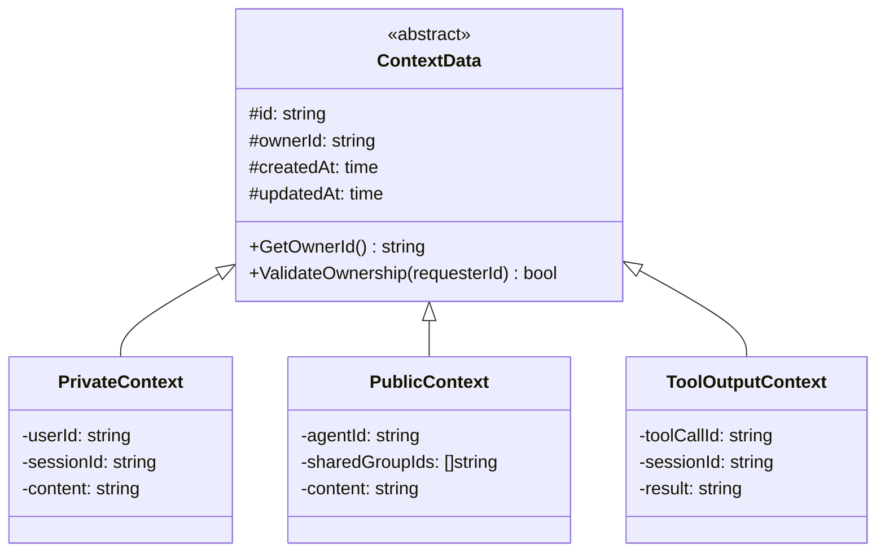

### 2.4 技术模型

#### 2.4.1 技术栈选型

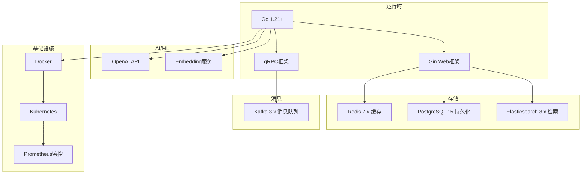

#### 2.4.2 开源组件依赖

| 组件类别 | 开源项目 | 版本 | 用途 |
|----------|----------|------|------|
| Web框架 | gin-gonic/gin | v1.9.x | HTTP API服务 |
| gRPC | grpc/grpc-go | v1.58.x | RPC通信 |
| ORM | gorm.io/gorm | v1.25.x | 数据库操作 |
| 缓存 | go-redis/redis | v9.x | Redis客户端 |
| 消息 | segmentio/kafka-go | v0.4.x | Kafka生产者/消费者 |
| 日志 | logrus | v1.9.x | 结构化日志 |
| 配置 | spf13/viper | v1.18.x | 配置管理 |
| 验证 | go-playground/validator | v10.x | 请求验证 |
| 监控 | prometheus/client_golang | v1.17.x | 指标采集 |

---

## 三、开发视图

开发视图从实现角度描述代码组织、构建管理和硬件依赖。

### 3.1 代码模型

#### 3.1.1 代码仓库结构

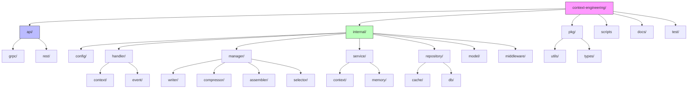

#### 3.1.2 核心代码模块映射

| 系统元素 | 代码模块 | 路径 |
|----------|----------|------|
| 上下文写入 | WriteManager | internal/manager/writer/ |
| 上下文压缩 | CompressionManager | internal/manager/compressor/ |
| 上下文组装 | AssemblyManager | internal/manager/assembler/ |
| 上下文选择 | SelectionManager | internal/manager/selector/ |
| gRPC服务 | ContextService | api/grpc/ |
| REST API | ContextHandler | api/rest/ |
| 事件处理 | EventHandler | internal/handler/event/ |
| 缓存操作 | CacheRepository | internal/repository/cache/ |
| 数据库操作 | DBRepository | internal/repository/db/ |
| 数据模型 | DomainModels | internal/model/ |

#### 3.1.3 核心代码结构

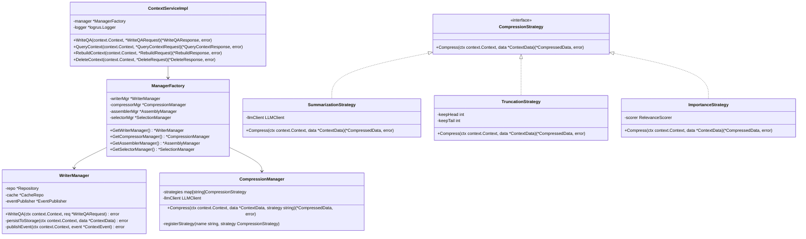

### 3.2 构建模型

#### 3.2.1 构建依赖关系

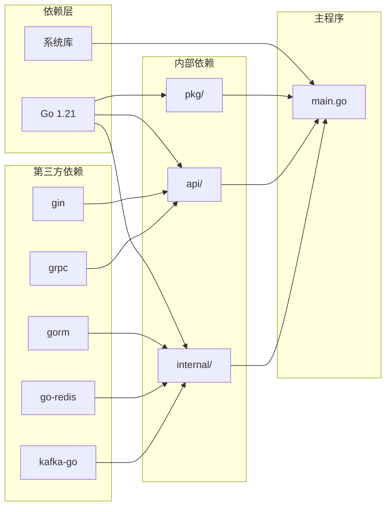

#### 3.2.2 构建工具链

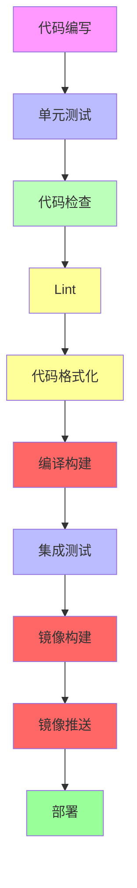

**构建命令：**

```bash
# 本地开发
make dev

# 运行测试
make test

# 代码检查
make lint

# 构建二进制
make build

# 构建镜像
make docker-build

# 推送镜像
make docker-push
```

### 3.3 硬件模型

#### 3.3.1 运行时资源要求

| 规格 | CPU | 内存 | 磁盘 | 说明 |
|------|-----|------|------|------|
| 开发环境 | 2核 | 4GB | 20GB | 本地运行 |
| 测试环境 | 4核 | 8GB | 50GB | 集成测试 |
| 生产环境(小) | 8核 | 16GB | 100GB | 单实例 |
| 生产环境(中) | 16核 | 32GB | 200GB | 3实例集群 |
| 生产环境(大) | 32核 | 64GB | 500GB | 5实例集群 |

---

## 四、运行视图

运行视图从运维角度描述系统运行时的行为、进程交互和运维能力。

### 4.1 运行模型

#### 4.1.1 进程与线程设计

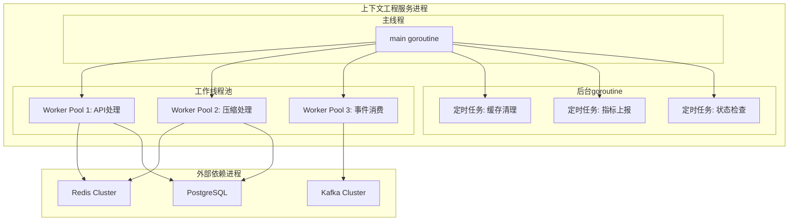

#### 4.1.2 并发与高可用设计

```mermaid
graph LR
    subgraph "高可用架构"
        LB["负载均衡"]
        
        subgraph "服务集群"
            CE1["CE实例1"]
            CE2["CE实例2"]
            CE3["CE实例3"]
        end
        
        subgraph "数据层"
            RedisCluster["Redis Cluster"]
            PGCluster["PostgreSQL集群"]
            KafkaCluster["Kafka集群"]
        end
        
        LB --> CE1
        LB --> CE2
        LB --> CE3
        
        CE1 --> RedisCluster
        CE2 --> RedisCluster
        CE3 --> RedisCluster
        
        CE1 --> PGCluster
        CE2 --> PGCluster
        CE3 --> PGCluster
        
        CE1 --> KafkaCluster
        CE2 --> KafkaCluster
        CE3 --> KafkaCluster
    end
    
    style LB fill:#f66
    style CE1 fill:#6f6
    style CE2 fill:#6f6
    style CE3 fill:#6f6
```

#### 4.1.3 弹性伸缩设计

```mermaid
flowchart TD
    A[监控指标] --> B{CPU > 70%?}
    B -->|是| C[触发扩容]
    B -->|否| D{CPU < 30%?}
    D -->|是| E[触发缩容]
    D -->|否| F[保持当前]
    
    C --> G[增加Pod]
    E --> H[减少Pod]
    F --> A
    
    G --> I[等待新Pod就绪]
    I --> A
    H --> A
    
    style C fill:#f66
    style E fill:#66f
```

#### 4.1.4 关键运行场景序列图

```mermaid
sequenceDiagram
    participant Client as 客户端
    participant LB as 负载均衡
    participant CE1 as CE实例1
    participant CE2 as CE实例2
    participant Redis as Redis
    participant DB as 数据库

    Client->>LB: QueryContext请求
    LB->>CE1: 转发请求
    CE1->>Redis: 检查缓存
    Redis-->>CE1: 缓存未命中
    CE1->>DB: 检索历史数据
    DB-->>CE1: 返回数据
    CE1->>CE1: 执行压缩和组装
    CE1-->>Client: 返回上下文
    
    Note over Client,CE2: 并发场景
    Client->>LB: 写入请求
    LB->>CE2: 转发请求
    CE2->>Redis: 写入缓存
    CE2->>DB: 持久化
    CE2->>Redis: 发布缓存失效事件
    Redis-->>CE1: 通知缓存失效
    CE1->>Redis: 清除本地缓存
    CE2-->>Client: 返回成功
```

### 4.2 运维模型

#### 4.2.1 运维系统设计

```mermaid
graph TB
    subgraph "监控体系"
        METRICS["指标采集\nPrometheus"]
        LOGS["日志收集\nLoki"]
        TRACE["链路追踪\nJaeger"]
        ALERT["告警通知\nAlertManager"]
    end
    
    subgraph "运维功能"
        HEALTH["健康检查"]
        METRIC["指标查询"]
        LOG["日志查询"]
        TRACEV["链路查看"]
    end
    
    subgraph "自动化运维"
        AUTOSCALE["自动伸缩"]
        ROLLBACK["自动回滚"]
        DEPLOY["部署管理"]
    end
    
    METRICS --> ALERT
    LOGS --> ALERT
    METRICS --> METRIC
    LOGS --> LOG
    TRACE --> TRACEV
    
    HEALTH --> AUTOSCALE
    METRICS --> AUTOSCALE
    AUTOSCALE --> DEPLOY
    HEALTH --> ROLLBACK
    METRICS --> ROLLBACK
```

#### 4.2.2 核心运维指标

| 指标名称 | 类型 | 阈值 | 说明 |
|----------|------|------|------|
| request_latency_p99 | 延迟 | <500ms | 请求P99延迟 |
| request_success_rate | 可用性 | >99.9% | 请求成功率 |
| context_compression_time | 延迟 | <200ms | 上下文压缩耗时 |
| cache_hit_rate | 缓存 | >80% | 缓存命中率 |
| memory_usage_percent | 资源 | <85% | 内存使用率 |
| cpu_usage_percent | 资源 | <70% | CPU使用率 |
| kafka_consumer_lag | 队列 | <1000 | 消息消费延迟 |

---

## 五、部署视图

部署视图面向交付，描述软件包格式、部署节点和拓扑结构。

### 5.1 交付模型

#### 5.1.1 软件包定义

```mermaid
graph TD
    subgraph "交付物"
        BIN["二进制文件\ncontext-engineering"]
        CONFIG["配置文件\nconfig.yaml"]
        DOCKER["Docker镜像\ncontext-engineering:v1.0.0"]
        HELM["Helm Chart\ncontext-engineering-1.0.0.tgz"]
    end
    
    subgraph "镜像内容"
        BASE["基础镜像\ngolang:1.21-alpine"]
        CERT["证书"]
        DEP["运行时依赖"]
        APP["应用程序"]
    end
    
    subgraph "镜像标签"
        TAG_VER["版本标签\nv1.0.0"]
        TAG_LATEST["最新标签\nlatest"]
        TAG_COMMIT["提交标签\nabc1234"]
    end
    
    BASE --> CERT
    CERT --> DEP
    DEP --> APP
    APP --> DOCKER
    
    DOCKER --> TAG_VER
    DOCKER --> TAG_LATEST
    DOCKER --> TAG_COMMIT
```

#### 5.1.2 版本命名规范

| 类型 | 格式 | 示例 |
|------|------|------|
| 版本号 | v主版本.次版本.修订 | v1.0.0 |
| 镜像标签 | {version}-{commit} | v1.0.0-abc1234 |
| Helm版本 | {chart}-{version} | context-engineering-1.0.0 |

### 5.2 部署模型

#### 5.2.1 部署拓扑

```mermaid
graph TB
    subgraph "云基础设施"
        VPC["VPC"]
        
        subgraph "Kubernetes集群"
            subgraph "命名空间: context-engineing"
                Deploy["Deployment\n3副本"]
                Svc["Service\nClusterIP"]
                HPA["HPA\n自动伸缩"]
                ConfigMap["ConfigMap\n配置"]
                Secret["Secret\n密钥"]
            end
            
            subgraph "Ingress"
                Ingress["Ingress\nTLS终止"]
            end
        end
        
        subgraph "外部服务"
            RedisExt["Redis Cluster"]
            PGExt["PostgreSQL"]
            KafkaExt["Kafka"]
        end
    end
    
    User["用户"] -->|HTTPS| Ingress
    Ingress --> Svc
    Svc --> Deploy
    Deploy --> HPA
    
    Deploy --> RedisExt
    Deploy --> PGExt
    Deploy --> KafkaExt
    
    style VPC fill:#f9f
    style Deploy fill:#bfb
    style HPA fill:#ff9
```

#### 5.2.2 冗余策略

| 组件 | 冗余方式 | 副本数 | 故障转移 |
|------|----------|--------|----------|
| CE服务 | Kubernetes Deployment | 3 | 自动 |
| Redis | Cluster模式 | 6节点 | 自动 |
| PostgreSQL | 主从复制 | 1主2从 | 自动 |
| Kafka | 多分区多副本 | 3 broker | 自动 |

#### 5.2.3 网络配置

```mermaid
graph LR
    subgraph "内部网络"
        K8S["K8s集群\n10.0.0.0/16"]
        
        subgraph "服务网络"
            CE["CE服务\n10.0.1.0/24"]
            OTHER["其他服务\n10.0.2.0/24"]
        end
        
        subgraph "数据网络"
            RedisNet["Redis\n10.0.10.0/24"]
            PGNet["PostgreSQL\n10.0.11.0/24"]
            KafkaNet["Kafka\n10.0.12.0/24"]
        end
    end
    
    subgraph "外部网络"
        Public["公网\n0.0.0.0/0"]
    end
    
    Public -->|HTTPS 443| CE
    CE --> RedisNet
    CE --> PGNet
    CE --> KafkaNet
    CE <--> OTHER
```

---

## 附录：架构决策记录 (ADR)

### ADR-001: 采用分层架构设计上下文工程服务

**状态**: 已通过

**背景**: 上下文工程需要处理多种类型的上下文（历史对话、工具输出、长期记忆），需要清晰的职责划分。

**决策**: 采用四层架构（接口层、管理层、数据层、基础组件层）

**影响**:
- 正面：职责清晰、易于维护、便于测试
- 负面：增加系统复杂度、可能带来性能开销

### ADR-002: 采用事件驱动处理新对话通知

**状态**: 已通过

**背景**: 长期记忆服务写入对话后需要通知上下文工程进行上下文管理处理。

**决策**: 使用Kafka消息队列实现异步事件通知

**影响**:
- 正面：解耦、异步处理、高可用
- 负面：增加系统复杂性、需要处理消息一致性

### ADR-003: 支持多种压缩策略

**状态**: 已通过

**背景**: 不同场景对上下文压缩的需求不同，需要灵活选择。

**决策**: 定义CompressionStrategy接口，支持Summarization、Truncation、Importance三种策略

**影响**:
- 正面：灵活、可扩展
- 负面：需要管理策略选择逻辑

### ADR-004: 上下文按Agent隔离

**状态**: 已通过

**背景**: 跨Agent的上下文需要隔离，避免信息泄露。

**决策**: 每个Agent维护独立的上下文窗口，使用agent_id作为隔离标识

**影响**:
- 正面：安全、隔离性好
- 负面：资源占用增加

### ADR-005: 使用Redis作为上下文缓存

**状态**: 已通过

**背景**: 上下文访问频繁，需要高速缓存。

**决策**: 使用Redis Cluster作为分布式缓存

**影响**:
- 正面：高性能、支持分布式
- 负面：需要维护Redis集群

---

## 版本历史

| 版本 | 日期 | 作者 | 变更说明 |
|------|------|------|----------|
| v1.0.0 | 2024-01-01 | 架构团队 | 初始版本 |

---

*本文档为上下文工程架构设计稿，需要经过评审后正式发布。* 
