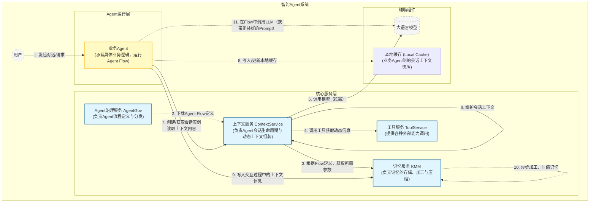

你是一个架构师，需要画出上下文服务在系统中的位置，系统中有上下文服务ContextService、记忆服务KMM、业务agent、agentgov、工具服务。
KMM负责记忆的写入，上下文服务负责上下文的管理，业务agent将交互过程中的所有上下文信息（工具输出、用户和助手的对话等）写入到KMM中，KMM接收到会异步的做数据加工，并做压缩，上下文服务在创建agent实例时就会从agentgov下载agentflow的流程，从中获取模型调用的流程，每个模型依赖的prompt定义来所需要的system prompt及各种动态的参数信息（如记忆、历史对话、时间、位置等）；同时上下文会针对该agent创建上下文的会话实例，在该会话实例中维护agent的模型调用流程，上下文服务会根据prompt定义的参数从记忆服务中获取所需的内容（如长期记忆、历史对话），并通过调用工具、模型、来填写动态的上下文信息。
业务agent侧会创建上下文的本地缓存（local cache），在agent的flow运行过程中，local cache会从上下文服务中获取该agent的session所涉及的上下文内容，在调用模型前的flow中把prompt及所包含的上下文作为引导词填入LLM中

