# Agent 上下文服务软件架构需求说明书

| 字段 | 内容 |
|------|------|
| 项目名称 | Agent 上下文服务（Context Service） |
| 文档版本 | v1.5.0 |
| 编写日期 | 2026-03-03 |
| 架构状态 | 已批准 |
| 适用范围 | Context Service 全系统设计 |

## 架构摘要

Context Service 是 Agent Runtime 的上下文编排与治理层，采用 **分层单体架构** 与 **依赖注入模式**，基于 **Go 1.21+** 语言实现，使用 **内存态存储 + 文件系统配置** 作为 Phase 1 基础设施。核心质量目标是 **一致性**（统一上下文读写路径）、**可控性**（明确的生命周期管理）和 **可观测性**（完整链路追踪），支持通过 **MemoryProvider** 和 **ToolProvider** 抽象层接入外部记忆服务和工具服务。

---

## 一、用例视图（Use Case View）

### 1.1 系统上下文模型

#### 系统定位

Context Service 是 Agent Runtime 的上下文编排与治理层（Context Orchestration Layer），负责统一调度会话与记忆上下文，并按 `agent_id + session_id` 维护会话实例、模型调用流程与步骤状态，最终将不同来源的上下文统一装配为可推理输入。

#### 系统边界

- **系统内**：
  - 会话实例与流程步骤状态管理
  - 上下文窗口信息填充与组装
  - 内核上下文版本管理与加载
  - 工具上下文参数填充与结果治理
  - 上下文治理能力（过期、回收、审计日志、降级控制）
  - 快照查询、回放与调试接口
- **系统外**：
  - KMM 知识记忆服务（Memory Provider）
  - 工具服务（Tool Provider）
  - 模型服务（LLM）
  - Agent服务

#### 外部接口清单

| 接口 | 方向 | 协议 | 数据格式 | 说明 |
|------|------|------|----------|------|
| Gateway API | 入 | HTTP REST | JSON | 北向业务接口：会话初始化、上下文组装、快照查询、内核解析 |
| CLI | 入 | 命令行 | - | 运维与调试入口（Phase 2） |
| Local Context Cache | 入 | C++ | 参数 | 北向的业务接口：创建上下文实例，获取上下文内容 |

#### 系统上下文图

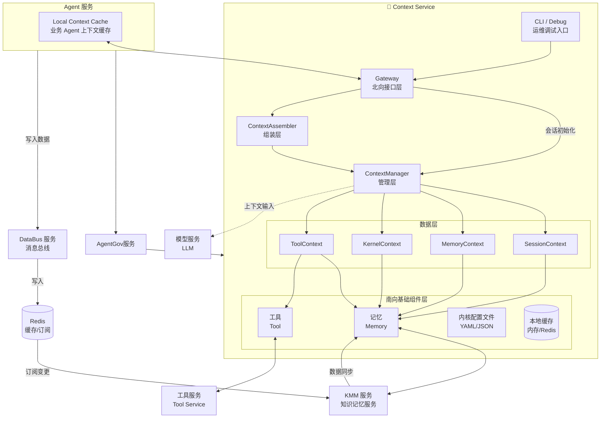
```mermaid
graph TB
    subgraph 北向角色["Agent 服务"]
        LocalCache[Local Context Cache<br/>业务 Agent 上下文缓存]
    end

    subgraph ContextService["🎯 Context Service"]
        GW[Gateway<br/>北向接口层]
        CLI[CLI / Debug<br/>运维调试入口]
        ASM[ContextAssembler<br/>组装层]
        CM[ContextManager<br/>管理层]
        subgraph 数据层["数据层"]
            SC[SessionContext]
            MC[MemoryContext]
            KC[KernelContext]
            TC[ToolContext]
        end
        subgraph 南向基础组件层["南向基础组件层"]
            KMM[记忆<br/>Memory]
            TOOL[工具<br/>Tool]
            KFILES[内核配置文件<br/>YAML/JSON]
            CACHE[(本地缓存<br/>内存/Redis)]
        end
    end

    LLM[模型服务<br/>LLM]
    KMMSvc[KMM 服务<br/>知识记忆服务]
    TOOLSvc[工具服务<br/>Tool Service]
    AGENTGOV[AgentGov服务]
    DataBus[DataBus 服务<br/>消息总线]
    Redis[(Redis<br/>缓存/订阅)]

    LocalCache <--> GW
    CLI --> GW
    GW -->|会话初始化| CM

    GW --> ASM
    ASM --> CM
    CM --> SC & MC & KC & TC

    MC --> KMM
    SC --> KMM
    KC --> KMM
    TC --> KMM
    TC --> TOOL

    CM -.->|上下文输入| LLM
    KMM <--> KMMSvc
    TOOL <--> TOOLSvc
    北向角色 --> AGENTGOV
    AGENTGOV --> ContextService

    北向角色 -->|写入数据| DataBus
    DataBus -->|写入| Redis
    Redis -->|订阅变更| KMMSvc
    KMMSvc -->|数据同步| KMM
```

---

### 1.2 关键用例与交互模型

#### 用例优先级列表

| 优先级 | 用例名称 | 参与者 | 质量目标 |
|--------|----------|--------|----------|
| P0 | 会话初始化 | Agent Runtime | 响应时间 < 50ms，成功率 > 99.9% |
| P0 | 上下文组装 | Agent Runtime | 响应时间 < 200ms（含南向调用），支持降级 |
| P0 | 查询组装上下文 | Agent Runtime | 响应时间 < 20ms |
| P0 | 上下文压缩 | Agent Runtime | 压缩率 ≥ 30%，响应时间 < 100ms |
| P0 | 上下文选择 | Agent Runtime | 选择准确率 ≥ 85%，响应时间 < 50ms |
| P1 | 查询会话快照 | CLI/Debug | 响应时间 < 100ms |
| P1 | 解析内核信息 | Agent Runtime | 响应时间 < 50ms |

#### 核心用例 1：会话初始化

**参与者**：Agent Runtime、Context Service、File Store

**前置条件**：
- `session_id`、`agent_id`、`kernel_id`、`user_id`、`caller_id`、`trace_id` 参数有效

**主成功流程**：
1. Gateway 接收 `POST /context/v1/sessions:init` 请求
2. ContextManager 校验参数，按 `agent_id + session_id` 创建/加载会话实例
3. KernelContext 解析 `kernel_id` 并返回 prompt 参数 schema
4. ContextManager 在会话实例中登记模型调用流程与当前步骤
5. 返回会话实例元数据给上层 Agent

**异常流程**：
- 参数校验失败：返回 `ErrInvalidParameter` (400)
- 内核不存在：返回 `ErrSessionNotFound` (404)
- 会话版本冲突：返回 `ErrSessionVersionConflict` (409)

#### 核心用例 2：上下文组装

**参与者**：Agent Runtime、Context Service、KMM、Tool Provider

**前置条件**：
- 会话已初始化且状态为 `active`

**主成功流程**：

1. Gateway 接收 `POST /context/v1/sessions:assemble` 请求
2. ContextAssembler 从 ContextManager 获取当前步骤及参数定义
3. 按参数定义并行调用：
   - SessionContext（窗口计算与压缩结果替换）
   - MemoryContext -> MemoryAdapter -> KMM（长期记忆、历史会话）
   - ToolContext -> ToolAdapter -> 工具服务（如步骤需要）
4. ContextAssembler 合并所有片段并做 token 预算收敛
5. 返回 `assembled_context`、`token_usage` 与 `degraded` 信息

**异常流程**：
- 记忆服务超时：降级为仅窗口 + 内核上下文，`degraded=true`
- 工具服务超时：跳过工具参数并标记缺失
- Token 超限：按优先级裁剪，返回 `ErrTokenBudgetExceeded` (400)

**会话初始化与组装序列图**

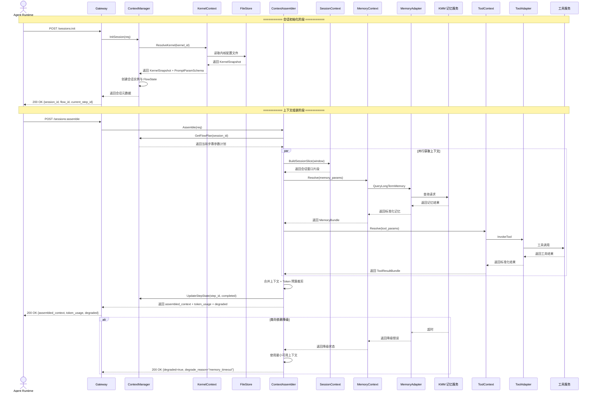
```mermaid
sequenceDiagram
    actor Agent as Agent Runtime
    participant GW as Gateway
    participant CM as ContextManager
    participant KC as KernelContext
    participant FS as FileStore
    participant ASM as ContextAssembler
    participant SC as SessionContext
    participant MC as MemoryContext
    participant MA as MemoryAdapter
    participant KMM as KMM 记忆服务
    participant TC as ToolContext
    participant TA as ToolAdapter
    participant TOOL as 工具服务

    Note over Agent,TOOL: =========== 会话初始化阶段 ===========
    Agent->>GW: POST /sessions:init
    GW->>CM: InitSession(req)
    CM->>KC: ResolveKernel(kernel_id)
    KC->>FS: 读取内核配置文件
    FS-->>KC: 返回 KernelSnapshot
    KC-->>CM: 返回 KernelSnapshot + PromptParamSchema
    CM->>CM: 创建会话实例与 FlowState
    CM-->>GW: 返回会话元数据
    GW-->>Agent: 200 OK {session_id, flow_id, current_step_id}

    Note over Agent,TOOL: =========== 上下文组装阶段 ===========
    Agent->>GW: POST /sessions:assemble
    GW->>ASM: Assemble(req)
    ASM->>CM: GetFlowPlan(session_id)
    CM-->>ASM: 返回当前步骤参数计划

    par 并行获取上下文
        ASM->>SC: BuildSessionSlice(window)
        SC-->>ASM: 返回会话窗口片段

        ASM->>MC: Resolve(memory_params)
        MC->>MA: QueryLongTermMemory
        MA->>KMM: 查询请求
        KMM-->>MA: 返回记忆结果
        MA-->>MC: 返回标准化记忆
        MC-->>ASM: 返回 MemoryBundle

        ASM->>TC: Resolve(tool_params)
        TC->>TA: InvokeTool
        TA->>TOOL: 工具调用
        TOOL-->>TA: 返回工具结果
        TA-->>TC: 返回标准化结果
        TC-->>ASM: 返回 ToolResultBundle
    end

    ASM->>ASM: 合并上下文 + Token 预算裁剪
    ASM->>CM: UpdateStepState(step_id, completed)
    ASM-->>GW: 返回 assembled_context + token_usage + degraded
    GW-->>Agent: 200 OK {assembled_context, token_usage, degraded}

    alt 南向依赖降级
        KMM--xMA: 超时
        MA-->>MC: 返回降级错误
        MC-->>ASM: 返回降级状态
        ASM->>ASM: 使用最小可用上下文
        ASM-->>GW: 200 OK {degraded=true, degrade_reason="memory_timeout"}
    end
```

#### 核心用例 3：查询组装上下文

**参与者**：Agent Runtime、Context Service

**前置条件**：
- 会话存在且已有成功组装的上下文

**主成功流程**：
1. Gateway 接收 `GET /context/v1/sessions:context` 请求
2. ContextManager 查询会话实例与最近一次成功组装结果
3. 命中则返回 `assembled_context` 与组装元数据
4. 未命中返回 `ErrAssembledContextNotFound` (404)

**异常流程**：
- 会话不存在：返回 `ErrSessionNotFound` (404)
- 会话过期：返回 `ErrSessionNotFound` (404)

---

#### 核心用例 4：上下文压缩

**参与者**：Agent Runtime、Context Service、KMM

**前置条件**：
- 会话已初始化且状态为 `active`
- 历史会话内容超过 Token 预算阈值

**主成功流程**：

1. ContextCompressor 接收压缩请求，指定压缩策略和参数
2. 根据压缩策略选择压缩算法：
   - **摘要压缩**：使用 LLM 生成历史对话摘要
   - **向量压缩**：使用向量检索提取关键信息
   - **规则压缩**：基于预定义规则裁剪冗余内容
   - **分层压缩**：结合摘要和向量压缩的多级策略
3. 调用 KMM 获取历史会话轮次数据
4. 执行压缩算法，生成压缩后的上下文片段
5. 计算压缩率（原始 Token 数 / 压缩后 Token 数）
6. 更新会话的压缩历史记录
7. 返回压缩结果：`compressed_context`、`compression_ratio`、`compression_method`

**异常流程**：
- 压缩服务超时：降级为简单截断策略，`degraded=true`
- 压缩率不达标（< 30%）：记录告警并返回原内容
- KMM 服务不可用：使用本地缓存的历史数据进行压缩

**压缩策略配置**：

| 策略名称 | 适用场景 | 压缩率目标 | 质量要求 |
|----------|----------|------------|----------|
| `summary_lite` | 轻量级摘要 | 40-50% | 保留关键决策点 |
| `summary_deep` | 深度摘要 | 60-70% | 完整语义保留 |
| `vector_extract` | 关键信息提取 | 50-60% | 高相关性保留 |
| `rule_truncate` | 紧急降级 | 20-30% | 保证可用性 |
| `hierarchical` | 综合策略 | 50-65% | 自适应平衡 |
| `smart_pruning` | 智能裁剪（冗余+场景感知） | 45-60% | 精准保留关键信息 |

---

#### 详细设计方案：融合冗余信息裁剪和场景感知的历史对话压缩

**方案名称**：SmartPruningCompression（智能裁剪压缩）

**设计目标**：
- 自动识别并裁剪工具调用、思考过程、推荐内容等低价值信息
- 基于场景感知保留对当前对话有价值的上下文
- 在保证语义完整性的前提下实现高压缩率

**核心处理流程**：

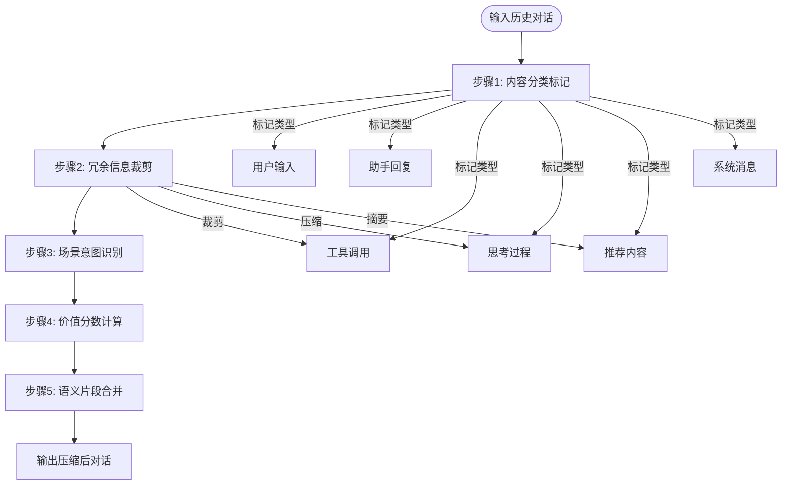
```mermaid
graph TD
    START([输入历史对话]) --> CLASSIFY[步骤1: 内容分类标记]
    CLASSIFY --> PRUNE[步骤2: 冗余信息裁剪]
    PRUNE --> SCENE[步骤3: 场景意图识别]
    SCENE --> SCORE[步骤4: 价值分数计算]
    SCORE --> MERGE[步骤5: 语义片段合并]
    MERGE --> OUTPUT[输出压缩后对话]

    CLASSIFY --> |标记类型| C1[用户输入]
    CLASSIFY --> |标记类型| C2[助手回复]
    CLASSIFY --> |标记类型| C3[工具调用]
    CLASSIFY --> |标记类型| C4[思考过程]
    CLASSIFY --> |标记类型| C5[推荐内容]
    CLASSIFY --> |标记类型| C6[系统消息]

    PRUNE --> |裁剪| C3
    PRUNE --> |压缩| C4
    PRUNE --> |摘要| C5
```

**步骤1：内容分类标记（Content Classification）**

对每轮历史对话进行多维度标记：

| 标记维度 | 类型值 | 识别特征 | 处理策略 |
|----------|--------|----------|----------|
| `message_type` | `user_query` | 用户输入 | 保留完整 |
| `message_type` | `assistant_response` | 助手回复 | 保留完整 |
| `message_type` | `tool_call` | 工具调用及结果 | 智能裁剪 |
| `message_type` | `thinking_process` | 思考过程（<think>） | 压缩或删除 |
| `message_type` | `recommendation` | 推荐内容 | 摘要保留 |
| `message_type` | `system_event` | 系统事件 | 条件保留 |
| `content_scene` | `question_answering` | 问答场景 | 保留Q&A对 |
| `content_scene` | `task_execution` | 任务执行 | 保留结果和异常 |
| `content_scene` | `multi_turn_chat` | 多轮闲聊 | 提取关键决策点 |
| `content_scene` | `tool_chaining` | 工具链调用 | 保留最终输出 |
| `value_level` | `critical` | 关键决策/承诺 | 必须保留 |
| `value_level` | `high` | 重要信息 | 优先保留 |
| `value_level` | `medium` | 一般信息 | 可摘要 |
| `value_level` | `low` | 冗余信息 | 可裁剪 |

**步骤2：冗余信息裁剪（Redundant Information Pruning）**

针对不同类型内容的裁剪策略：

```cpp
// 工具调用裁剪策略
struct ToolCallPruningStrategy {
    // 成功且无副作用的工具调用：只保留结果摘要
    bool PruneSuccessfulTool(const ToolCall& tool) {
        if (tool.status == "success" && !tool.has_side_effect) {
            return true; // 裁剪详细过程，只保留: "已执行[tool_name]，获得[结果摘要]"
        }
        return false;
    }

    // 失败或异常工具调用：保留完整信息用于错误追踪
    bool PruneFailedTool(const ToolCall& tool) {
        return tool.status != "success"; // 保留完整错误信息
    }

    // 工具链调用：只保留最终输出，中间过程用省略号代替
    std::string CompressToolChain(const std::vector<ToolCall>& chain) {
        if (chain.size() <= 2) return FormatFullChain(chain);
        return "执行了" + std::to_string(chain.size()) + "个工具，最终获得: "
               + chain.back().result_summary;
    }
};

// 思考过程裁剪策略
struct ThinkingProcessStrategy {
    // 将详细思考过程压缩为一句话决策理由
    std::string CompressThinking(const std::string& thinking) {
        // 使用轻量级模型提取核心推理路径
        return ExtractKeyDecisionPoint(thinking);
    }
};

// 推荐内容裁剪策略
struct RecommendationPruningStrategy {
    // 用户采纳的推荐：保留关键信息
    // 用户忽略的推荐：完全删除
    std::string PruneRecommendation(const Recommendation& rec, bool accepted) {
        if (!accepted) return ""; // 完全删除未采纳的推荐
        return "推荐使用: " + rec.key_point; // 只保留关键点
    }
};
```

**步骤3：场景意图识别（Scene-Aware Detection）**

基于当前对话上下文识别场景类型：

| 场景类型 | 识别特征 | 压缩策略 |
|----------|----------|----------|
| `code_debug` | 代码错误、调试请求 | 保留错误信息、保留代码片段、删除成功执行日志 |
| `data_analysis` | 数据分析、图表请求 | 保留数据源、保留结论、删除中间计算过程 |
| `creative_writing` | 创意写作、内容生成 | 保留风格要求、保留修改历史、删除生成过程中的备选 |
| `task_planning` | 任务规划、日程安排 | 保留最终计划、保留变更记录、删除讨论过程 |
| `knowledge_qa` | 知识问答 | 保留问题和准确答案、删除搜索过程 |
| `multi_agent_coord` | 多Agent协作 | 保留协调结果、保留关键决策、删除协商过程 |

**步骤4：价值分数计算（Value Scoring）**

综合多维度计算每轮对话的价值分数（0-100）：

```
价值分数 = w1 * 时效性分数 + w2 * 场景相关性 + w3 * 语义完整性 + w4 * 用户关注度

其中：
- 时效性分数：基于时间衰减函数 e^(-λ * Δt)，最近对话分数高
- 场景相关性：与当前 query 的向量相似度
- 语义完整性：是否包含完整的问答对或任务闭环
- 用户关注度：用户是否追问、是否标记重要

权重配置（可基于场景调整）：
- 问答场景: w1=0.2, w2=0.4, w3=0.3, w4=0.1
- 任务场景: w1=0.3, w2=0.3, w3=0.2, w4=0.2
```

**步骤5：语义片段合并（Semantic Chunk Merging）**

将保留下来的片段智能合并为连贯的摘要：

```cpp
// 合并策略
struct SemanticMergeStrategy {
    // 将相邻的短对话合并为一个语义单元
    std::vector<ContextChunk> MergeAdjacentChunks(
        const std::vector<ContextChunk>& chunks) {
        std::vector<ContextChunk> merged;
        for (const auto& chunk : chunks) {
            if (!merged.empty() && CanMerge(merged.back(), chunk)) {
                merged.back() = Merge(merged.back(), chunk);
            } else {
                merged.push_back(chunk);
            }
        }
        return merged;
    }

    // 判断两个片段是否可以合并
    bool CanMerge(const ContextChunk& a, const ContextChunk& b) {
        // 同一话题、时间接近、角色互补
        return SameTopic(a, b) &&
               TimeDelta(a, b) < 60s &&
               ComplementaryRole(a.role, b.role);
    }
};
```

**压缩效果示例**：

```
原始对话（Token数: 850）：
[用户]: 帮我查一下北京的天气
[助手思考]: 用户想知道北京天气，我需要调用天气工具...
[工具调用]: weather_api.get(city="北京")
[工具结果]: {temp: 25, humidity: 60%, ...详细字段}
[助手回复]: 北京今天天气晴朗，25度...
[推荐]: 是否需要查看上海天气？
[用户]: 不需要
[思考]: 用户拒绝了推荐...

压缩后（Token数: 120, 压缩率: 86%）：
[用户]: 帮我查一下北京的天气
[助手]: 已查询天气 → 北京今天天气晴朗，25度
（省略了工具调用细节、思考过程、未采纳的推荐）
```

**配置参数**：

| 参数名 | 默认值 | 说明 |
|--------|--------|------|
| `enable_tool_pruning` | true | 启用工具调用裁剪 |
| `enable_thinking_pruning` | true | 启用思考过程裁剪 |
| `enable_rec_pruning` | true | 启用推荐内容裁剪 |
| `scene_detection` | auto | 场景检测模式 |
| `value_threshold` | 40 | 价值分数阈值，低于此值的对话被裁剪 |
| `merge_adjacent` | true | 启用相邻片段合并 |
| `preserve_qa_pairs` | true | 强制保留完整的问答对 |

---

#### 核心用例 5：上下文选择

**参与者**：Agent Runtime、Context Service、KMM

**前置条件**：
- 会话已初始化且状态为 `active`
- 存在多个候选上下文片段供选择

**主成功流程**：

1. ContextSelector 接收选择请求，包含当前用户 query 和候选上下文列表
2. 根据选择模式执行不同策略：
   - **语义相关性选择**：计算候选内容与当前 query 的语义相似度
   - **时序重要性选择**：基于时间衰减模型评估历史重要性
   - **结构化选择**：按预定义结构（如技能、领域、意图）筛选
   - **混合选择**：综合语义、时序和结构化因素
3. 为每个候选上下文计算选择分数
4. 根据 Token 预算筛选 Top-K 最相关的上下文
5. 对选中内容进行排序和去重
6. 返回选择结果：`selected_contexts`、`selection_scores`、`selection_method`

**异常流程**：
- 选择服务超时：使用简单的 LRU 策略选择最近上下文
- 所有候选相关性低：扩大选择范围并标记 `low_confidence=true`
- KMM 向量服务不可用：降级为基于关键词的匹配选择

**选择算法配置**：

| 算法模式 | 核心机制 | 适用场景 | 复杂度 |
|----------|----------|----------|--------|
| `semantic_similarity` | 向量余弦相似度 | 开放式对话 | O(n) |
| `temporal_decay` | 时间衰减 + 访问频率 | 长期会话 | O(n log n) |
| `structured_match` | 元数据标签匹配 | 结构化任务 | O(log n) |
| `hybrid_scoring` | 多维度加权评分 | 复杂场景 | O(n log n) |
| `attention_based` | 注意力机制权重 | 多轮推理 | O(n²) |
| `precision_recall` | 精准匹配+召回增强 | 精确查询场景 | O(n log n) |

---

#### 详细设计方案：保留与当前 Query 相关且精确的历史对话选择

**方案名称**：PrecisionRecallSelector（精准召回选择器）

**设计目标**：
- 精确识别与当前 query 语义相关的历史对话
- 保留对当前决策有实质影响的关键上下文
- 避免信息过载，选择最精炼有效的历史片段

**核心处理流程**：

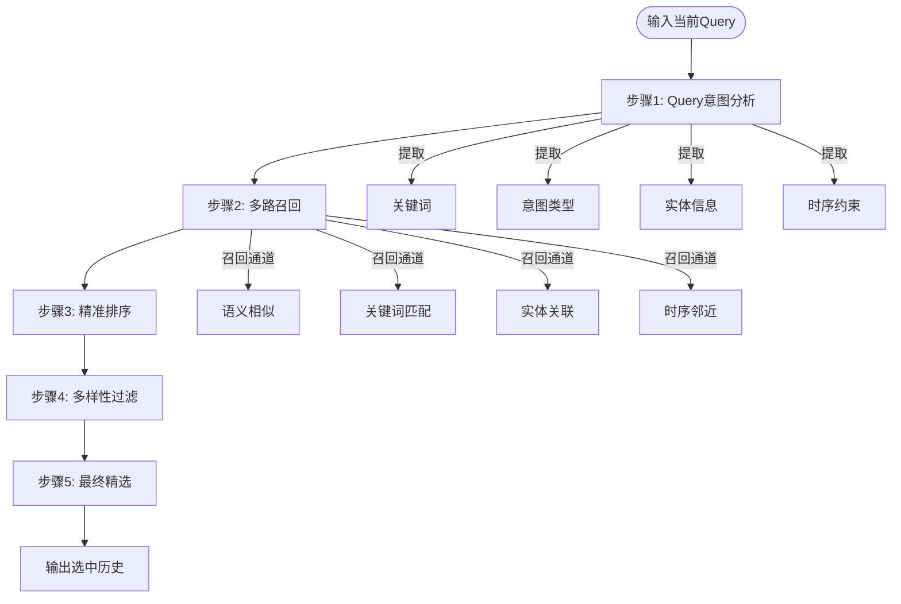
```mermaid
graph TD
    START([输入当前Query]) --> ANALYSIS[步骤1: Query意图分析]
    ANALYSIS --> RETRIEVAL[步骤2: 多路召回]
    RETRIEVAL --> RANKING[步骤3: 精准排序]
    RANKING --> DIVERSITY[步骤4: 多样性过滤]
    DIVERSITY --> FINAL[步骤5: 最终精选]
    FINAL --> OUTPUT[输出选中历史]

    ANALYSIS --> |提取| A1[关键词]
    ANALYSIS --> |提取| A2[意图类型]
    ANALYSIS --> |提取| A3[实体信息]
    ANALYSIS --> |提取| A4[时序约束]

    RETRIEVAL --> |召回通道| R1[语义相似]
    RETRIEVAL --> |召回通道| R2[关键词匹配]
    RETRIEVAL --> |召回通道| R3[实体关联]
    RETRIEVAL --> |召回通道| R4[时序邻近]
```

**步骤1：Query意图分析（Query Intent Analysis）**

深度解析当前 query，提取选择所需的关键要素：

```cpp
struct QueryAnalysis {
    // 语义向量表示
    std::vector<float> semantic_vector;

    // 提取的关键词及其权重
    std::vector<std::pair<std::string, float>> keywords;

    // 意图类型分类
    enum IntentType {
        FOLLOW_UP,      // 追问/跟进
        TOPIC_SWITCH,   // 话题切换
        REFINEMENT,     // 细化/澄清
        CONTRADICTION,  // 否定/修正
        GENERAL         // 一般询问
    } intent_type;

    // 命名实体识别结果
    struct Entity {
        std::string name;
        std::string type;  // PERSON, LOCATION, ORGANIZATION, TIME, etc.
        float confidence;
    };
    std::vector<Entity> entities;

    // 时序约束（如"刚才说的","之前提到的"）
    struct TemporalConstraint {
        bool has_constraint;
        enum Type { RECENT, SPECIFIC, RANGE } type;
        int turn_range;  // 最近N轮
    } temporal;

    // 话题一致性检测
    float topic_coherence_with_recent;  // 与最近对话的话题连贯度 0-1
};
```

**步骤2：多路召回（Multi-Channel Retrieval）**

基于不同策略召回候选历史对话：

| 召回通道 | 策略描述 | 适用场景 | 召回数量 |
|----------|----------|----------|----------|
| **语义相似召回** | 向量相似度 Top-K | 语义相关但表述不同 | K=10 |
| **关键词匹配召回** | BM25/TF-IDF 高分 | 关键词重叠 | K=8 |
| **实体关联召回** | 相同实体共现 | 涉及相同人物/地点/事物 | K=6 |
| **时序邻近召回** | 最近 N 轮对话 | 上下文连贯性强 | K=5 |
| **意图链召回** | 相同意图类型的历史 | 追问、细化类 query | K=5 |
| **用户关注召回** | 用户标记重要/追问 | 高价值历史 | K=3 |

**步骤3：精准排序（Precision Ranking）**

使用多阶段排序模型对召回结果进行精细排序：

```cpp
// 第一阶段：粗排（轻量级特征，快速过滤）
struct CoarseRanker {
    float Score(const HistoryTurn& turn, const QueryAnalysis& query) {
        float score = 0.0;

        // 1. 基础语义相似度 (40%)
        score += 0.4 * CosineSimilarity(turn.vector, query.semantic_vector);

        // 2. 关键词匹配度 (30%)
        score += 0.3 * KeywordMatchScore(turn.content, query.keywords);

        // 3. 实体匹配度 (20%)
        score += 0.2 * EntityOverlapScore(turn.entities, query.entities);

        // 4. 时序衰减 (10%)
        score += 0.1 * TemporalDecayScore(turn.timestamp);

        return score;
    }
};

// 第二阶段：精排（深度特征，保证质量）
struct FineRanker {
    float Score(const HistoryTurn& turn, const QueryAnalysis& query) {
        float score = 0.0;

        // 1. 语义相关性（使用交叉编码器）
        score += 0.35 * CrossEncoderScore(query.text, turn.content);

        // 2. 意图一致性
        score += 0.25 * IntentConsistencyScore(query.intent_type, turn.intent);

        // 3. 话题连贯性
        score += 0.20 * TopicCoherenceScore(query.text, turn.topic_vector);

        // 4. 信息增益评估（该历史对回答当前query的价值）
        score += 0.15 * InformationGainScore(turn, query);

        // 5. 用户反馈信号（历史是否被用户确认/采纳）
        score += 0.05 * UserFeedbackScore(turn.feedback_signals);

        return score;
    }
};
```

**步骤4：多样性过滤（Diversity Filtering）**

避免选择内容高度相似的历史，保证信息的多样性：

```cpp
// MMR (Maximal Marginal Relevance) 算法实现
std::vector<HistoryTurn> DiversityFilter(
    const std::vector<HistoryTurn>& ranked_history,
    const QueryAnalysis& query,
    float lambda = 0.5) {  // 平衡相关性和多样性

    std::vector<HistoryTurn> selected;
    std::set<size_t> selected_indices;

    while (selected.size() < target_count && selected_indices.size() < ranked_history.size()) {
        float max_mmr_score = -1;
        size_t best_idx = 0;

        for (size_t i = 0; i < ranked_history.size(); ++i) {
            if (selected_indices.count(i)) continue;

            // MMR = λ * Sim(query, doc) - (1-λ) * max(Sim(doc, selected))
            float relevance = Similarity(query, ranked_history[i]);
            float max_sim_to_selected = 0;
            for (const auto& sel : selected) {
                max_sim_to_selected = std::max(max_sim_to_selected,
                                               Similarity(ranked_history[i], sel));
            }

            float mmr_score = lambda * relevance - (1 - lambda) * max_sim_to_selected;

            if (mmr_score > max_mmr_score) {
                max_mmr_score = mmr_score;
                best_idx = i;
            }
        }

        selected.push_back(ranked_history[best_idx]);
        selected_indices.insert(best_idx);
    }

    return selected;
}
```

**步骤5：最终精选（Final Selection）**

基于 Token 预算和重要性进行最终筛选：

```
精选策略：
1. 强制保留（Must-Have）：
   - 包含与当前 query 相同实体的对话
   - 用户明确确认/采纳的历史建议
   - 上一轮的直接上下文（保持连贯性）

2. 优先保留（Should-Have）：
   - 高排序分数且信息增益大
   - 与当前话题高度相关
   - 包含关键决策点或用户偏好

3. 可选保留（Nice-to-Have）：
   - 提供额外背景信息
   - 有助于理解用户长期偏好

4. 排除（Exclude）：
   - 与当前 query 语义无关
   - 已被后续对话覆盖/修正
   - 信息价值低（如简单问候）
```

**特殊场景处理**：

| 场景 | 检测特征 | 选择策略 |
|------|----------|----------|
| **追问场景** | "刚才说的..."、"那个..." | 优先选择最近的包含目标实体的对话 |
| **话题回归** | "回到之前的话题..." | 选择该话题的历史锚点对话 |
| **修正/否定** | "不对，我是说..." | 选择被修正前的对话（了解误解原因）和修正后的对话 |
| **多轮规划** | "第一步...第二步..." | 选择规划相关的完整对话链 |
| **对比询问** | "A和B有什么区别..." | 分别选择包含A和B的历史对话 |

**相关性评估示例**：

```
当前Query: "那个方案的成本是多少？"

历史候选：
1. [5轮前] 用户: 帮我设计一个微服务架构方案
   → 相关性: 0.85 (高，是提到的"那个方案")

2. [3轮前] 用户: 数据库选型有什么建议？
   → 相关性: 0.45 (中，属于架构的一部分)

3. [2轮前] 用户: 推荐一本技术书
   → 相关性: 0.10 (低，无关话题)

4. [1轮前] 用户: 这个方案需要多少人天？
   → 相关性: 0.90 (高，同一方案的成本相关)

选择结果: [1, 4] + 当前query构成的完整上下文
```

**配置参数**：

| 参数名 | 默认值 | 说明 |
|--------|--------|------|
| `recall_channels` | 6 | 启用的召回通道数量 |
| `coarse_top_k` | 20 | 粗排保留数量 |
| `fine_top_k` | 10 | 精排保留数量 |
| `diversity_lambda` | 0.5 | MMR多样性权重 |
| `max_token_budget` | 2000 | 选择结果的最大Token数 |
| `min_relevance_threshold` | 0.3 | 最小相关性阈值 |
| `preserve_last_n` | 2 | 强制保留最近N轮 |
| `enable_entity_boost` | true | 启用实体匹配加分 |

**效果评估指标**：

| 指标 | 说明 | 目标值 |
|------|------|--------|
| 精确率@K | 前K个选择结果的相关比例 | ≥ 90% |
| 召回率 | 相关历史被成功选择的比例 | ≥ 85% |
| 多样性指数 | 选择结果的多样性度量 | ≥ 0.6 |
| 用户满意度 | 人工评估选择质量 | ≥ 4.2/5 |

---

#### 核心用例 6：Local Context Cache 上下文获取

**参与者**：业务 Agent、Local Context Cache、Context Service、LLM

**前置条件**：
- 业务 Agent 已创建 AgentContext 实例
- Workflow 流程已定义并传入
- Context Service 服务可用

**主成功流程**：

1. 业务 Agent 创建 AgentContext 对象，传入 workflow 配置
2. AgentContext 解析 workflow，识别各节点所需的上下文类型
3. AgentContext 启动异步预加载线程，提前获取可能需要的上下文
4. Agent 执行到某 node 节点时，调用 AgentContext.GetContext(node_id)
5. AgentContext 检查缓存：命中直接返回，未命中则同步请求 Context Service
6. AgentContext 组装完整的上下文信息（包括 prompt、memory、tool 等）
7. 返回 ContextPackage 给业务 Agent
8. 业务 Agent 将上下文传给 LLM 进行推理

**异常流程**：
- Context Service 超时：返回已缓存的基础上下文，标记 `partial=true`
- 上下文获取失败：返回错误，业务 Agent 可选择降级或重试
- Workflow 节点不存在：返回 `ErrInvalidNodeID` 错误

---

**Local Context Cache C++ 接口定义**

```cpp
// AgentContext.h
// Local Context Cache 对外 C++ 接口定义

#pragma once

#include <string>
#include <vector>
#include <memory>
#include <functional>
#include <future>
#include <unordered_map>
#include <optional>

namespace context_service {

// 前向声明
class ContextServiceClient;

// 上下文类型枚举
enum class ContextType {
    SESSION = 0,    // 会话上下文
    MEMORY = 1,     // 记忆上下文
    KERNEL = 2,     // 内核上下文
    TOOL = 3,       // 工具上下文
    COMPRESSED = 4, // 压缩上下文
    SELECTED = 5    // 选择后的上下文
};

// 上下文元数据
struct ContextMeta {
    std::string context_id;
    ContextType type;
    std::string source;
    uint64_t token_count;
    uint64_t timestamp;
    float relevance_score;
    std::unordered_map<std::string, std::string> tags;
};

// 上下文包，包含完整的上下文信息
struct ContextPackage {
    // 基础信息
    std::string session_id;
    std::string agent_id;
    std::string node_id;

    // Prompt 信息
    std::string system_prompt;
    std::string user_prompt;
    std::vector<std::pair<std::string, std::string>> few_shot_examples;

    // 历史上下文
    std::vector<std::string> conversation_history;
    std::string compressed_history_summary;

    // 记忆上下文
    std::vector<std::string> long_term_memories;
    std::vector<std::string> relevant_memories;

    // 工具上下文
    std::vector<std::string> available_tools;
    std::string tool_results;

    // 元数据
    ContextMeta meta;
    bool is_partial;          // 是否为部分上下文（降级）
    bool is_from_cache;       // 是否来自缓存
    uint64_t latency_ms;      // 获取延迟

    // Token 统计
    struct TokenUsage {
        uint32_t prompt_tokens;
        uint32_t completion_tokens;
        uint32_t total_tokens;
        uint32_t budget_limit;
    } token_usage;
};

// Workflow 节点定义
struct WorkflowNode {
    std::string node_id;
    std::string node_type;
    std::vector<ContextType> required_contexts;
    std::unordered_map<std::string, std::string> params;
    std::vector<std::string> dependencies;
};

// Workflow 定义
struct Workflow {
    std::string workflow_id;
    std::string workflow_name;
    std::vector<WorkflowNode> nodes;
    std::unordered_map<std::string, std::string> global_params;
};

// 回调函数类型定义
using ContextReadyCallback = std::function<void(const std::string& node_id,
                                                  const ContextPackage& context,
                                                  bool success)>;
using ContextUpdateCallback = std::function<void(const std::string& context_id,
                                                   const ContextMeta& meta)>;

// AgentContext 类 - Local Context Cache 核心接口
class AgentContext {
public:
    // 构造函数
    // agent_id: Agent 唯一标识
    // session_id: 会话唯一标识（可选，不传则创建新会话）
    // workflow: Workflow 流程定义
    // config: 配置参数
    AgentContext(const std::string& agent_id,
                 const std::optional<std::string>& session_id,
                 const Workflow& workflow,
                 const std::unordered_map<std::string, std::string>& config);

    // 析构函数
    ~AgentContext();

    // 禁止拷贝，允许移动
    AgentContext(const AgentContext&) = delete;
    AgentContext& operator=(const AgentContext&) = delete;
    AgentContext(AgentContext&&) noexcept;
    AgentContext& operator=(AgentContext&&) noexcept;

    // ========== 同步接口 ==========

    // 获取指定节点的完整上下文（阻塞式）
    // node_id: Workflow 节点 ID
    // timeout_ms: 超时时间（毫秒）
    // 返回: 上下文包，失败时抛出异常
    ContextPackage GetContext(const std::string& node_id,
                               uint32_t timeout_ms = 5000);

    // 获取指定类型的上下文（阻塞式）
    ContextPackage GetContextByType(ContextType type,
                                     const std::string& node_id,
                                     uint32_t timeout_ms = 5000);

    // 检查指定节点的上下文是否已就绪
    bool IsContextReady(const std::string& node_id) const;

    // ========== 异步接口 ==========

    // 异步获取上下文
    // 返回 future 对象，可通过 get() 获取结果
    std::future<ContextPackage> GetContextAsync(const std::string& node_id);

    // 预加载指定节点的上下文（后台异步）
    // 用于提前准备后续节点需要的上下文
    void PreloadContext(const std::string& node_id);

    // 批量预加载多个节点的上下文
    void PreloadContexts(const std::vector<std::string>& node_ids);

    // 注册上下文就绪回调
    void RegisterContextReadyCallback(ContextReadyCallback callback);

    // 注册上下文更新回调
    void RegisterContextUpdateCallback(ContextUpdateCallback callback);

    // ========== 缓存管理接口 ==========

    // 刷新指定节点的上下文缓存
    void RefreshContext(const std::string& node_id);

    // 使指定节点的上下文缓存失效
    void InvalidateContext(const std::string& node_id);

    // 清空所有缓存
    void ClearCache();

    // 获取当前缓存统计信息
    struct CacheStats {
        size_t hit_count;
        size_t miss_count;
        size_t cache_size;
        size_t max_cache_size;
        double hit_rate;
    };
    CacheStats GetCacheStats() const;

    // ========== 会话管理接口 ==========

    // 创建新的 task（在现有 session 内创建子任务上下文）
    std::string CreateTask(const std::string& task_name,
                           const std::unordered_map<std::string, std::string>& task_params);

    // 切换到指定 task
    void SwitchTask(const std::string& task_id);

    // 结束指定 task
    void EndTask(const std::string& task_id);

    // 获取当前 session ID
    std::string GetSessionId() const;

    // 获取当前 task ID
    std::string GetCurrentTaskId() const;

    // ========== 配置接口 ==========

    // 更新配置
    void UpdateConfig(const std::unordered_map<std::string, std::string>& config);

    // 设置全局上下文参数
    void SetGlobalParam(const std::string& key, const std::string& value);

    // 获取全局上下文参数
    std::string GetGlobalParam(const std::string& key) const;

private:
    class Impl;
    std::unique_ptr<Impl> pImpl;
};

// 线程安全配置（新增）
struct ThreadSafetyConfig {
    // 预加载线程池大小
    size_t preload_thread_pool_size = 4;
    size_t max_concurrent_preloads = 10;

    // 回调线程池
    size_t callback_thread_pool_size = 2;

    // 缓存锁策略
    enum CacheLockStrategy {
        MUTEX,              // 互斥锁
        READ_WRITE_LOCK,    // 读写锁（默认）
        LOCK_FREE           // 无锁结构
    } cache_lock_strategy = READ_WRITE_LOCK;

    // 调试选项
    bool enable_deadlock_detection = false;
};

// 一致性级别（新增）
enum ConsistencyLevel {
    EVENTUAL_CONSISTENCY,   // 最终一致性（默认）
    READ_YOUR_WRITES,       // 读己之写
    SESSION_CONSISTENCY,    // 会话一致性
    STRONG_CONSISTENCY      // 强一致性
};

// 版本向量（新增）
struct VersionVector {
    std::string session_id;
    std::string node_id;
    uint64_t sequence_number;
    uint64_t timestamp_ms;
    std::string content_hash;
};

// 上下文异常类
class ContextException : public std::exception {
public:
    enum ErrorCode {
        OK = 0,
        SESSION_NOT_FOUND = 1001,
        NODE_NOT_FOUND = 1002,
        CONTEXT_NOT_READY = 1003,
        TIMEOUT = 1004,
        SERVICE_UNAVAILABLE = 1005,
        INVALID_PARAMETER = 1006,
        NETWORK_ERROR = 1007,
        COMPRESSION_FAILED = 1008,
        SELECTION_FAILED = 1009,
        VERSION_CONFLICT = 1010,      // 版本冲突（新增）
        CACHE_STALE = 1011,           // 缓存过期（新增）
        RACE_CONDITION = 1012         // 竞态条件（新增）
    };

    ContextException(ErrorCode code, const std::string& message);
    ErrorCode GetCode() const { return code_; }
    const char* what() const noexcept override { return message_.c_str(); }

private:
    ErrorCode code_;
    std::string message_;
};

// 工厂函数：创建 AgentContext 实例
std::shared_ptr<AgentContext> CreateAgentContext(
    const std::string& agent_id,
    const std::optional<std::string>& session_id,
    const Workflow& workflow,
    const std::unordered_map<std::string, std::string>& config = {});

// 初始化 Local Context Cache 库
void Initialize(const std::unordered_map<std::string, std::string>& global_config);

// 反初始化
void Shutdown();

} // namespace context_service
```

---

**Local Context Cache 工作流程图**

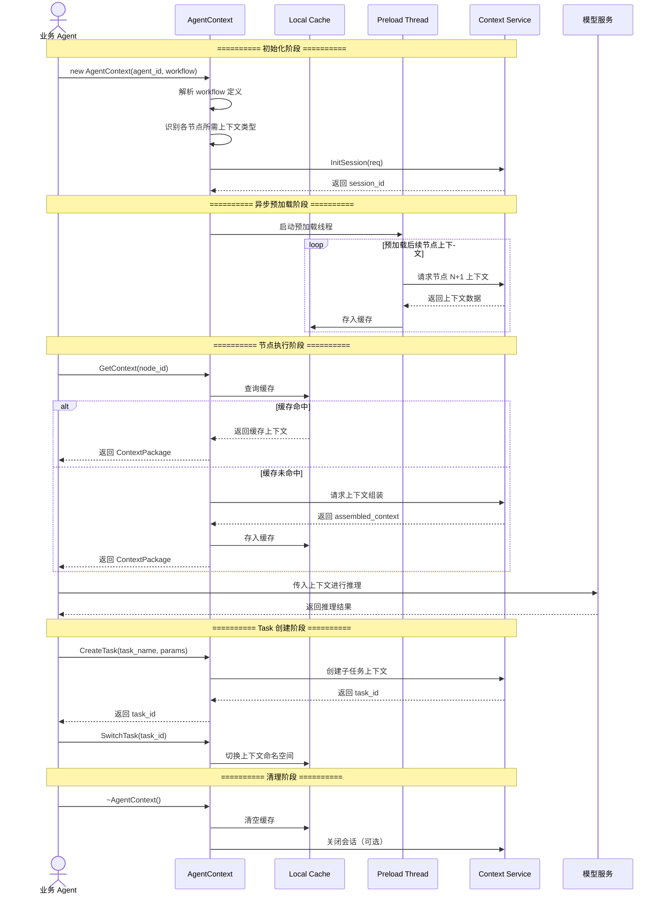
```mermaid
sequenceDiagram
    actor Agent as 业务 Agent
    participant ACC as AgentContext
    participant Cache as Local Cache
    participant prefetch as Preload Thread
    participant CS as Context Service
    participant LLM as 模型服务

    Note over Agent,CS: ========== 初始化阶段 ==========
    Agent->>ACC: new AgentContext(agent_id, workflow)
    ACC->>ACC: 解析 workflow 定义
    ACC->>ACC: 识别各节点所需上下文类型
    ACC->>CS: InitSession(req)
    CS-->>ACC: 返回 session_id

    Note over Agent,CS: ========== 异步预加载阶段 ==========
    ACC->>prefetch: 启动预加载线程
    loop 预加载后续节点上下文
        prefetch->>CS: 请求节点 N+1 上下文
        CS-->>prefetch: 返回上下文数据
        prefetch->>Cache: 存入缓存
    end

    Note over Agent,CS: ========== 节点执行阶段 ==========
    Agent->>ACC: GetContext(node_id)
    ACC->>Cache: 查询缓存

    alt 缓存命中
        Cache-->>ACC: 返回缓存上下文
        ACC-->>Agent: 返回 ContextPackage
    else 缓存未命中
        ACC->>CS: 请求上下文组装
        CS-->>ACC: 返回 assembled_context
        ACC->>Cache: 存入缓存
        ACC-->>Agent: 返回 ContextPackage
    end

    Agent->>LLM: 传入上下文进行推理
    LLM-->>Agent: 返回推理结果

    Note over Agent,CS: ========== Task 创建阶段 ==========
    Agent->>ACC: CreateTask(task_name, params)
    ACC->>CS: 创建子任务上下文
    CS-->>ACC: 返回 task_id
    ACC-->>Agent: 返回 task_id

    Agent->>ACC: SwitchTask(task_id)
    ACC->>Cache: 切换上下文命名空间

    Note over Agent,CS: ========== 清理阶段 ==========
    Agent->>ACC: ~AgentContext()
    ACC->>Cache: 清空缓存
    ACC->>CS: 关闭会话（可选）
```

**Local Context Cache 状态流转图**

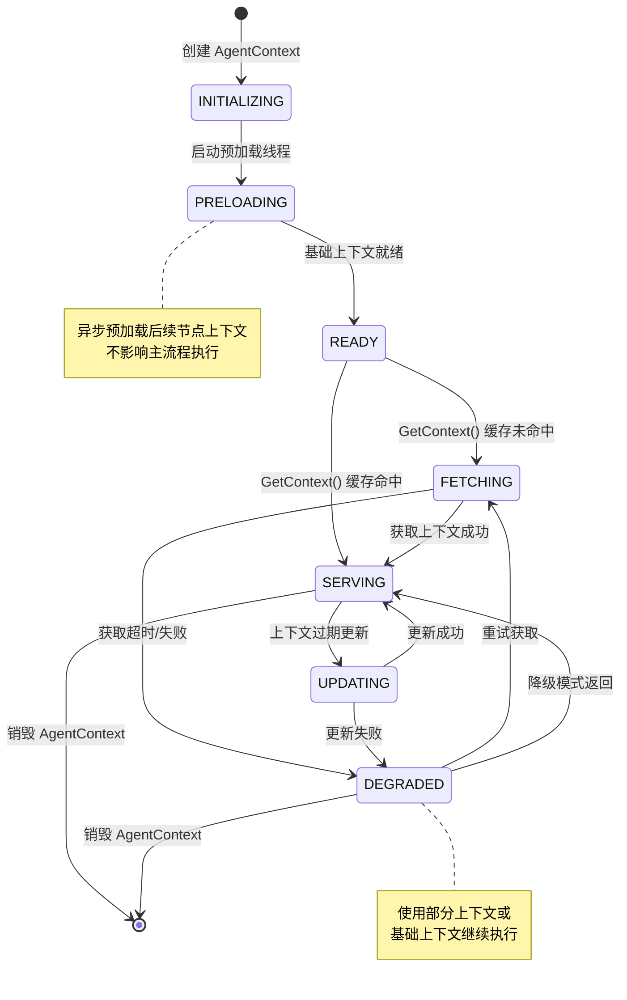
```mermaid
stateDiagram-v2
    [*] --> INITIALIZING: 创建 AgentContext
    INITIALIZING --> PRELOADING: 启动预加载线程
    PRELOADING --> READY: 基础上下文就绪

    READY --> FETCHING: GetContext() 缓存未命中
    READY --> SERVING: GetContext() 缓存命中

    FETCHING --> SERVING: 获取上下文成功
    FETCHING --> DEGRADED: 获取超时/失败

    SERVING --> UPDATING: 上下文过期更新
    UPDATING --> SERVING: 更新成功
    UPDATING --> DEGRADED: 更新失败

    DEGRADED --> FETCHING: 重试获取
    DEGRADED --> SERVING: 降级模式返回

    SERVING --> [*]: 销毁 AgentContext
    DEGRADED --> [*]: 销毁 AgentContext

    note right of PRELOADING
        异步预加载后续节点上下文
        不影响主流程执行
    end note

    note right of DEGRADED
        使用部分上下文或
        基础上下文继续执行
    end note
```

---

#### 核心用例 7：缓存一致性管理

**参与者**：Local Context Cache、Context Service、Agent Runtime

**前置条件**：
- Local Context Cache 已缓存部分上下文数据
- Context Service 中对应的数据可能已更新

**主成功流程**：

1. Local Context Cache 定期或在特定事件触发时，向 Context Service 发送版本校验请求
2. Context Service 返回各缓存键的当前版本号（Version Vector）或 ETag
3. Local Cache 对比本地版本与服务器版本
4. 若版本不一致，标记该缓存项为 `stale`
5. 根据策略选择立即刷新或惰性刷新（下次访问时更新）
6. 更新本地缓存版本号，保持与服务端一致

**异常流程**：
- 版本校验超时：标记缓存为 `uncertain`，增加校验频率
- 服务端不可达：延长本地缓存有效期，进入降级模式
- 版本冲突（Concurrent Update）：使用 Last-Write-Wins 或自定义冲突解决策略

---

#### 详细设计方案：数据一致性与缓存失效机制

**方案名称**：VersionBasedConsistency（基于版本的缓存一致性协议）

**设计目标**：
- 保证 Local Cache 与 Context Service 数据最终一致性
- 最小化网络开销，避免频繁全量同步
- 支持离线/弱网环境下的优雅降级

**核心架构**：

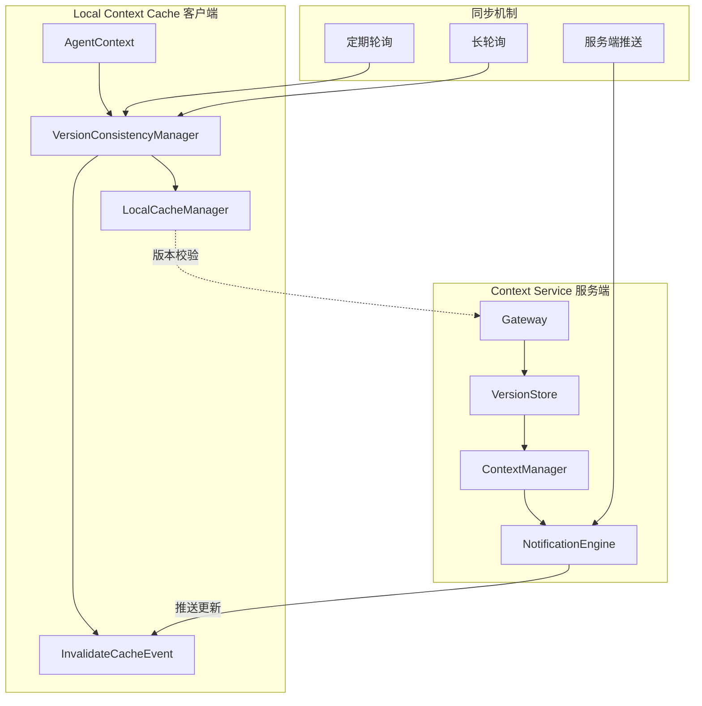
```mermaid
graph TB
    subgraph Client["Local Context Cache 客户端"]
        AC[AgentContext]
        VCM[VersionConsistencyManager]
        LM[LocalCacheManager]
        ICE[InvalidateCacheEvent]
    end

    subgraph Server["Context Service 服务端"]
        GW[Gateway]
        VS[VersionStore]
        CM[ContextManager]
        NE[NotificationEngine]
    end

    subgraph Sync["同步机制"]
        Polling[定期轮询]
        LongPoll[长轮询]
        Push[服务端推送]
    end

    AC --> VCM
    VCM --> LM
    VCM --> ICE
    LM -.->|版本校验| GW
    GW --> VS
    VS --> CM
    CM --> NE
    NE -->|推送更新| ICE
    Polling --> VCM
    LongPoll --> VCM
    Push --> NE
```

**版本向量机制（Version Vector）**：

```cpp
// 版本向量定义
struct VersionVector {
    std::string session_id;
    std::string node_id;
    uint64_t sequence_number;      // 单调递增序列号
    uint64_t timestamp_ms;         // 物理时间戳
    std::string content_hash;      // 内容哈希（可选）

    // 比较操作
    Ordering Compare(const VersionVector& other) const {
        if (sequence_number < other.sequence_number) return LESS;
        if (sequence_number > other.sequence_number) return GREATER;
        if (timestamp_ms < other.timestamp_ms) return LESS;
        if (timestamp_ms > other.timestamp_ms) return GREATER;
        return EQUAL;
    }
};

// 会话级版本管理
struct SessionVersionState {
    VersionVector current_version;
    std::unordered_map<std::string, VersionVector> node_versions;
    uint64_t last_sync_time_ms;
    bool is_dirty;  // 本地是否有未同步修改
};
```

**缓存一致性协议**：

```cpp
class VersionConsistencyManager {
public:
    // 配置选项
    struct Config {
        // 同步策略
        enum SyncStrategy {
            LAZY,        // 惰性同步（读取时检查）
            EAGER,       // 主动同步（定期轮询）
            EVENT_BASED  // 事件驱动（服务端推送）
        } sync_strategy = EVENT_BASED;

        // 校验间隔
        uint32_t version_check_interval_ms = 5000;  // 5秒
        uint32_t max_staleness_ms = 30000;          // 最大过期时间30秒

        // 冲突解决策略
        enum ConflictResolution {
            LAST_WRITE_WINS,    // 最后写入胜出
            SERVER_WINS,        // 服务端优先
            CLIENT_WINS,        // 客户端优先
            MERGE               // 合并（需业务支持）
        } conflict_resolution = SERVER_WINS;
    };

    // 初始化版本管理
    void Initialize(const std::string& session_id, const Config& config);

    // 获取带版本校验的上下文
    std::pair<ContextPackage, VersionVector> GetContextWithVersion(
        const std::string& node_id);

    // 处理服务端推送的失效事件
    void HandleInvalidateEvent(const InvalidateEvent& event);

    // 强制同步指定节点的版本
    SyncResult ForceSync(const std::string& node_id);

    // 批量版本校验（轻量级）
    BatchVersionCheckResult CheckVersions(
        const std::vector<std::string>& node_ids);

private:
    // 版本比较与冲突检测
    void DetectAndResolveConflict(
        const std::string& node_id,
        const VersionVector& local_version,
        const VersionVector& server_version);

    // 后台版本同步线程
    void BackgroundVersionSync();
};
```

**三级缓存失效策略**：

| 失效级别 | 触发条件 | 处理策略 | 性能影响 |
|----------|----------|----------|----------|
| **Level 1: 软失效** | 版本号变化但内容未变（哈希相同） | 仅更新版本号，保留缓存内容 | 无 |
| **Level 2: 内容失效** | 服务端内容更新 | 标记为 stale，下次访问时刷新 | 低 |
| **Level 3: 强制失效** | 配置变更、权限变更、手动清除 | 立即清除缓存，强制重新加载 | 中 |

**服务端推送机制**：

```cpp
// 服务端推送事件定义
struct CacheInvalidateEvent {
    std::string session_id;
    std::string node_id;
    VersionVector new_version;
    InvalidateReason reason;
    uint64_t timestamp_ms;

    enum InvalidateReason {
        CONTENT_UPDATED,     // 内容被更新
        CONFIG_CHANGED,      // 配置变更
        PERMISSION_CHANGED,  // 权限变更
        SESSION_EXPIRED,     // 会话过期
        MANUAL_INVALIDATE    // 手动失效
    };
};

// 长轮询机制
class LongPollingClient {
public:
    // 建立长轮询连接
    void StartLongPolling(const std::string& session_id);

    // 处理服务端推送
    void OnServerPush(const std::vector<CacheInvalidateEvent>& events);

private:
    // 连接断开重连（指数退避）
    void ReconnectWithBackoff();
};
```

**一致性级别配置**：

```cpp
enum ConsistencyLevel {
    // 最终一致性（默认）
    // 允许短暂不一致，强调性能
    EVENTUAL_CONSISTENCY,

    // 读己之写一致性
    // 保证自己写入的数据能立即读到
    READ_YOUR_WRITES,

    // 会话一致性
    // 同一会话内保证一致性
    SESSION_CONSISTENCY,

    // 强一致性（需牺牲性能）
    // 每次读取都校验版本
    STRONG_CONSISTENCY
};

// 在 AgentContext 构造时指定
AgentContext(const std::string& agent_id,
             const Workflow& workflow,
             ConsistencyLevel consistency_level = EVENTUAL_CONSISTENCY);
```

**容错与降级**：

```cpp
struct ConsistencyFallback {
    // 服务端不可达时的策略
    enum UnreachableStrategy {
        USE_STALE,      // 使用过期缓存（带标记）
        FAIL_FAST,      // 快速失败
        LOCAL_MODE      // 纯本地模式
    } strategy = USE_STALE;

    // 最大可接受过期时间
    uint32_t max_acceptable_staleness_ms = 60000;

    // 服务端恢复后是否自动同步
    bool auto_resync_on_recovery = true;
};
```

---

#### 详细设计方案：并发与线程安全机制

**方案名称**：ThreadSafeContextAccess（线程安全上下文访问）

**设计目标**：
- 明确 AgentContext 的线程安全保证级别
- 避免数据竞争和死锁
- 提供高性能的并发访问能力

**线程安全级别定义**：

```cpp
// AgentContext 线程安全声明
class AgentContext {
public:
    // ========================================
    // 线程安全等级说明
    // ========================================
    //
    // 【线程安全】可同时多线程调用：
    //   - GetContext() / GetContextAsync()
    //   - GetContextByType()
    //   - IsContextReady()
    //   - GetCacheStats()
    //   - GetSessionId() / GetCurrentTaskId()
    //
    // 【需外部同步】不建议多线程并发：
    //   - CreateTask() / EndTask()
    //   - SwitchTask()
    //   - UpdateConfig()
    //   - SetGlobalParam()
    //
    // 【内部线程安全】回调函数执行：
    //   - 回调在专用线程池执行
    //   - 回调中禁止调用阻塞式 API
    //
    // ========================================

    // 线程安全配置
    struct ConcurrencyConfig {
        // 预加载线程池
        size_t preload_thread_pool_size = 4;
        size_t max_concurrent_preloads = 10;

        // 回调线程池
        size_t callback_thread_pool_size = 2;

        // 缓存访问策略
        enum CacheLockStrategy {
            MUTEX,          // 互斥锁（简单）
            READ_WRITE_LOCK, // 读写锁（读多写少）
            LOCK_FREE       // 无锁结构（高性能）
        } cache_lock_strategy = READ_WRITE_LOCK;

        // 是否启用线程亲和性（避免跨 NUMA 访问）
        bool enable_thread_affinity = false;

        // 死锁检测（调试模式）
        bool enable_deadlock_detection = false;
    };
};
```

**内部并发控制架构**：

```cpp
// 内部实现使用 Pimpl 模式隐藏线程安全细节
class AgentContext::Impl {
public:
    // 缓存访问控制
    struct ThreadSafeCache {
        mutable std::shared_mutex cache_mutex;  // C++17 读写锁
        std::unordered_map<std::string, CacheEntry> data;

        // 读操作（共享锁）
        std::optional<CacheEntry> Get(const std::string& key) const {
            std::shared_lock<std::shared_mutex> lock(cache_mutex);
            auto it = data.find(key);
            if (it != data.end()) return it->second;
            return std::nullopt;
        }

        // 写操作（独占锁）
        void Set(const std::string& key, const CacheEntry& value) {
            std::unique_lock<std::shared_mutex> lock(cache_mutex);
            data[key] = value;
        }

        // 批量读（共享锁）
        std::vector<CacheEntry> GetBatch(const std::vector<std::string>& keys) const {
            std::shared_lock<std::shared_mutex> lock(cache_mutex);
            std::vector<CacheEntry> results;
            for (const auto& key : keys) {
                auto it = data.find(key);
                if (it != data.end()) results.push_back(it->second);
            }
            return results;
        }
    };

    // 任务队列（预加载用）
    struct PreloadTaskQueue {
        std::mutex queue_mutex;
        std::condition_variable cv;
        std::queue<PreloadTask> tasks;
        std::atomic<size_t> pending_count{0};
        std::atomic<bool> shutdown{false};

        void Push(PreloadTask task) {
            std::lock_guard<std::mutex> lock(queue_mutex);
            tasks.push(std::move(task));
            pending_count++;
            cv.notify_one();
        }

        std::optional<PreloadTask> Pop() {
            std::unique_lock<std::mutex> lock(queue_mutex);
            cv.wait(lock, [this] { return !tasks.empty() || shutdown; });
            if (shutdown && tasks.empty()) return std::nullopt;
            auto task = std::move(tasks.front());
            tasks.pop();
            pending_count--;
            return task;
        }
    };

    // 会话状态（需原子操作）
    struct AtomicSessionState {
        std::atomic<std::string*> current_task_id{nullptr};
        std::atomic<uint64_t> sequence_number{0};
        std::atomic<bool> is_initialized{false};
    };
};
```

**异步操作与线程安全**：

```cpp
// 异步操作状态机
class AsyncContextOperation {
public:
    enum State {
        PENDING,      // 等待执行
        RUNNING,      // 执行中
        COMPLETED,    // 完成
        FAILED,       // 失败
        CANCELLED     // 已取消
    };

    std::future<ContextPackage> ExecuteAsync(
        const std::string& node_id,
        uint32_t timeout_ms) {

        auto promise = std::make_shared<std::promise<ContextPackage>>();
        auto future = promise->get_future();

        // 提交到线程池
        thread_pool_.Submit([this, node_id, timeout_ms, promise]() {
            try {
                auto result = GetContextInternal(node_id, timeout_ms);
                promise->set_value(result);
            } catch (const std::exception& e) {
                promise->set_exception(std::current_exception());
            }
        });

        return future;
    }

private:
    ThreadPool thread_pool_;
};
```

**数据竞争防护**：

```cpp
// 线程安全的数据结构封装
template<typename T>
class ThreadSafe {
public:
    template<typename... Args>
    ThreadSafe(Args&&... args) : data_(std::forward<Args>(args)...) {}

    // 读访问（const）
    template<typename Func>
    auto Read(Func&& func) const -> decltype(func(std::declval<const T&>())) {
        std::shared_lock<std::shared_mutex> lock(mutex_);
        return func(data_);
    }

    // 写访问（非const）
    template<typename Func>
    auto Write(Func&& func) -> decltype(func(std::declval<T&>())) {
        std::unique_lock<std::shared_mutex> lock(mutex_);
        return func(data_);
    }

private:
    mutable std::shared_mutex mutex_;
    T data_;
};

// 使用示例
ThreadSafe<std::unordered_map<std::string, ContextPackage>> context_cache_;

// 读操作
auto result = context_cache_.Read([](const auto& cache) {
    auto it = cache.find("node_1");
    return it != cache.end() ? std::optional(it->second) : std::nullopt;
});

// 写操作
context_cache_.Write([](auto& cache) {
    cache["node_1"] = new_context;
});
```

**调试与诊断工具**：

```cpp
#ifdef DEBUG
class ThreadSafetyDebugger {
public:
    // 记录锁的获取/释放
    void RecordLockAcquire(const std::string& lock_name,
                           const std::string& thread_id);
    void RecordLockRelease(const std::string& lock_name,
                           const std::string& thread_id);

    // 死锁检测
    void CheckForDeadlock();

    // 数据竞争检测（类似 ThreadSanitizer）
    void RecordMemoryAccess(void* addr, size_t size, bool is_write);
};
#endif
```

---

## 二、逻辑视图（Logical View）

### 2.1 结构模型

#### 架构风格选型

**选定架构风格**：分层单体架构（Layered Monolith）+ 依赖注入（DI）模式

**理由**：
- Phase 1 范围聚焦于核心上下文编排能力，团队规模小，单体架构更合适
- 分层清晰（Gateway -> Manager -> Assembler -> Context -> Adapter），便于后续拆分微服务
- 依赖注入模式支持南向依赖可插拔（MemoryProvider、ToolProvider、CacheProvider）

**备选方案对比**：

| 方案 | 优点 | 缺点 | Trade-off |
|------|------|------|----------|
| 分层单体 | 开发简单、部署便捷、事务一致性好 | 后期拆分成本 | Phase 1 优先选择 |
| 微服务 | 独立扩缩容、技术栈灵活 | 运维复杂、分布式事务难 | 不符合 Phase 1 约束 |
| 事件驱动 | 解耦强、异步高吞吐 | 一致性保证复杂、调试困难 | 不符合 Phase 1 范围 |

#### 分层/分模块职责

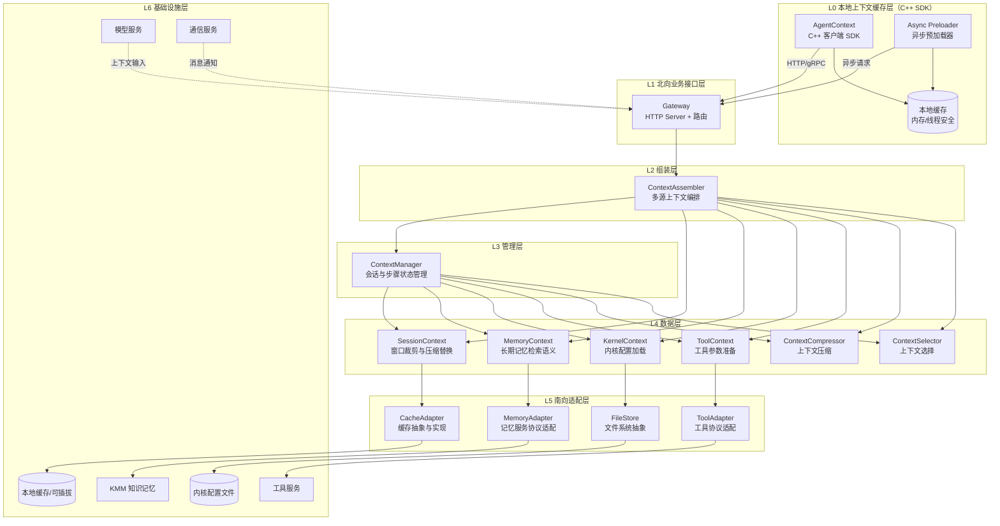
```mermaid
graph TB
    subgraph L0["L0 本地上下文缓存层（C++ SDK）"]
        LCC[AgentContext<br/>C++ 客户端 SDK]
        ACC[Async Preloader<br/>异步预加载器]
        CACHE_LOCAL[(本地缓存<br/>内存/线程安全)]
    end

    subgraph L1["L1 北向业务接口层"]
        GW[Gateway<br/>HTTP Server + 路由]
    end

    subgraph L2["L2 组装层"]
        ASM[ContextAssembler<br/>多源上下文编排]
    end

    subgraph L3["L3 管理层"]
        CM[ContextManager<br/>会话与步骤状态管理]
    end

    subgraph L4["L4 数据层"]
        SC[SessionContext<br/>窗口裁剪与压缩替换]
        MC[MemoryContext<br/>长期记忆检索语义]
        KC[KernelContext<br/>内核配置加载]
        TC[ToolContext<br/>工具参数准备]
        CC[ContextCompressor<br/>上下文压缩]
        CSEL[ContextSelector<br/>上下文选择]
    end

    subgraph L5["L5 南向适配层"]
        MA[MemoryAdapter<br/>记忆服务协议适配]
        FS[FileStore<br/>文件系统抽象]
        CA[CacheAdapter<br/>缓存抽象与实现]
        TA[ToolAdapter<br/>工具协议适配]
    end

    subgraph L6["L6 基础设施层"]
        KMM[KMM 知识记忆]
        KFILES[(内核配置文件)]
        CACHE[(本地缓存/可插拔)]
        TOOL[工具服务]
        LLM[模型服务]
        CMM[通信服务]
    end

    LCC --> |HTTP/gRPC| GW
    ACC --> |异步请求| GW
    LCC --> CACHE_LOCAL
    ACC --> CACHE_LOCAL
    GW --> ASM
    ASM --> CM

    CM --> SC
    CM --> MC
    CM --> KC
    CM --> TC
    CM --> CC
    CM --> CSEL

    ASM --> SC
    ASM --> MC
    ASM --> KC
    ASM --> TC
    ASM --> CC
    ASM --> CSEL

    MC --> MA
    KC --> FS
    SC --> CA
    TC --> TA

    MA --> KMM
    FS --> KFILES
    CA --> CACHE
    TA --> TOOL

    LLM -.->|上下文输入| GW
    CMM -.->|消息通知| GW
```

#### 组件接口定义

**ContextManager 接口**

```go
type ContextManager interface {
    // 初始化会话实例
    InitSession(ctx context.Context, req InitSessionRequest) (*InitSessionResult, error)

    // 获取当前步骤的参数计划
    GetFlowPlan(ctx context.Context, req GetFlowPlanRequest) (*FlowPlan, error)

    // 查询最近组装的上下文
    GetAssembledContext(ctx context.Context, req GetAssembledContextRequest) (*AssembledContextResult, error)

    // 更新步骤状态
    UpdateStepState(ctx context.Context, req UpdateStepStateRequest) error

    // 查询会话快照
    GetSessionSnapshot(ctx context.Context, req GetSessionSnapshotRequest) (*SessionSnapshotResult, error)
}
```

**ContextAssembler 接口**

```go
type ContextAssembler interface {
    // 组装模型调用上下文
    Assemble(ctx context.Context, req AssembleRequest) (*AssembleResult, error)
}
```

**SessionContext 接口**

```go
type SessionContext interface {
    // 构建会话窗口片段
    BuildSessionSlice(ctx context.Context, req SessionSliceRequest) (*SessionSliceResult, error)
}
```

**MemoryContext 接口**

```go
type MemoryContext interface {
    // 解析记忆上下文
    Resolve(ctx context.Context, req MemoryResolveRequest) (*MemoryResolveResult, error)
}
```

**KernelProvider 接口**

```go
type KernelProvider interface {
    // 解析内核快照
    Resolve(ctx context.Context, agentID string, kernelID string) (*KernelSnapshot, error)
}
```

**ToolContext 接口**

```go
type ToolContext interface {
    // 解析工具上下文
    Resolve(ctx context.Context, req ToolResolveRequest) (*ToolResolveResult, error)
}
```

**ContextCompressor 接口**

```go
type ContextCompressor interface {
    // 压缩上下文内容
    Compress(ctx context.Context, req CompressRequest) (*CompressResult, error)

    // 获取支持的压缩策略列表
    GetSupportedStrategies(ctx context.Context) ([]CompressionStrategy, error)

    // 评估压缩质量
    EvaluateCompression(ctx context.Context, original string, compressed string) (*CompressionQuality, error)
}
```

**ContextSelector 接口**

```go
type ContextSelector interface {
    // 从候选上下文中选择最相关的内容
    Select(ctx context.Context, req SelectRequest) (*SelectResult, error)

    // 批量选择并排序候选上下文
    SelectBatch(ctx context.Context, req SelectBatchRequest) (*SelectBatchResult, error)

    // 计算上下文相关性分数
    ScoreRelevance(ctx context.Context, query string, candidate ContextCandidate) (float64, error)
}
```

**MemoryProvider 接口（南向）**

```go
type MemoryProvider interface {
    QueryLongTermMemory(ctx context.Context, req LongTermMemoryQueryRequest) (*LongTermMemoryQueryResult, error)
    QuerySessionHistory(ctx context.Context, req SessionHistoryQueryRequest) (*SessionHistoryQueryResult, error)
}
```

**ToolProvider 接口（南向）**

```go
type ToolProvider interface {
    Invoke(ctx context.Context, req ToolInvokeRequest) (*ToolInvokeResult, error)
}
```

**LocalContextCache 接口（C++ SDK）**

```cpp
// AgentContext - Local Context Cache 核心类（C++ 接口）
class AgentContext {
public:
    // 构造函数：创建 Agent 上下文实例
    AgentContext(const std::string& agent_id,
                 const std::optional<std::string>& session_id,
                 const Workflow& workflow,
                 const std::unordered_map<std::string, std::string>& config);

    // ========== 同步接口 ==========

    // 获取指定节点的完整上下文（阻塞式）
    ContextPackage GetContext(const std::string& node_id, uint32_t timeout_ms = 5000);

    // 检查指定节点的上下文是否已就绪
    bool IsContextReady(const std::string& node_id) const;

    // ========== 异步接口 ==========

    // 异步获取上下文
    std::future<ContextPackage> GetContextAsync(const std::string& node_id);

    // 预加载指定节点的上下文（后台异步）
    void PreloadContext(const std::string& node_id);

    // 批量预加载多个节点的上下文
    void PreloadContexts(const std::vector<std::string>& node_ids);

    // ========== 缓存管理接口 ==========

    // 刷新指定节点的上下文缓存
    void RefreshContext(const std::string& node_id);

    // 使指定节点的上下文缓存失效
    void InvalidateContext(const std::string& node_id);

    // 清空所有缓存
    void ClearCache();

    // ========== 会话管理接口 ==========

    // 创建新的 task（在现有 session 内创建子任务上下文）
    std::string CreateTask(const std::string& task_name,
                           const std::unordered_map<std::string, std::string>& task_params);

    // 切换到指定 task
    void SwitchTask(const std::string& task_id);

    // 结束指定 task
    void EndTask(const std::string& task_id);

    // 获取当前 session ID
    std::string GetSessionId() const;

    // 获取当前 task ID
    std::string GetCurrentTaskId() const;
};
```

---

### 2.2 行为模型

#### 关键业务流程 1：会话生命周期

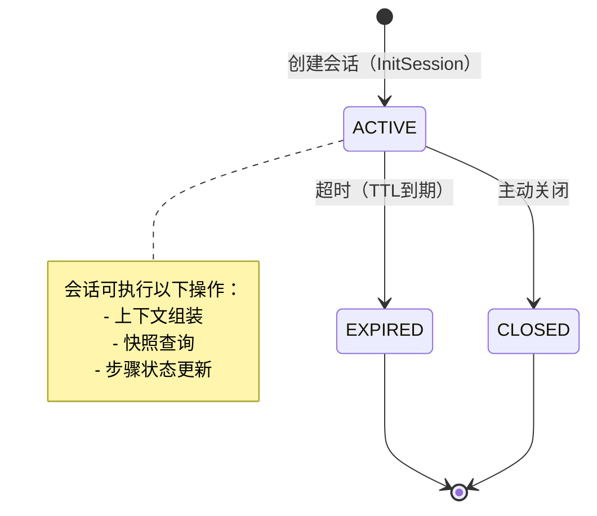
```mermaid
stateDiagram-v2
    [*] --> ACTIVE: 创建会话（InitSession）
    ACTIVE --> CLOSED: 主动关闭
    ACTIVE --> EXPIRED: 超时（TTL到期）
    EXPIRED --> [*]
    CLOSED --> [*]

    note right of ACTIVE
        会话可执行以下操作：
        - 上下文组装
        - 快照查询
        - 步骤状态更新
    end note
```

#### 关键业务流程 2：步骤状态流转

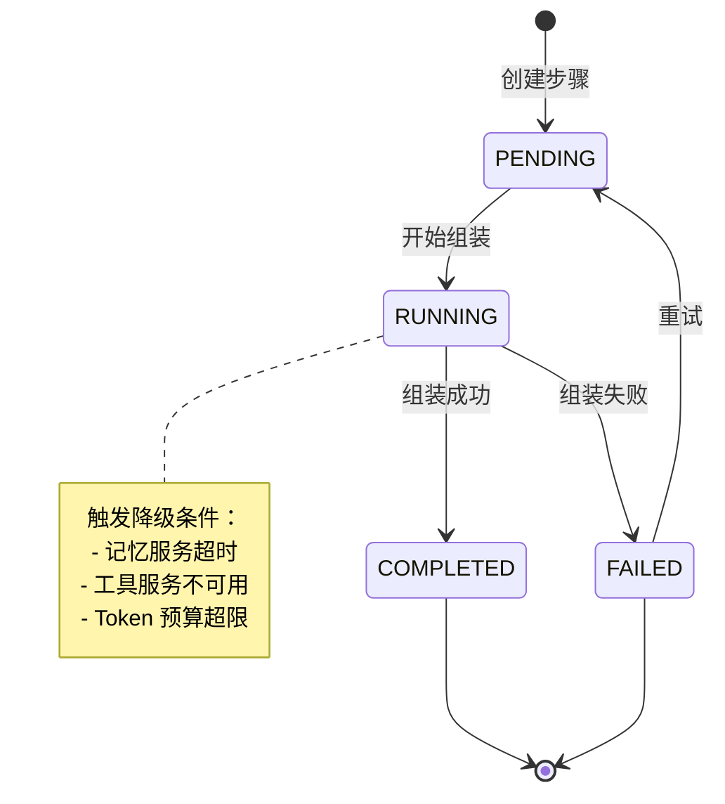
```mermaid
stateDiagram-v2
    [*] --> PENDING: 创建步骤
    PENDING --> RUNNING: 开始组装
    RUNNING --> COMPLETED: 组装成功
    RUNNING --> FAILED: 组装失败
    FAILED --> PENDING: 重试
    COMPLETED --> [*]
    FAILED --> [*]

    note right of RUNNING
        触发降级条件：
        - 记忆服务超时
        - 工具服务不可用
        - Token 预算超限
    end note
```

#### 关键业务流程 3：上下文组装流程

```mermaid
graph TD
    START([开始组装]) --> PARSE[解析当前步骤参数计划]
    PARSE --> PARALLEL{并行获取上下文}

    PARALLEL -->|窗口| SESSION[SessionContext<br/>构建会话窗口]
    PARALLEL -->|记忆| MEMORY[MemoryContext<br/>检索长期记忆]
    PARALLEL -->|内核| KERNEL[KernelContext<br/>加载内核配置]
    PARALLEL -->|工具| TOOL[ToolContext<br/>准备工具参数]

    SESSION --> MERGE[合并上下文片段]
    MEMORY --> MERGE
    KERNEL --> MERGE
    TOOL --> MERGE

    MERGE --> TOKEN[Token 预算裁剪]
    TOKEN --> CHECK{Token 超限?}

    CHECK -->|否| UPDATE[更新步骤状态]
    CHECK -->|是| TRIM[按优先级裁剪]
    TRIM --> UPDATE

    UPDATE --> RETURN[返回组装结果]
    RETURN --> END([结束])

    alt 南向依赖失败
        MEMORY -.->|超时| DEGRADE[降级处理]
        TOOL -.->|超时| DEGRADE
        DEGRADE --> SKIP[跳过失败组件]
        SKIP --> MERGE
    end
```

#### 事务边界与一致性

- **强一致性**：会话状态更新使用乐观并发控制（`session_version`）
- **最终一致性**：南向依赖调用失败时，降级返回最小可用上下文，不阻塞主链路
- **幂等性**：`assemble` 接口通过 `session_version` 防止重复组装

---

### 2.3 数据模型

#### 核心实体定义

**SessionInstance（会话实例）**

| 字段 | 类型 | 约束 | 说明 |
|------|------|------|------|
| `session_id` | string | PK | 会话标识，全局唯一 |
| `agent_id` | string | - | Agent 标识 |
| `user_id` | string | - | 用户标识 |
| `kernel_id` | string | FK | 当前使用的内核标识 |
| `status` | enum | - | ACTIVE / EXPIRED / CLOSED |
| `session_version` | int64 | - | 会话版本号，用于乐观并发控制 |
| `created_at` | datetime | - | 创建时间 |
| `updated_at` | datetime | - | 最后更新时间 |
| `expired_at` | datetime | - | 过期时间 |
| `window_params` | object | - | 默认窗口参数 |

**FlowState（流程状态）**

| 字段 | 类型 | 约束 | 说明 |
|------|------|------|------|
| `flow_id` | string | - | 流程标识 |
| `current_step_id` | string | - | 当前步骤 ID |
| `steps` | map | - | 所有步骤的状态映射 |
| `last_assembled_at` | datetime | - | 最后一次组装时间 |

**KernelSnapshot（内核快照）**

| 字段 | 类型 | 约束 | 说明 |
|------|------|------|------|
| `kernel_id` | string | PK | 内核标识 |
| `kernel_version` | string | - | 内核版本 |
| `prompt_hash` | string | UK | Prompt 内容哈希值 |
| `skills_version` | string | - | Skills 配置版本 |
| `mcp_manifest_version` | string | - | MCP 清单版本 |
| `prompt_param_schema` | object | - | Prompt 参数定义（JSON Schema） |
| `loaded_at` | datetime | - | 快照加载时间 |

**AssembledContext（组装上下文）**

| 字段 | 类型 | 约束 | 说明 |
|------|------|------|------|
| `flow_step_id` | string | PK | 所属步骤 ID |
| `assembled_context` | object | - | 最终模型输入数据 |
| `token_usage` | object | - | Token 统计信息 |
| `window_applied` | object | - | 实际应用的窗口参数 |
| `prompt_params_filled` | array | - | 已填充的参数名列表 |
| `degraded` | bool | - | 是否降级 |
| `degrade_reason` | string | - | 降级原因 |
| `assembled_at` | datetime | - | 组装完成时间 |
| `sources` | object | - | 上下文来源明细 |

**ContextCompressionRecord（上下文压缩记录）**

| 字段 | 类型 | 约束 | 说明 |
|------|------|------|------|
| `compression_id` | string | PK | 压缩记录标识 |
| `session_id` | string | FK | 所属会话 ID |
| `flow_step_id` | string | FK | 所属流程步骤 ID |
| `strategy` | string | - | 压缩策略名称 |
| `original_tokens` | int | - | 原始 Token 数 |
| `compressed_tokens` | int | - | 压缩后 Token 数 |
| `compression_ratio` | float | - | 压缩率（0-1） |
| `original_content_hash` | string | - | 原始内容哈希 |
| `compressed_content_hash` | string | - | 压缩后内容哈希 |
| `quality_score` | float | - | 压缩质量评分（0-1） |
| `degraded` | bool | - | 是否降级压缩 |
| `compressed_at` | datetime | - | 压缩时间 |

**ContextSelectionResult（上下文选择结果）**

| 字段 | 类型 | 约束 | 说明 |
|------|------|------|------|
| `selection_id` | string | PK | 选择记录标识 |
| `session_id` | string | FK | 所属会话 ID |
| `flow_step_id` | string | FK | 所属流程步骤 ID |
| `query` | string | - | 选择请求的查询内容 |
| `algorithm` | string | - | 选择算法名称 |
| `candidates_count` | int | - | 候选上下文数量 |
| `selected_count` | int | - | 选中上下文数量 |
| `selections` | array | - | 选中的上下文列表 |
| `selection_scores` | object | - | 各候选的选择分数 |
| `low_confidence` | bool | - | 是否为低置信度选择 |
| `selection_time_ms` | int | - | 选择耗时（毫秒） |
| `selected_at` | datetime | - | 选择时间 |

**ContextCandidate（上下文候选）**

| 字段 | 类型 | 约束 | 说明 |
|------|------|------|------|
| `candidate_id` | string | PK | 候选标识 |
| `source_type` | enum | - | 来源类型：memory/session/kernel/tool |
| `content` | string | - | 候选内容 |
| `content_hash` | string | - | 内容哈希 |
| `token_count` | int | - | Token 数量 |
| `metadata` | object | - | 候选元数据（时间、标签、权重等） |
| `relevance_score` | float | - | 相关性分数（由选择器计算） |
| `created_at` | datetime | - | 创建时间 |

#### 实体关系 ER 图

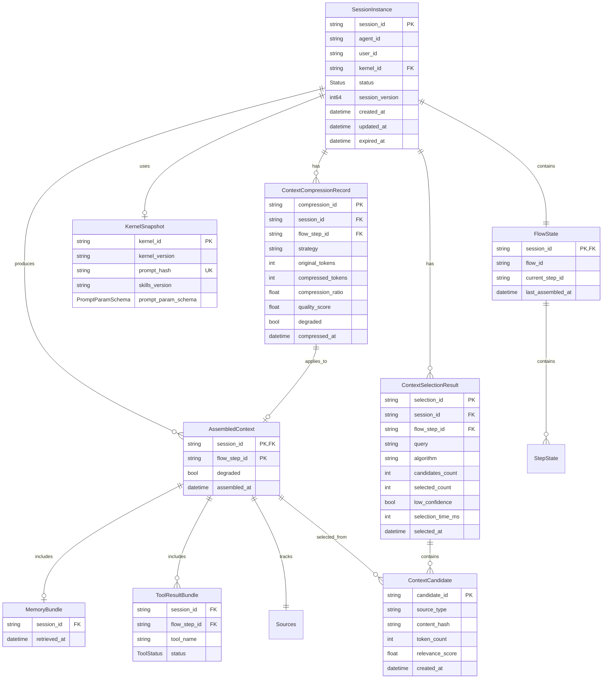
```mermaid
erDiagram
    SessionInstance ||--|| FlowState : contains
    SessionInstance ||--o| KernelSnapshot : uses
    SessionInstance ||--o{ AssembledContext : produces
    SessionInstance ||--o{ ContextCompressionRecord : has
    SessionInstance ||--o{ ContextSelectionResult : has
    FlowState ||--o{ StepState : contains
    AssembledContext ||--o| MemoryBundle : includes
    AssembledContext ||--o{ ToolResultBundle : includes
    AssembledContext ||--|| Sources : tracks
    AssembledContext ||--o{ ContextCandidate : selected_from
    ContextSelectionResult ||--o{ ContextCandidate : contains
    ContextCompressionRecord ||--o| AssembledContext : applies_to

    SessionInstance {
        string session_id PK
        string agent_id
        string user_id
        string kernel_id FK
        Status status
        int64 session_version
        datetime created_at
        datetime updated_at
        datetime expired_at
    }

    FlowState {
        string session_id PK, FK
        string flow_id
        string current_step_id
        datetime last_assembled_at
    }

    KernelSnapshot {
        string kernel_id PK
        string kernel_version
        string prompt_hash UK
        string skills_version
        PromptParamSchema prompt_param_schema
    }

    AssembledContext {
        string session_id PK, FK
        string flow_step_id PK
        bool degraded
        datetime assembled_at
    }

    MemoryBundle {
        string session_id FK
        datetime retrieved_at
    }

    ToolResultBundle {
        string session_id FK
        string flow_step_id FK
        string tool_name
        ToolStatus status
    }

    ContextCompressionRecord {
        string compression_id PK
        string session_id FK
        string flow_step_id FK
        string strategy
        int original_tokens
        int compressed_tokens
        float compression_ratio
        float quality_score
        bool degraded
        datetime compressed_at
    }

    ContextSelectionResult {
        string selection_id PK
        string session_id FK
        string flow_step_id FK
        string query
        string algorithm
        int candidates_count
        int selected_count
        bool low_confidence
        int selection_time_ms
        datetime selected_at
    }

    ContextCandidate {
        string candidate_id PK
        string source_type
        string content_hash
        int token_count
        float relevance_score
        datetime created_at
    }
```

#### 数据所有权边界

| 数据类型 | 拥有者 | 说明 |
|----------|--------|------|
| 会话实例与状态 | Context Service | 按 `agent_id + session_id` 管理生命周期 |
| 内核配置 | File Store / KernelContext | 版本化配置，由文件系统或配置中心管理 |
| 长期记忆 | KMM（Memory Provider） | 跨 Session 的长期沉淀，由记忆服务管理 |
| 会话轮次数据 | KMM（Memory Provider） | 历史会话与压缩结果，由记忆服务管理 |
| 工具结果 | Tool Provider | 工具调用结果，由工具服务管理 |
| 压缩记录 | Context Service | 上下文压缩操作的历史记录，用于审计和优化 |
| 选择结果 | Context Service | 上下文选择操作的结果记录，用于反馈和调优 |

#### 关键索引策略

- `SessionInstance`: `session_id`（主键）、`agent_id + session_id`（联合索引）
- `FlowState`: `session_id`（主键）
- `AssembledContext`: `session_id + flow_step_id`（联合索引）
- `KernelSnapshot`: `kernel_id`（主键）、`prompt_hash`（唯一索引）
- `ContextCompressionRecord`: `compression_id`（主键）、`session_id + flow_step_id`（联合索引）、`compressed_at`（时间索引）
- `ContextSelectionResult`: `selection_id`（主键）、`session_id + flow_step_id`（联合索引）、`selected_at`（时间索引）
- `ContextCandidate`: `candidate_id`（主键）、`source_type + created_at`（联合索引）

---

### 2.4 技术模型

#### 技术选型清单

| 类别 | 技术 | 版本 | 用途 | 选型理由 |
|------|------|------|------|----------|
| 语言 | Go | 1.21+ | 后端开发 | 高并发性能、团队技能匹配、生态完善 |
| HTTP 框架 | net/http | 标准库 | REST API | 轻量级、无额外依赖、性能优异 |
| JSON 处理 | encoding/json | 标准库 | 序列化/反序列化 | 标准库、性能可接受 |
| 日志 | 自定义接口 | v1.0 | 结构化日志 | 首期输出到控制台，预留扩展接口 |
| 错误处理 | errors | 标准库 + Wrap | 错误传播 | 符合 `%w` 规范，支持错误链 |
| 配置文件 | YAML | 1.0 | 内核配置 | 人类可读、注释支持 |
| 存储 | 内存 | - | Phase 1 存储实现 | 简单快速、无需外部依赖 |
| 缓存 | 自定义抽象 | v1.0 | 服务内缓存 | 可插拔设计，支持后续接入 Redis |
| 测试 | testing | 标准库 + testify | 单元/集成测试 | 标准库、testify 提供断言增强 |

#### 技术栈框图

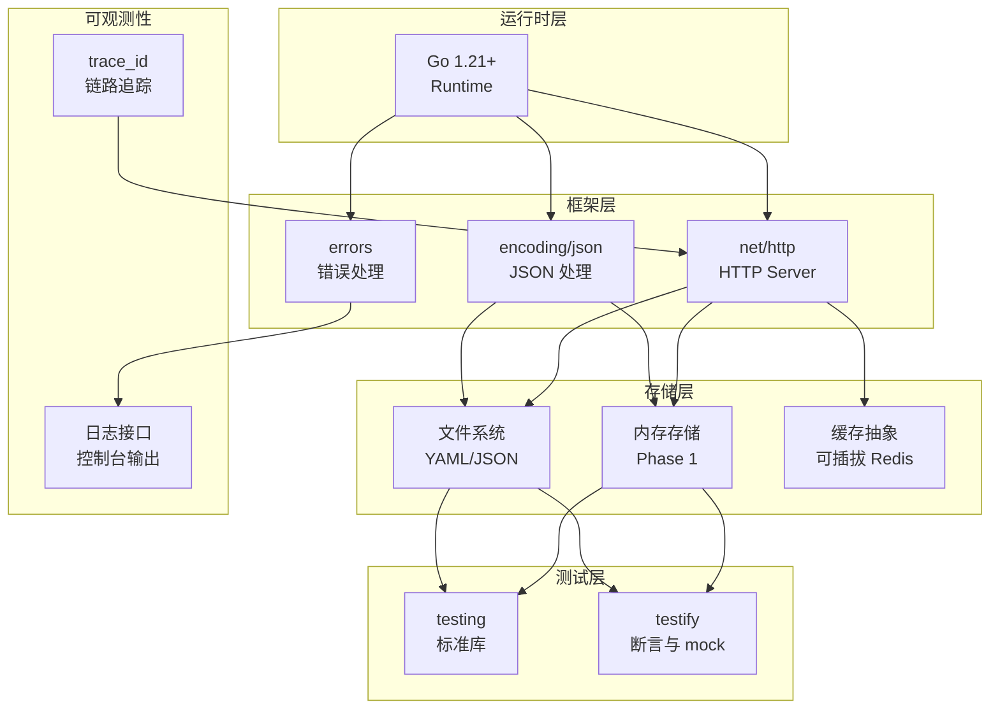
```mermaid
graph TB
    subgraph Runtime["运行时层"]
        Go["Go 1.21+<br/>Runtime"]
    end

    subgraph Framework["框架层"]
        HTTP["net/http<br/>HTTP Server"]
        JSON["encoding/json<br/>JSON 处理"]
        Errors["errors<br/>错误处理"]
    end

    subgraph Storage["存储层"]
        Mem["内存存储<br/>Phase 1"]
        Files["文件系统<br/>YAML/JSON"]
        Cache["缓存抽象<br/>可插拔 Redis"]
    end

    subgraph Testing["测试层"]
        Stdlib["testing<br/>标准库"]
        Testify["testify<br/>断言与 mock"]
    end

    subgraph Observability["可观测性"]
        Log["日志接口<br/>控制台输出"]
        Trace["trace_id<br/>链路追踪"]
    end

    Go --> HTTP & JSON & Errors
    HTTP --> Mem & Files & Cache
    JSON --> Mem & Files
    Errors --> Log
    Trace --> HTTP

    Mem --> Stdlib & Testify
    Files --> Stdlib & Testify
```

---

## 三、开发视图（Development View）

### 3.1 代码模型

#### 仓库组织策略

**策略**：Monorepo（单仓库），按 DDD 分层组织代码

**理由**：
- Phase 1 范围聚焦，单仓库便于统一构建和测试
- 模块边界清晰（api/internal/pkg 分层），便于后续拆分

#### 完整目录结构

```
shuhao-ContextService/
├── docs/                          # 文档目录
│   ├── 00_overview/               # 导航与术语
│   ├── 01_principles/             # 理念与原则
│   ├── 02_architecture/           # 总体架构
│   ├── 03_detail/                 # 详细设计
│   ├── 04_flow/                  # 流程文档
│   ├── 05_validation/             # 验收标准
│   ├── 06_Task/                  # 阶段任务
│   └── 07_deployment/            # 部署文档
├── src/                          # 源代码目录
│   └── ctxtservice/              # 上下文服务主目录
│       ├── api/                  # 北向接口层
│       │   ├── handler/          # HTTP 处理器
│       │   ├── dto/              # 数据传输对象
│       │   └── middleware/       # 中间件（限流、日志）
│       ├── internal/             # 内部实现
│       │   ├── adapter/          # 南向适配层
│       │   │   ├── memory/       # 记忆服务适配器
│       │   │   ├── tool/         # 工具服务适配器
│       │   │   ├── cache/        # 缓存适配器
│       │   │   └── file/         # 文件存储适配器
│       │   ├── app/             # 应用层
│       │   │   ├── assembler/    # ContextAssembler
│       │   │   └── manager/      # ContextManager
│       │   ├── domain/          # 领域层
│       │   │   ├── session/      # SessionContext
│       │   │   ├── memory/       # MemoryContext
│       │   │   ├── kernel/       # KernelContext
│       │   │   ├── tool/         # ToolContext
│       │   │   ├── compressor/   # ContextCompressor
│       │   │   └── selector/     # ContextSelector
│       │   ├── gateway/         # Gateway HTTP Server
│       │   └── model/           # 领域模型
│       │       ├── session.go
│       │       ├── flow.go
│       │       ├── kernel.go
│       │       └── context.go
│       └── pkg/                 # 共享包
│           ├── error/            # 错误处理
│           ├── logger/           # 日志接口
│           └── trace/           # 链路追踪
├── configs/                      # 配置文件
│   └── kernels/                 # 内核配置目录
├── scripts/                     # 脚本目录
├── tests/                       # 测试目录
│   ├── unit/                    # 单元测试
│   └── integration/             # 集成测试
├── go.mod                       # Go 模块定义
├── go.sum                       # Go 依赖锁文件
├── Makefile                     # 构建脚本
└── README.md                    # 项目说明
```

#### 逻辑组件 → 代码路径映射

| 逻辑组件 | 代码路径 | 关键类/接口 |
|----------|----------|-------------|
| Gateway | `src/ctxtservice/internal/gateway/` | `GatewayServer`, `HTTPHandler` |
| ContextManager | `src/ctxtservice/internal/app/manager/` | `ContextManager`, `InitSession`, `GetFlowPlan` |
| ContextAssembler | `src/ctxtservice/internal/app/assembler/` | `ContextAssembler`, `Assemble` |
| SessionContext | `src/ctxtservice/internal/domain/session/` | `SessionContext`, `BuildSessionSlice` |
| MemoryContext | `src/ctxtservice/internal/domain/memory/` | `MemoryContext`, `Resolve` |
| KernelContext | `src/ctxtservice/internal/domain/kernel/` | `KernelProvider`, `Resolve` |
| ToolContext | `src/ctxtservice/internal/domain/tool/` | `ToolContext`, `Resolve` |
| ContextCompressor | `src/ctxtservice/internal/domain/compressor/` | `ContextCompressor`, `Compress`, `EvaluateCompression` |
| ContextSelector | `src/ctxtservice/internal/domain/selector/` | `ContextSelector`, `Select`, `ScoreRelevance` |
| MemoryAdapter | `src/ctxtservice/internal/adapter/memory/` | `MemoryAdapter`, `QueryLongTermMemory` |
| ToolAdapter | `src/ctxtservice/internal/adapter/tool/` | `ToolAdapter`, `Invoke` |
| CacheAdapter | `src/ctxtservice/internal/adapter/cache/` | `CacheAdapter`, `Get/Set` |
| FileStore | `src/ctxtservice/internal/adapter/file/` | `FileStore`, `LoadKernel` |

#### 核心类图

```mermaid
classDiagram
    class GatewayServer {
        -server *http.Server
        -router *http.ServeMux
        -manager ContextManager
        -assembler ContextAssembler
        +Start(port int) error
        +Stop(ctx context.Context) error
        -registerRoutes()
    }

    class ContextManager {
        -sessions sync.Map
        -kernelProvider KernelProvider
        +InitSession(ctx, req) (*InitSessionResult, error)
        +GetFlowPlan(ctx, req) (*FlowPlan, error)
        +GetAssembledContext(ctx, req) (*AssembledContextResult, error)
        +UpdateStepState(ctx, req) error
        +GetSessionSnapshot(ctx, req) (*SessionSnapshotResult, error)
    }

    class ContextAssembler {
        -manager ContextManager
        -sessionContext SessionContext
        -memoryContext MemoryContext
        -kernelProvider KernelProvider
        -toolContext ToolContext
        -compressor ContextCompressor
        -selector ContextSelector
        +Assemble(ctx, req) (*AssembleResult, error)
        -assembleWindow(ctx, req) (*SessionSliceResult, error)
        -assembleMemory(ctx, req) (*MemoryResolveResult, error)
        -assembleKernel(ctx, req) (*KernelSnapshot, error)
        -assembleTool(ctx, req) (*ToolResolveResult, error)
        -compressContext(ctx, req) (*CompressResult, error)
        -selectContexts(ctx, req) (*SelectResult, error)
    }

    class SessionContext {
        -cache CacheAdapter
        +BuildSessionSlice(ctx, req) (*SessionSliceResult, error)
    }

    class MemoryContext {
        -adapter MemoryAdapter
        +Resolve(ctx, req) (*MemoryResolveResult, error)
    }

    class KernelProvider {
        -fileStore FileStore
        +Resolve(ctx, agentID, kernelID) (*KernelSnapshot, error)
    }

    class MemoryAdapter {
        -client MemoryProviderClient
        -timeout time.Duration
        +QueryLongTermMemory(ctx, req) (*LongTermMemoryQueryResult, error)
        +QuerySessionHistory(ctx, req) (*SessionHistoryQueryResult, error)
    }

    class ToolAdapter {
        -client ToolProviderClient
        -timeout time.Duration
        +Invoke(ctx, req) (*ToolInvokeResult, error)
    }

    class FileStore {
        +LoadKernel(ctx, kernelID) (*KernelSnapshot, error)
        +SaveSnapshot(ctx, snapshot) error
        +LoadSnapshot(ctx, sessionID) (*SessionSnapshot, error)
    }

    class CacheAdapter {
        +Get(ctx, key) (interface{}, error)
        +Set(ctx, key, value, ttl) error
        +Delete(ctx, key) error
    }

    class ContextCompressor {
        -adapter MemoryAdapter
        -strategies map[string]CompressionStrategy
        -defaultStrategy string
        +Compress(ctx, req) (*CompressResult, error)
        +GetSupportedStrategies(ctx) ([]CompressionStrategy, error)
        +EvaluateCompression(ctx, original, compressed) (*CompressionQuality, error)
        -selectStrategy(req CompressRequest) CompressionStrategy
        -calculateCompressionRatio(original, compressed int) float64
    }

    class ContextSelector {
        -adapter MemoryAdapter
        -algorithms map[string]SelectionAlgorithm
        -defaultAlgorithm string
        +Select(ctx, req) (*SelectResult, error)
        +SelectBatch(ctx, req) (*SelectBatchResult, error)
        +ScoreRelevance(ctx, query string, candidate ContextCandidate) (float64, error)
        -selectAlgorithm(req SelectRequest) SelectionAlgorithm
        -rankCandidates(candidates []ContextCandidate) []ContextCandidate
    }

    GatewayServer --> ContextManager
    GatewayServer --> ContextAssembler
    ContextAssembler --> ContextManager
    ContextAssembler --> SessionContext
    ContextAssembler --> MemoryContext
    ContextAssembler --> KernelProvider
    ContextAssembler --> ToolContext
    ContextAssembler --> ContextCompressor
    ContextAssembler --> ContextSelector
    MemoryContext --> MemoryAdapter
    KernelProvider --> FileStore
    ToolContext --> ToolAdapter
    SessionContext --> CacheAdapter
    ContextCompressor --> MemoryAdapter
    ContextSelector --> MemoryAdapter
```

#### 命名约定

| 约定项 | 规范 | 示例 |
|--------|------|------|
| 包名 | 小写单词 | `internal/app/manager` |
| 接口 | 以 `er` 或 `or` 结尾的名词 | `ContextManager`, `KernelProvider` |
| 结构体 | 驼峰命名 | `SessionInstance`, `KernelSnapshot` |
| 方法 | 驼峰命名 | `InitSession`, `Assemble` |
| 常量 | 大写蛇形命名 | `MAX_TOKENS`, `DEFAULT_TTL` |
| 错误 | 以 `Err` 开头 | `ErrSessionNotFound`, `ErrTokenBudgetExceeded` |

---

### 3.2 构建模型

#### 构建工具链

- **语言**：Go 1.21+
- **构建工具**：`go build`, `go test`
- **版本管理**：Go Modules (`go.mod`, `go.sum`)
- **代码检查**：`go fmt`, `go vet`, `golint`

#### 构建阶段定义

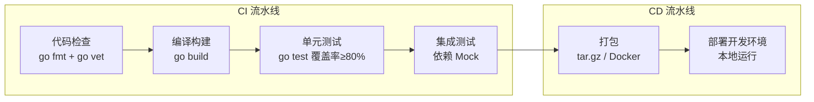
```mermaid
graph LR
    subgraph CI["CI 流水线"]
        Lint[代码检查<br/>go fmt + go vet] --> Build[编译构建<br/>go build]
        Build --> UnitTest[单元测试<br/>go test 覆盖率≥80%]
        UnitTest --> IntTest[集成测试<br/>依赖 Mock]
    end

    subgraph CD["CD 流水线"]
        IntTest --> Package[打包<br/>tar.gz / Docker]
        Package --> DeployDev[部署开发环境<br/>本地运行]
    end
```

#### 测试策略

| 测试类型 | 范围 | 覆盖率要求 | 工具 |
|----------|------|------------|------|
| 单元测试 | 各模块独立逻辑 | ≥ 80% | `go test` + `testify` |
| 集成测试 | 模块间协作 | 核心链路 100% | `go test` + Mock |
| 端到端测试 | 完整请求链路 | Phase 1 核心用例 | `httpexpect` 或自定义 |

#### 测试用例清单

- **ContextManager**：
  - 会话初始化成功/失败
  - 会话版本冲突
  - 步骤状态流转

- **ContextAssembler**：
  - 正常组装流程
  - 南向依赖降级
  - Token 超限裁剪

- **SessionContext**：
  - 窗口参数计算
  - 边界校验

- **MemoryAdapter** / **ToolAdapter**：
  - 超时重试
  - 错误映射

---

### 3.3 硬件模型

#### 最低硬件资源要求

| 组件 | CPU | 内存 | 存储 | 网络 |
|------|-----|------|------|------|
| Context Service（开发环境） | 1 核 | 1 GB | 100 MB | - |
| Context Service（测试环境） | 2 核 | 2 GB | 500 MB | 1 Gbps |
| Context Service（生产环境） | 4 核 | 4 GB | 1 GB | 10 Gbps |

#### 各环境差异化配置

| 配置项 | 开发环境 | 测试环境 | 生产环境 |
|--------|----------|----------|----------|
| 副本数 | 1 | 2 | 3-10（自动扩缩） |
| 日志级别 | DEBUG | INFO | WARN |
| 会话 TTL | 1 小时 | 4 小时 | 24 小时 |
| 南向调用超时 | 10s | 5s | 3s |
| 重试次数 | 3 | 2 | 1 |

---

## 四、运行视图（Process View）

### 4.1 运行模型

#### 进程/并发模型

- **并发模型**：Goroutine + Channel（Go 原生并发）
- **请求处理**：每个 HTTP 请求独立 Goroutine
- **并行调用**：南向依赖调用使用 `sync.WaitGroup` 或 `errgroup` 并行执行
- **状态保护**：会话状态使用 `sync.Map` 或 `sync.RWMutex` 保护

#### 高可用设计

| 场景 | 检测机制 | 恢复策略 | RTO 目标 |
|------|----------|----------|---------|
| HTTP 实例故障 | Liveness Probe | 自动重启 | < 30s |
| 南向依赖超时 | 超时检测 | 降级返回 | 即时 |
| 会话过期 | TTL 检查 | 标记 EXPIRED | 即时 |

#### 弹性伸缩策略

- **触发指标**：并发请求数 > 100
- **扩缩容边界**：1 ~ 10 实例
- **预热策略**：新实例启动后 30s 内逐步引入流量

#### 流量控制

| 限制类型 | 阈值 | 算法 |
|----------|------|------|
| 单 IP QPS | 100 | 令牌桶 |
| 单 User QPS | 50 | 令牌桶 |
| 单 Session QPS | 10 | 令牌桶 |
| 南向调用超时 | 3s | 固定超时 |
| 重试次数 | 1-3 | 指数退避 |

#### 启动和关闭流程

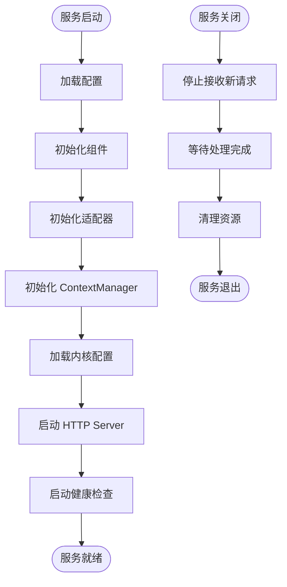
```mermaid
graph TB
    START([服务启动]) --> LOAD[加载配置]
    LOAD --> INIT[初始化组件]
    INIT --> ADAPTER[初始化适配器]
    ADAPTER --> MANAGER[初始化 ContextManager]
    MANAGER --> KERNEL[加载内核配置]
    KERNEL --> SERVER[启动 HTTP Server]
    SERVER --> HEALTH[启动健康检查]
    HEALTH --> READY([服务就绪])

    STOP([服务关闭]) --> DRAIN[停止接收新请求]
    DRAIN --> WAIT[等待处理完成]
    WAIT --> CLEAN[清理资源]
    CLEAN --> EXIT([服务退出])
```

#### 运行时拓扑图

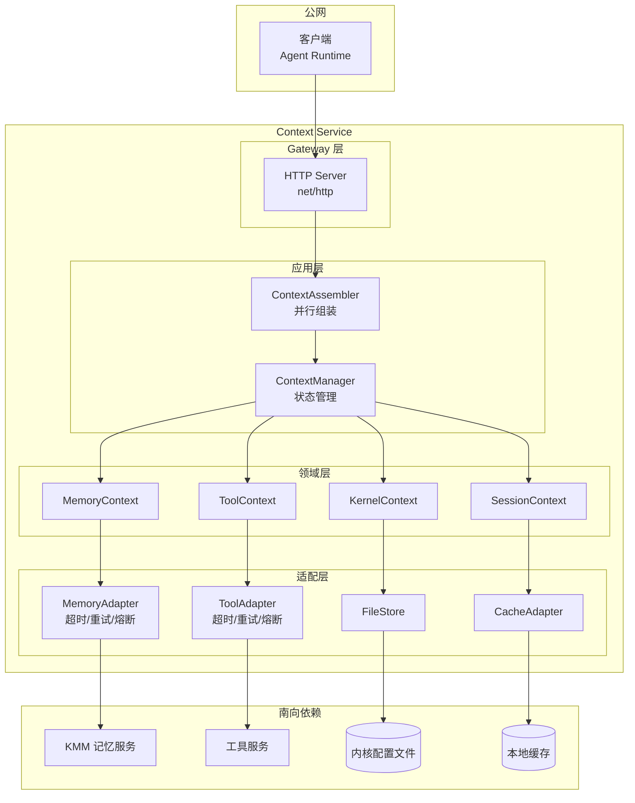
```mermaid
graph TB
    subgraph Internet["公网"]
        Client[客户端<br/>Agent Runtime]
    end

    subgraph ContextService["Context Service"]
        subgraph Gateway["Gateway 层"]
            HTTP[HTTP Server<br/>net/http]
        end

        subgraph App["应用层"]
            Assembler[ContextAssembler<br/>并行组装]
            Manager[ContextManager<br/>状态管理]
        end

        subgraph Domain["领域层"]
            Session[SessionContext]
            Memory[MemoryContext]
            Kernel[KernelContext]
            Tool[ToolContext]
        end

        subgraph Adapter["适配层"]
            MemAdapter[MemoryAdapter<br/>超时/重试/熔断]
            ToolAdapter[ToolAdapter<br/>超时/重试/熔断]
            FileAdapter[FileStore]
            CacheAdapter[CacheAdapter]
        end
    end

    subgraph Southbound["南向依赖"]
        KMM[KMM 记忆服务]
        ToolSvc[工具服务]
        Files[(内核配置文件)]
        Cache[(本地缓存)]
    end

    Client --> HTTP
    HTTP --> Assembler
    Assembler --> Manager
    Manager --> Session & Memory & Kernel & Tool

    Session --> CacheAdapter
    Memory --> MemAdapter
    Kernel --> FileAdapter
    Tool --> ToolAdapter

    CacheAdapter --> Cache
    MemAdapter --> KMM
    ToolAdapter --> ToolSvc
    FileAdapter --> Files
```

---

### 4.2 运维模型

#### 可观测性三支柱

**1. 日志**

- **格式**：结构化 JSON
- **核心字段**：
  - `trace_id`：链路追踪 ID
  - `agent_id`：Agent 标识
  - `session_id`：会话标识
  - `flow_step_id`：流程步骤 ID
  - `degraded`：是否降级
  - `latency_ms`：耗时（毫秒）
  - `error_code`：错误码（如有）

- **输出**：Phase 1 输出到控制台（stdout）

**2. 指标（Metrics）**

| 指标 | SLI 定义 | SLO 目标 | 告警阈值 |
|------|----------|----------|---------|
| 可用性 | 成功请求数 / 总请求数 | 99.9% / 月 | < 99.5% 触发告警 |
| 延迟（P99） | 第 99 百分位响应时间 | < 200ms | > 500ms 触发告警 |
| 错误率 | 5xx 响应数 / 总请求数 | < 0.1% | > 1% 触发 P1 告警 |
| 组装成功率 | 成功组装数 / 总请求数 | > 99% | < 95% 触发告警 |
| 降级率 | 降级响应数 / 总请求数 | < 1% | > 5% 触发告警 |

**3. 链路追踪**

- **追踪 ID**：所有请求必须透传 `trace_id`
- **格式**：`^[a-zA-Z0-9-]{16,64}$`
- **关联**：日志和指标必须携带 `trace_id`

#### 可观测性架构图

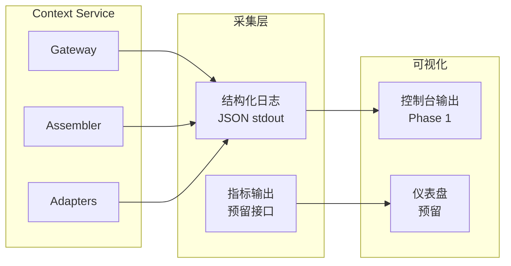
```mermaid
graph LR
    subgraph Services["Context Service"]
        GW[Gateway]
        ASM[Assembler]
        ADP[Adapters]
    end

    subgraph Collection["采集层"]
        Logs[结构化日志<br/>JSON stdout]
        Metrics[指标输出<br/>预留接口]
    end

    subgraph Visualization["可视化"]
        Console[控制台输出<br/>Phase 1]
        Dashboard[仪表盘<br/>预留]
    end

    GW --> Logs
    ASM --> Logs
    ADP --> Logs

    Logs --> Console
    Metrics --> Dashboard
```

#### 告警策略

| 告警级别 | 条件 | 通知渠道 | 响应 SLA |
|----------|------|----------|---------|
| P1（严重） | 可用性 < 99.5% | PagerDuty / 短信 | 15 分钟内响应 |
| P2（高） | P99 延迟 > 500ms | 邮件 / IM | 1 小时内响应 |
| P3（中） | 降级率 > 5% | 邮件 | 4 小时内响应 |
| P4（低） | 其他异常 | 邮件 | 次日处理 |

#### 健康检查设计

| 端点 | 检查内容 | 说明 |
|------|----------|------|
| `/health/live` | 进程存活 | Liveness Probe |
| `/health/ready` | 南向依赖连通性 | Readiness Probe |
| `/health/metrics` | 指标输出 | Prometheus 格式（预留） |

---

## 五、部署视图（Deployment View）

### 5.1 交付模型

#### 制品类型

| 制品 | 类型 | 命名规范 | 包含内容 |
|------|------|----------|----------|
| Context Service 二进制 | Executable | `ctxtservice-{version}-{os}-{arch}` | 应用代码、非敏感配置 |
| 内核配置包 | tar.gz | `kernels-{version}.tar.gz` | 内核配置 YAML 文件 |
| Docker 镜像 | Image | `registry.example.com/ctxtservice:{version}` | 二进制 + 配置文件 |

#### 命名规范

```
{name}-{version}-{os}-{arch}
示例：ctxtservice-1.0.0-linux-amd64
```

#### 多环境交付策略

| 环境 | 配置方式 | 数据库 | 缓存 |
|------|----------|--------|------|
| 开发环境 | 环境变量 | 内存 | 内存 |
| 测试环境 | 环境变量 | 内存 | 内存 |
| 生产环境 | 环境变量 + 配置文件 | 外部存储 | Redis（预留） |

#### 制品安全

- **代码检查**：`go vet`, `golint`
- **依赖扫描**：`go mod verify`
- **签名**：预留 GPG 签名（Phase 2）

---

### 5.2 部署模型

#### 部署拓扑图

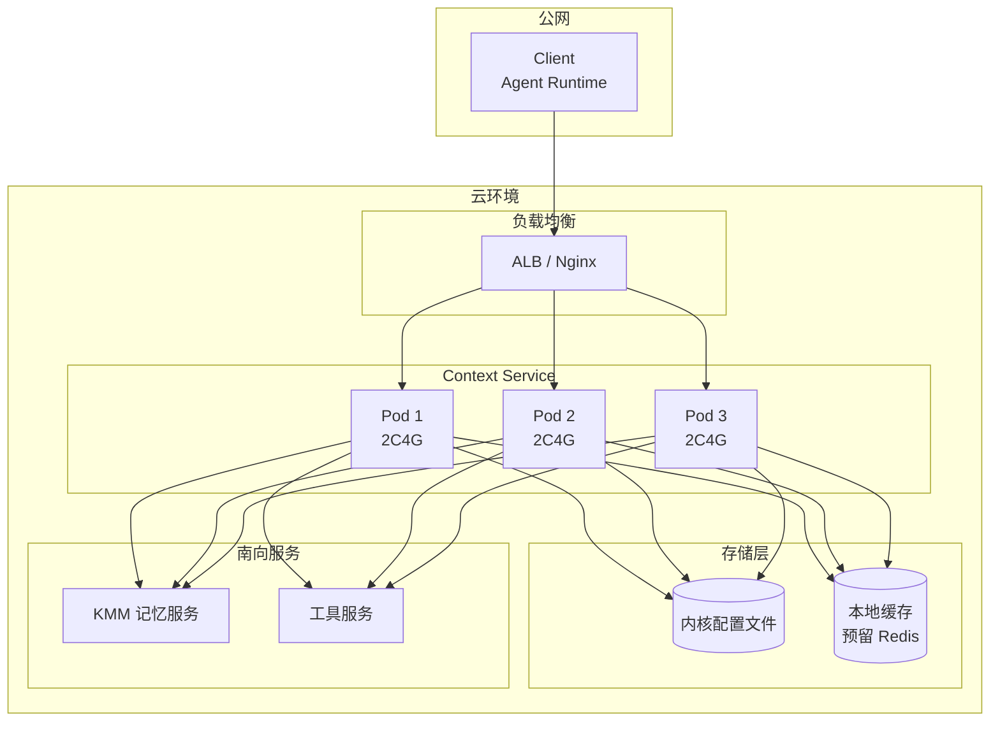
```mermaid
graph TB
    subgraph Internet["公网"]
        Client[Client<br/>Agent Runtime]
    end

    subgraph Cloud["云环境"]
        subgraph LB["负载均衡"]
            ALB[ALB / Nginx]
        end

        subgraph ContextSvc["Context Service"]
            Pod1[Pod 1<br/>2C4G]
            Pod2[Pod 2<br/>2C4G]
            Pod3[Pod 3<br/>2C4G]
        end

        subgraph Storage["存储层"]
            Files[(内核配置文件)]
            Cache[(本地缓存<br/>预留 Redis)]
        end

        subgraph Southbound["南向服务"]
            KMM[KMM 记忆服务]
            Tool[工具服务]
        end
    end

    Client --> ALB
    ALB --> Pod1 & Pod2 & Pod3
    Pod1 & Pod2 & Pod3 --> Files
    Pod1 & Pod2 & Pod3 --> Cache
    Pod1 & Pod2 & Pod3 --> KMM
    Pod1 & Pod2 & Pod3 --> Tool
```

#### 环境配置矩阵

| 配置项 | 开发环境 | 测试环境 | 生产环境 |
|--------|----------|----------|----------|
| 副本数 | 1 | 2 | 3-10（自动扩缩） |
| CPU 配额 | 1 核 | 2 核 | 4 核 |
| 内存配额 | 1 GB | 2 GB | 4 GB |
| 存储大小 | 100 MB | 500 MB | 1 GB |
| 日志级别 | DEBUG | INFO | WARN |
| 会话 TTL | 1h | 4h | 24h |
| 南向超时 | 10s | 5s | 3s |

#### 数据库迁移策略

- Phase 1 使用内存存储，无需迁移
- Phase 2 引入持久化后，使用版本化 Schema 管理

---

## 六、架构决策记录（ADR）

### ADR-001：采用分层单体架构

- **日期**：2026-03-01
- **状态**：已接受
- **背景**：Context Service 是 Agent Runtime 的上下文编排层，Phase 1 范围聚焦核心能力，团队规模小，需要快速交付。
- **决策**：采用分层单体架构（Layered Monolith）+ 依赖注入（DI）模式。
- **备选方案**：
  - **方案 A（分层单体）**：
    - 优点：开发简单、部署便捷、事务一致性好、易于调试
    - 缺点：后续拆分微服务需要额外成本
  - **方案 B（微服务）**：
    - 优点：独立扩缩容、技术栈灵活
    - 缺点：运维复杂、分布式事务难、开发效率低
- **后果**：
  - ✅ 正面影响：Phase 1 快速交付、部署简单、事务一致性好
  - ⚠️ 负面影响/风险：后续拆分微服务需要重构成本
  - 📌 需关注：模块边界必须清晰（Gateway -> Manager -> Assembler -> Context -> Adapter），便于后续拆分

---

### ADR-002：使用 Go 标准库而非第三方框架

- **日期**：2026-03-01
- **状态**：已接受
- **背景**：Context Service 需要处理 HTTP 请求、JSON 序列化、日志等基础能力。
- **决策**：使用 Go 标准库（net/http、encoding/json、errors、testing），不引入 Gin/Echo 等第三方 Web 框架。
- **备选方案**：
  - **方案 A（标准库）**：
    - 优点：零额外依赖、学习成本低、长期稳定
    - 缺点：缺少部分高级特性（如路由、中间件）
  - **方案 B（Gin/Echo）**：
    - 优点：路由简洁、中间件丰富、生态好
    - 缺点：引入依赖、可能升级问题
- **后果**：
  - ✅ 正面影响：零额外依赖、维护成本低、长期稳定
  - ⚠️ 负面影响/风险：需要自行实现部分特性（如路由、限流中间件）
  - 📌 需关注：中间件设计需预留扩展接口

---

### ADR-003：南向依赖通过适配层抽象

- **日期**：2026-03-01
- **状态**：已接受
- **背景**：Context Service 需要调用 KMM 记忆服务和工具服务，这些服务的协议和实现可能变化。
- **决策**：通过 MemoryProvider 和 ToolProvider 接口抽象南向依赖，所有调用通过适配层进行统一治理（超时、重试、熔断、错误映射）。
- **备选方案**：
  - **方案 A（适配层抽象）**：
    - 优点：解耦、可插拔、统一治理
    - 缺点：增加一层抽象，开发成本略高
  - **方案 B（直接调用）**：
    - 优点：开发简单
    - 缺点：耦合严重、难以切换实现、无法统一治理
- **后果**：
  - ✅ 正面影响：南向依赖可插拔、统一超时重试策略、便于测试（Mock）
  - ⚠️ 负面影响/风险：增加抽象层，初期开发成本略高
  - 📌 需关注：适配层接口需稳定，避免频繁变更

---

### ADR-004：Phase 1 使用内存存储

- **日期**：2026-03-01
- **状态**：已接受
- **背景**：Context Service 需要存储会话实例、状态等信息。Phase 1 聚焦核心能力，需要快速交付。
- **决策**：Phase 1 使用 `sync.Map` 或 `sync.RWMutex` + 内存存储，不引入 Redis/PostgreSQL 等外部依赖。
- **备选方案**：
  - **方案 A（内存存储）**：
    - 优点：零外部依赖、性能最高、快速交付
    - 缺点：重启数据丢失、无法横向扩展
  - **方案 B（Redis）**：
    - 优点：数据持久化、支持横向扩展
    - 缺点：引入外部依赖、部署复杂
  - **方案 C（PostgreSQL）**：
    - 优点：强一致性、查询能力强大
    - 缺点：引入外部依赖、ORM 层复杂
- **后果**：
  - ✅ 正面影响：零外部依赖、快速交付、性能最高
  - ⚠️ 负面影响/风险：重启数据丢失、无法横向扩展
  - 📌 需关注：预留 CacheAdapter 接口，Phase 2 可平滑切换到 Redis

---

### ADR-005：降级优先于阻塞主链路

- **日期**：2026-03-01
- **状态**：已接受
- **背景**：南向依赖（KMM、工具服务）可能不可用，需要确保主链路不中断。
- **决策**：南向依赖失败时，默认允许降级为"仅会话+内核上下文"路径，返回 `degraded=true` 和降级原因，主链路不中断。
- **备选方案**：
  - **方案 A（降级优先）**：
    - 优点：可用性高、主链路不中断
    - 缺点：返回内容不完整
  - **方案 B（阻塞主链路）**：
    - 优点：保证内容完整
    - 缺点：可用性低、南向故障影响全局
- **后果**：
  - ✅ 正面影响：南向故障不阻塞主链路、可用性高
  - ⚠️ 负面影响/风险：返回内容不完整，可能影响模型质量
  - 📌 需关注：降级响应必须明确标记 `degraded=true` 和 `degrade_reason`，便于上层决策

---

## 七、横切关注点（Cross-Cutting Concerns）

### 7.1 安全架构

#### 认证机制

- **Phase 1**：暂不实现完整鉴权系统，仅预留接口
- **Phase 2**：计划支持以下认证方式：
  - Bearer Token（JWT）
  - API Key

#### 授权模型

- **Phase 1**：无授权控制
- **Phase 2**：计划引入 RBAC（基于角色的访问控制）

#### 数据加密

- **传输加密**：Phase 1 暂不强制 TLS，生产环境建议使用 HTTPS
- **静态加密**：Phase 1 不涉及敏感数据存储

#### 敏感数据处理

- **Phase 1**：不处理 PII 数据
- **Phase 2**：需要时引入数据脱敏策略

#### 安全扫描

- **代码检查**：`go vet`, `golint`
- **依赖扫描**：`go mod verify`

---

### 7.2 错误处理规范

#### 错误码体系

| 类别 | 错误码 | HTTP 状态 | 说明 |
|------|--------|----------|------|
| 领域错误 | `ErrSessionNotFound` | 404 | 会话不存在或已过期 |
| 领域错误 | `ErrFlowStepInvalid` | 400 | 流程步骤无效 |
| 领域错误 | `ErrTokenBudgetExceeded` | 400 | Token 预算超限 |
| 领域错误 | `ErrAssembledContextNotFound` | 404 | 会话存在但无可读上下文内容 |
| 领域错误 | `ErrSessionVersionConflict` | 409 | 会话版本冲突 |
| 记忆依赖错误 | `ErrMemoryDependencyTimeout` | 504 | 记忆服务调用超时 |
| 记忆依赖错误 | `ErrMemoryDependencyUnavailable` | 503 | 记忆服务不可用 |
| 工具依赖错误 | `ErrToolDependencyTimeout` | 504 | 工具服务调用超时 |
| 工具依赖错误 | `ErrToolDependencyUnavailable` | 503 | 工具服务不可用 |
| 通用错误 | `ErrInvalidParameter` | 400 | 请求参数无效 |
| 通用错误 | `ErrInternalError` | 500 | 内部错误 |
| 压缩错误 | `ErrCompressionFailed` | 500 | 上下文压缩失败 |
| 压缩错误 | `ErrCompressionTimeout` | 504 | 压缩服务超时 |
| 压缩错误 | `ErrCompressionQualityLow` | 400 | 压缩质量不达标 |
| 选择错误 | `ErrSelectionFailed` | 500 | 上下文选择失败 |
| 选择错误 | `ErrSelectionTimeout` | 504 | 选择服务超时 |
| 选择错误 | `ErrNoRelevantContext` | 404 | 未找到相关上下文 |

#### 重试策略

| 场景 | 重试次数 | 退避策略 |
|------|----------|----------|
| 记忆服务超时 | 3 | 指数退避（1s, 2s, 4s） |
| 工具服务超时 | 2 | 固定延迟（1s） |
| 其他可重试错误 | 1 | 固定延迟（500ms） |

#### 幂等设计

- **Phase 1**：通过 `session_version` 实现乐观并发控制
- **Phase 2**：计划引入幂等键（`idempotency_key`）

#### 错误传播规则

- **边界处理**：Gateway 层统一错误映射，不暴露南向错误细节
- **错误链**：使用 `errors.Wrap` 或 `%w` 保留错误上下文

---

### 7.3 API 设计规范

#### 版本策略

- **URL 版本**：所有 API 使用 `/context/v1/` 前缀
- **版本演进**：向后兼容优先，破坏性变更需要升级版本号

#### 分页规范

- **Phase 1**：暂不支持分页
- **Phase 2**：计划使用 cursor-based 分页

#### 幂等性保障

- **Phase 1**：通过 `session_version` 实现乐观并发控制
- **Phase 2**：计划引入幂等键

---

## 附录

### A. 术语表

| 术语 | 说明 |
|------|------|
| **Session Context** | 单次 Session 内的运行时动态状态，包含对话历史、会话窗口等实时数据 |
| **Memory Context** | 跨 Session 的长期记忆与用户画像，包括长期记忆、历史会话压缩结果等 |
| **Kernel Context** | Agent 能力定义与执行策略，包含 Prompt、Skills、MCP 与策略配置 |
| **Tool Context** | 工具参数与工具结果的上下文化表示 |
| **Context Manager** | 会话实例与流程步骤状态管理组件 |
| **Context Assembler** | 多源上下文组装与裁剪执行组件 |
| **Context Compressor** | 上下文压缩组件，负责减少历史会话的 Token 占用 |
| **Context Selector** | 上下文选择组件，负责从候选内容中选择最相关的上下文 |
| **Flow Step** | 模型调用流程中的单个步骤 |
| **Session Instance** | 由 `agent_id + session_id` 唯一标识的会话实例 |
| **Kernel Snapshot** | 内核的版本化快照 |
| **Local Context Cache** | 业务 Agent 侧本地缓存 |
| **北向接口** | 对上层 Agent 应用暴露的服务接口 |
| **南向依赖** | 对记忆服务、工具服务等基础能力的调用 |
| **Token Budget** | 模型调用可用的 token 预算 |
| **Degrade** | 当南向依赖不可用时，降级返回最小可用上下文 |
| **Window Strategy** | 会话窗口管理策略 |
| **Trace ID** | 链路追踪标识符 |
| **Compression Strategy** | 上下文压缩策略，如摘要压缩、向量压缩、规则压缩等 |
| **Compression Ratio** | 压缩率，表示压缩后 Token 数与原始 Token 数的比例 |
| **Selection Algorithm** | 上下文选择算法，如语义相似度、时序衰减、混合评分等 |
| **Context Candidate** | 上下文候选，供选择器评估和筛选的上下文片段 |
| **Relevance Score** | 相关性分数，表示候选上下文与当前查询的相关程度 |
| **AgentContext** | C++ SDK 核心类，业务 Agent 通过该类与 Context Service 交互 |
| **Local Context Cache** | 本地上下文缓存，位于业务 Agent 侧的 C++ 客户端 SDK |
| **Workflow** | 工作流定义，描述 Agent 执行流程及各节点所需上下文 |
| **ContextPackage** | 上下文包，包含完整的模型输入上下文信息 |
| **Preload** | 预加载机制，提前异步获取后续节点需要的上下文 |
| **Task** | 子任务，在 Session 内创建的独立上下文命名空间 |

### B. 参考资料

- [设计理念与原则](./01_principles/01_ContextConcept.md)
- [总体架构设计](./02_architecture/02_Context_Architecture.md)
- [详细设计文档](./03_detail/03_Context_Detail_Design.md)
- [数据模型](./03_detail/Data_Model.md)
- [API 参考文档](./00_overview/API_Reference.md)
- [请求流程](./04_flow/request_flow.md)
- [降级流程](./04_flow/degrade_flow.md)
- [测试计划](./05_validation/test_plan.md)
- [验收标准](./05_validation/acceptance_criteria.md)
- [Phase 1 任务](./06_Task/Phase1.md)
- [Phase 2 任务](./06_Task/Phase2.md)
- [Phase 3 任务](./06_Task/Phase3.md)

### C. 变更历史

| 版本 | 日期 | 变更内容 | 变更人 |
|------|------|----------|--------|
| v1.0.0 | 2026-03-01 | 初始版本，基于 4+1 视图方法论完成架构设计 | Context Service Team |
| v1.1.0 | 2026-03-03 | 新增上下文压缩（Context Compression）和上下文选择（Context Selection）模块设计，包括用例定义、接口规范、数据模型和组件架构 | Context Service Team |
| v1.2.0 | 2026-03-03 | 新增 Local Context Cache C++ SDK 详细设计，包括 AgentContext 类接口、异步预加载机制、Workflow 集成、状态流转图和序列图 | Context Service Team |
| v1.3.0 | 2026-03-03 | 新增详细设计方案：1) SmartPruningCompression 融合冗余信息裁剪和场景感知的压缩方案；2) PrecisionRecallSelector 与当前 Query 相关且精确的历史对话选择方案 | Context Service Team |
| v1.4.0 | 2026-03-03 | 修复架构缺陷：1) 新增 VersionBasedConsistency 缓存一致性协议；2) 新增 ThreadSafeContextAccess 并发与线程安全机制；补充核心用例7（缓存一致性管理） | Context Service Team |
| v1.5.0 | 2026-03-03 | 更新系统上下文视图：简化 DataBus 和 Redis 数据流表示，去除独立分层，保持平铺结构展示 Agent → DataBus → Redis → KMM 数据链路 | Context Service Team |
